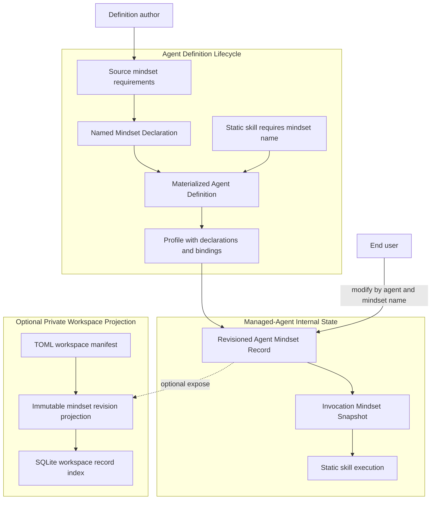
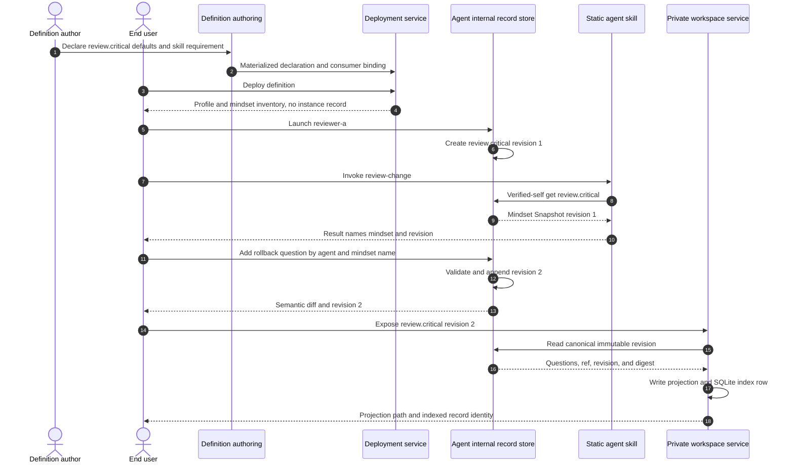

# Use Case UC-06: Use Named Mindsets Required by Agent Skills

## Actor Goal

As a human Agent Definition author, I want to declare named mindsets with default question lists and bind skills to the mindsets they require, so that each managed-agent instance receives editable reflective guidance that end users can modify by name without rewriting the skill.

## Use Case

The definition author states in `intent/src/agent-def-overview.md` that one static Agent Skill requires a mindset and supplies the mindset's name and default questions. Authoring derives a strict **Agent Mindset Declaration** with a stable name, purpose, ordered questions, stable question ids, low-authority posture, and skill-consumer bindings. The materialized Agent Definition owns the reusable defaults. It does not own any concrete managed-agent instance's current mindset state.

Agent Deployment validates that every skill requirement references a declared mindset and preserves the declarations and consumer bindings in the generated project profile. Deployment does not create a mutable mindset record. When a human later launches a managed-agent instance, Houmao initializes one revisioned **Agent Mindset Record** for every declared mindset in canonical `state.sqlite`. Each instance starts from the exact deployed defaults. V1 has no implicit active subset or initial override. Separate instances own independent records.

Before a required skill follows its mindset-dependent procedure, its static instructions use verified-self `houmao-mgr` behavior to load the required record by mindset name. The invocation receives one revision-consistent **Mindset Snapshot** containing the ordered questions and record identity. Definition validation checks this instruction phase, and behavior tests exercise it. Houmao does not claim a provider-neutral invocation interceptor. The questions act as a reflective checklist and cannot grant authority.

A human end user modifies one managed agent's mindset by targeting the agent and stable mindset name through the admin route. The maintained operation may add, revise, reorder, or remove questions within the declaration's bounds, validates the complete candidate, and appends a new internal record revision atomically. An in-progress skill invocation keeps the snapshot it already loaded; the next invocation uses the new revision. The reusable definition, deployed profile, static skill, and peer instances remain unchanged.

Mindsets remain canonical agent-internal records even when the instance has no Private Agent Workspace. The dependent `add-private-agent-workspaces` change may expose immutable revision projections beneath a manifest-resolved semantic path. Such projections never become canonical or mutate `state.sqlite`.

## Supported Actions

### Declare a Named Mindset

This action converts the author's default reflective questions into a reusable named definition contract.

- context
  - Actor **has** a stable mindset name, its purpose, and an ordered list of default questions.
  - System **has** the Agent Definition authoring lifecycle and can distinguish reusable defaults from per-instance records.
- intent
  - Actor **wants** end users and skills to refer to the same mindset without depending on a file path or copying question text.
  - Actor **wonders** "Can I define `review.critical` with these five questions and let users later modify that mindset by name?"
- action
  - Actor then **asks** authoring to derive the named mindset and default question contract.
- result
  - Actor **gets** a reviewable Agent Mindset Declaration with a stable name, purpose, ordered question ids and prompts, bounds, provenance, and low-authority classification.

### Bind a Skill to Its Required Mindset

This action makes the mindset requirement an explicit validated skill dependency.

- context
  - Actor **has** one complete static Agent Skill and one declared mindset that the skill must use.
  - System **has** Agent Definition skill bindings and mindset-consumer validation.
- intent
  - Actor **wants** the skill to stop when its required mindset is unavailable rather than silently ignoring the intended reasoning posture.
  - Actor **wonders** "Will the review skill always load `review.critical` before it evaluates a change?"
- action
  - Actor then **asks** authoring to bind the skill to the mindset as a required consumer.
- result
  - Actor **gets** a validated skill-to-mindset binding whose static instructions load the named record through verified self without embedding current question content.

### Initialize Per-Instance Mindset Records

This action creates independent current mindset state when one managed agent starts.

- context
  - Actor **has** a deployed profile carrying mindset declarations and a separate explicit launch request.
  - System **has** a managed-agent internal record store and launch rollback behavior.
- intent
  - Actor **wants** the launched agent to start with the definition's default questions while remaining independent from peer instances.
  - Actor **wonders** "Can `reviewer-a` and `reviewer-b` start from the same defaults but evolve their mindsets separately?"
- action
  - Actor then **asks** Houmao to launch one named managed-agent instance.
- result
  - Actor **gets** a launched instance with one initial Agent Mindset Record revision per declaration, while the definition and other instances remain unchanged.

### Modify One Mindset by Name

This action lets the end user revise a concrete instance's reflective questions through stable identity.

- context
  - Actor **has** one explicit managed-agent target and the name of a current Agent Mindset Record.
  - System **has** admin-targeted mindset inspection and optimistic revision mutation.
- intent
  - Actor **wants** to change future skill behavior without editing the skill or locating an internal storage path.
  - Actor **wonders** "Can I add a rollback-risk question to `review.critical` for `reviewer-a` only?"
- action
  - Actor then **asks** Houmao to update the named mindset with the requested question change.
- result
  - Actor **gets** a validated new record revision, old and new digests, a semantic question diff, and confirmation that peer records and static packages did not change.

### Invoke a Skill With a Mindset Snapshot

This action gives one skill invocation a stable reflective checklist.

- context
  - Actor **has** invoked a skill whose bundle binding requires a named mindset.
  - System **has** verified the managed-agent identity and can load the current valid record revision.
- intent
  - Actor **wants** the skill to consider every current question consistently throughout the operation.
  - Actor **wonders** "If the user changes the mindset while the skill is running, which question list applies?"
- action
  - Actor then **asks** or allows the skill to begin its mindset-dependent operation.
- result
  - Actor **gets** an operation bound to one Mindset Snapshot revision; concurrent later changes apply only to the next invocation.

### Expose a Mindset Revision in a Private Workspace

This action creates a human-readable or tool-readable projection without changing canonical authority.

- context
  - Actor **has** one concrete mindset revision and a healthy Private Agent Workspace whose contract declares a suitable semantic exposure path.
  - System **has** manifest-backed path resolution and the SQLite workspace-record index.
- intent
  - Actor **wants** to inspect, share locally, or process the mindset revision with workspace tools.
  - Actor **wonders** "Can I expose `review.critical` in the private workspace without moving its canonical record there?"
- action
  - Actor then **asks** Houmao to expose the selected named mindset revision.
- result
  - Actor **gets** a derived projection beneath the resolved path and an indexed workspace record linked to the canonical internal ref, revision, and digest.

## Main Flow

1. The human asks the admin operator agent to author a reusable reviewer.
2. The human says that the bundled `review-change` skill requires named mindset `review.critical`.
3. The human supplies the mindset's default questions, including questions about correctness, evidence, failure modes, rollback, and unresolved uncertainty.
4. Agent Definition authoring preserves the statement and exact question text in `intent/src/agent-def-overview.md`.
5. Derivation proposes stable question ids, preserves question order, records the mindset purpose, and classifies the question list as low-authority reflective guidance.
6. Derivation creates a required consumer binding from `review-change` to `review.critical`.
7. Derivation ensures the static skill instructions request the named mindset through verified-self product behavior before mindset-dependent work.
8. Bundle validation rejects duplicate names, unsafe names, duplicate question ids, empty required question inventories, unknown skill consumers, and skill requirements referencing undeclared mindsets.
9. The human reviews the mindset names, default questions, skill bindings, mutation posture, instance lifecycle, and optional private-workspace exposure.
10. Approved materialization writes the declarations and skill-consumer bindings into the Agent Definition Bundle.
11. Agent Deployment preserves the declarations and bindings in deployment-owned content attached to the generated profile.
12. Deployment doctor reports the declared mindset inventory and required skill dependencies but creates no Agent Mindset Record.
13. The human separately launches the profile as `reviewer-a`.
14. Before process start, Houmao creates initial revision 1 of `review.critical` in `reviewer-a`'s canonical `state.sqlite` from the exact deployed declaration digest.
15. Launch records the owning agent identity, definition and deployment provenance, declaration digest, revision, question inventory digest, and timestamps.
16. Houmao starts the managed agent only after every required initial mindset record validates.
17. The human invokes `review-change`.
18. The static skill identifies its required mindset name from its validated binding and requests it through verified self.
19. Houmao verifies `reviewer-a`, loads current `review.critical` revision 1, and returns a revision-consistent Mindset Snapshot.
20. The skill treats every question as a reflective checklist and records or reports the mindset name and revision used with its ordinary operation result.
21. The human explicitly targets `reviewer-a` and asks to add a question about database rollback hazards to `review.critical`.
22. Houmao loads the current record and revision, applies the named question mutation to a candidate, and validates the complete ordered inventory.
23. Houmao appends revision 2 atomically with the prior revision relation, semantic diff, actor provenance, timestamp, and new digest.
24. If a revision 1 skill invocation is still active, it continues using its original snapshot.
25. The next `review-change` invocation loads revision 2 and includes the new rollback question.
26. A separately launched `reviewer-b` retains its own revision 1 record created from the deployed defaults.
27. The human enables exposure for `reviewer-a` and asks to expose `review.critical` in its Private Agent Workspace.
28. Houmao resolves the contract-declared `workspace.mindsets` path from `houmao-agent-workspace.toml`.
29. Houmao renders an immutable revision 2 projection containing the mindset name, questions, canonical record ref, revision, digest, and exposure timestamp.
30. Houmao writes the projection under the resolved path and transactionally registers it in `houmao-agent-workspace.sqlite`.
31. The Agent Mindset Record remains canonical inside the managed-agent record store; the TOML manifest and projection file do not become mutation authority.

## Alternative and Exception Flows

- If the user supplies question text but no mindset name, authoring asks for a stable name before materialization because end-user mutation and skill bindings require identity.
- If the author gives a name with traversal, whitespace-only content, unsafe separators, reserved prefixes, or excessive length, validation rejects it.
- If the author supplies duplicate or empty questions, derivation proposes a corrected stable question inventory and blocks materialization until ambiguity is resolved.
- If an existing skill references an undeclared mindset, bundle validation blocks rather than converting the name into an implicit declaration.
- If a mindset is declared but has no skill consumer or explicit operator-inspection purpose, validation reports it as unused.
- If two skills require the same named mindset, both may consume the same per-instance record. Each invocation still snapshots the current revision independently.
- If a skill requires several mindsets, one read transaction returns the current revision of every required record before task logic begins.
- If deployment selects project-root mode, mindset initialization and use still work because canonical records do not depend on a Private Agent Workspace.
- If launch cannot create a valid initial record for every required mindset, launch fails before process start and rolls back newly created mindset state.
- If the user targets an unknown mindset name, mutation fails with the known-name inventory and does not create an ad hoc record.
- If the user requests a broad change such as "modify the mindset" while multiple names exist, admin routing asks which stable name is intended.
- If a mutation removes the final required question, violates bounds, duplicates an id, adds secret-like content, or changes immutable identity fields, validation preserves the prior revision.
- If the record changed after the operator inspected it, optimistic revision validation rejects the stale mutation and returns the current revision for rebase.
- If the user changes a mindset while a skill invocation is active, the current invocation retains its snapshot. Houmao does not rewrite the agent's submitted system prompt or interrupt the operation.
- If a required mindset record is missing, corrupt, or inconsistent with its owning agent identity, the skill stops before mindset-dependent behavior. It does not silently fall back to the definition default because that would hide instance-state corruption or user edits.
- If a question conflicts with a higher-priority instruction, requests unauthorized tools, claims to satisfy a gate, or attempts to define evidence by assertion, the skill follows the higher-priority contract and records the question as inapplicable or blocked when the operation records answers.
- If a managed agent asks to mutate its own mindset, the v1 verified-self route remains read-only. A human operator must target the instance.
- If the agent is stopped but preserved, its current mindset revisions remain available for inspection and relaunch.
- If the same preserved agent is relaunched with the same instance-contract digest, it retains its current mindset records.
- If the Agent Definition later changes default questions, an in-use deployment update is blocked. Fresh behavior uses a new deployment; v1 performs no implicit reset or reconciliation.
- If no Private Agent Workspace exists, exposure is unavailable but internal inspection, user mutation by name, and skill consumption continue to work.
- If the workspace contract lacks a semantic exposure path, exposure reports the missing declared surface and does not invent a directory or edit the TOML manifest.
- If an exposed projection is manually edited, workspace doctor reports payload drift. The edit does not mutate the canonical internal record or become the next revision.
- If the workspace SQLite index cannot transactionally register the projection, exposure rolls back the new projection or reports it as unindexed without claiming success.
- If a newer mindset revision exists after exposure, the old projection remains an immutable historical view. A later explicit exposure creates or selects the newer revision rather than overwriting history silently.
- If the managed-agent instance is removed, canonical internal records follow the maintained instance cleanup or archive policy. Any previously exposed workspace projections remain derived files governed by explicit private-workspace cleanup.

## Mermaid Flow Diagram

## Mermaid Sequence Diagram

## Durable Outputs

- Human-owned mindset names, purposes, default questions, and skill requirements in `intent/src/agent-def-overview.md`.
- Derived Agent Mindset Declarations with stable names, question ids, order, prompts, bounds, low-authority classification, consumer bindings, assumptions, and blockers.
- Approved `materialization.toml` and Agent Definition Revision content for mindset declarations and skill-to-mindset requirements.
- Deployment-owned declaration and consumer-binding content attached to the concrete project profile without mutable instance records.
- One independent revisioned Agent Mindset Record chain per named mindset and managed-agent instance.
- Record provenance including owning agent, definition and deployment identity, declaration digest, revision, question inventory digest, actor, timestamps, and prior revision.
- A revision-consistent Mindset Snapshot identity for each mindset-dependent skill operation.
- Admin-targeted mutation evidence with the stable mindset name, old and new revisions, semantic question diff, and validation result.
- Optional immutable private-workspace projections linked to canonical internal refs and revisions.
- SQLite workspace-index rows for exposed projections, including semantic type, payload path, canonical record ref, revision, digest, and timestamps.
- No growing mindset inventory or record history in `houmao-agent-workspace.toml`.

## Example Prompt and Expected AI Response

### Event 001: Author a Required Named Mindset

> Time: `design example` · Session: `human operator authoring a reviewer`

User Prompt:

> `$houmao-admin-entrypoint define a reviewer whose review-change skill requires mindset review.critical. By default it asks: What could be incorrect? What evidence supports each conclusion? What failure modes are hidden? What rollback risks exist? What remains uncertain? My end users may modify this mindset later by referring to review.critical.`

AI:

> The assistant preserves the exact request and questions in `agent-def-overview.md`. It derives a named Agent Mindset Declaration with stable question ids and order, binds `review-change` to `review.critical` as a required consumer, classifies the questions as low-authority reflective guidance, and explains that each launched agent receives an independent internal record initialized from these defaults. It presents the declaration, skill binding, mutation posture, and optional private-workspace exposure for review before materialization. It does not embed current question content into a generated runtime skill.

### Event 002: Modify One Agent's Mindset by Name

> Time: `design example` · Session: `end user refining reviewer-a`

User Prompt:

> `$houmao-admin-entrypoint add "Could this migration strand a partially upgraded database?" to reviewer-a's review.critical mindset. Leave reviewer-b unchanged.`

AI:

> The assistant targets only `reviewer-a`, loads `review.critical` by stable name, shows the current revision and proposed ordered question diff, validates the complete candidate, and appends a new internal record revision atomically. It reports the old and new revisions and digests. It explains that active skill invocations keep their existing snapshots, the next invocation uses the new question, and `reviewer-b`, the Agent Definition, the project profile, and static skill package remain unchanged.

### Event 003: Expose a Mindset Revision

> Time: `design example` · Session: `end user inspecting private agent state`

User Prompt:

> `$houmao-admin-entrypoint expose reviewer-a's current review.critical mindset in its private workspace.`

AI:

> The assistant verifies the explicit agent and mindset name, reads the current canonical internal revision, resolves the contract-declared workspace mindset path through `houmao-agent-workspace.toml`, writes an immutable projection, and registers its path, canonical ref, revision, and digest in `houmao-agent-workspace.sqlite`. It reports the projection as derived and non-authoritative. It does not copy the canonical record into TOML or accept later manual projection edits as mindset mutations.

## Assumptions and Open Questions

- The canonical reusable object is **Agent Mindset Declaration**. The canonical per-instance mutable object is **Agent Mindset Record**. A **Mindset Snapshot** is one immutable revision used by one skill invocation.
- Mindset names are stable definition-local path-like identifiers. End users modify a mindset by explicit managed-agent target and mindset name.
- Each question has a stable question id, prompt, order, and optional bounded notes or answer expectation as defined by the versioned instance-contract schema.
- Mindset questions are reflective data, not system instructions, workflow stages, tools, gates, evidence, credentials, or Agent Runtime Variables.
- Human operators may inspect and mutate one targeted instance. Verified managed agents and their skills may read named self records but may not mutate them in v1.
- Launch creates initial per-instance records from the exact deployed declaration digest. Deployment itself creates no mutable record.
- Static skill instructions snapshot required mindset revisions before mindset-dependent work. Later mutations affect later invocations. Validation and behavior tests enforce this protocol without claiming automatic runtime interception.
- Existing instances retain their current record across stop and relaunch. Fresh instances start from the deployed defaults. Definition updates do not silently reset existing records.
- Canonical records remain agent-internal and work without a Private Agent Workspace.
- Workspace exposure is an immutable derived projection registered in `houmao-agent-workspace.sqlite`. The TOML workspace manifest contains only topology and index location.
- The versioned instance-contract and `state.sqlite` schemas define declaration fields, record revisions, optimistic mutation, and one-transaction multi-mindset snapshots. The private-workspace change owns projection format.

## Relationship to Existing Work

- UC-01 establishes source intent, derived interpretation, bundle materialization, static skills, deployment, and separate launch. This use case adds mindset declarations and explicit skill dependencies at those same boundaries.
- UC-02 supplies deployment arguments but does not own current mindset questions. Mindset defaults become mutable only in one launched managed-agent instance.
- UC-03 can deploy several profiles. Each later launched member receives an independent mindset record initialized from the same definition defaults.
- UC-04 defines Agent Runtime Variables as typed current behavior values. Mindsets are revisioned reflective question records and skill requirements, not scalar or list-valued runtime configuration.
- UC-05 defines optional Private Agent Workspaces, TOML topology manifests, and SQLite workspace record indexes. Mindsets use private workspaces only for optional indexed projections; their canonical state remains agent-internal.
- Isomer Kaoju distinguishes mutable named Mindset Sources from immutable Run-scoped Mindset Records, validates stable question ids, and prevents mindset content from gaining workflow authority. Houmao adopts the source-versus-record and low-authority principles while using per-managed-agent current records and per-skill invocation snapshots.
