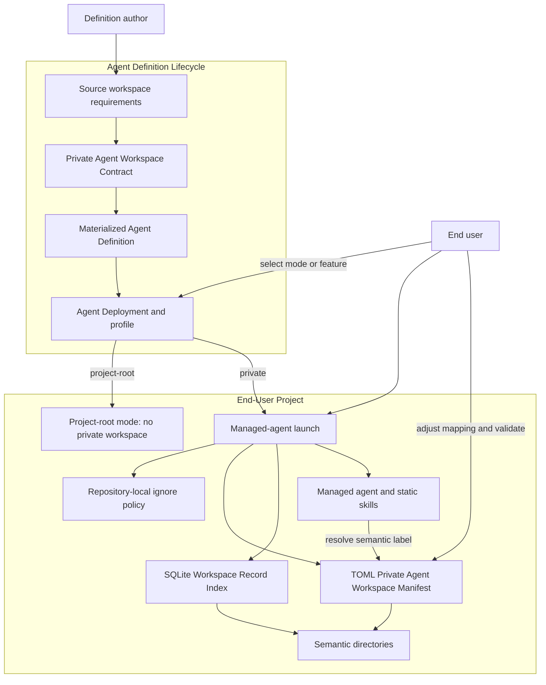
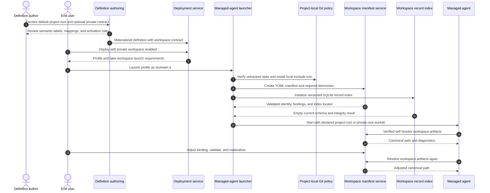

# Use Case UC-05: Use Optional Manifest-Backed Private Agent Workspaces

## Actor Goal

As a human Agent Definition author, I want an agent to work directly in the end user's project by default while declaring an optional private-workspace contract with semantic directory labels, so that an end user can enable one private workspace per managed-agent instance and both humans and agents can resolve its actual directories through `houmao-mgr` without a definition-specific harness.

## Use Case

The definition author describes the default project-root posture and optional private-workspace behavior in `intent/src/agent-def-overview.md`. Authoring derives a strict **Private Agent Workspace Contract** that declares whether private workspace support is optional or required, its default activation posture, a safe project-relative root template, stable semantic directory labels and meanings, default relative paths, and required or optional directory state. The approved Agent Definition stores that contract as reusable material. It does not contain a concrete end-user project path or a concrete managed-agent workspace.

The default workspace mode is `project-root`. Deployment then creates a profile whose workdir is the selected end-user project and does not create a private workspace, workspace manifest, or semantic directories.

The human may explicitly select `private` workspace mode during deployment, or a definition-declared deployment feature may require that mode. Deployment validates and records the selection and the reason, but it still does not create per-instance runtime content. When the human later launches one managed-agent instance, Houmao derives a collision-free workspace root inside the selected project, establishes the requested Git tracking posture, writes a concrete **Private Agent Workspace Manifest** at `<private-workspace>/houmao-agent-workspace.toml`, initializes the versioned **Private Agent Workspace Record Index** at `<private-workspace>/houmao-agent-workspace.sqlite`, and materializes required directories. The agent continues to run in the user project unless the definition explicitly selects `workdir_mode=private-root`.

The TOML manifest uses the Houmao-owned `houmao-agent-private-workspace.v1` schema. It records stable workspace identity, topology, semantic path bindings, tracking posture, and the relative SQLite index location and schema. It stores no mutable SQLite digest or generation and does not grow record arrays. SQLite owns its current generation, growing metadata, relations, payload locators, revisions, digests, and timestamps. A human may adjust path bindings without changing stable labels. Managed agents and static skills resolve paths by semantic label through verified-self commands.

Private workspaces are local and untracked by default. For a Git-backed project, Houmao interprets "local ignore" as an idempotent Houmao-owned entry in the enclosing repository's `.git/info/exclude`; a `.gitignore` stored only inside a new workspace cannot hide that workspace root from its parent repository. Repository-wide `.gitignore` mutation, staging, and commits require separate explicit human intent. An explicit `tracked` selection makes the workspace eligible for normal Git tracking but does not automatically stage or commit it.

## Supported Actions

### Declare Optional Private Workspace Support

This action turns the author's freeform workspace requirements into a reusable definition-level contract.

- context
  - Actor **has** an Agent Definition whose normal behavior needs only the end user's project but whose optional features may need agent-owned directories.
  - System **has** the Agent Definition authoring workflow and the source-derived-materialized lifecycle.
- intent
  - Actor **wants** to define stable semantic directory meanings and default paths without requiring every deployment to create those directories.
  - Actor **wonders** "Can this agent normally work from the project root, but create private `scratch`, `artifacts`, and `state` directories when the user enables its private workspace?"
- action
  - Actor then **asks** the authoring workflow to derive a Private Agent Workspace Contract from the supplied requirements.
- result
  - Actor **gets** a reviewable strict contract with default `project-root` mode, permitted activation paths, semantic labels and meanings, default relative mappings, path classifications, and validation rules.

### Select the Workspace Mode During Deployment

This action fixes whether one concrete Agent Deployment will use the project root or create private workspaces for later instances.

- context
  - Actor **has** a materialized Agent Definition with an optional Private Agent Workspace Contract and a selected end-user project.
  - System **has** the definition's deployment-argument and feature-selection interface.
- intent
  - Actor **wants** an explicit, inspectable workspace decision before deployment creates the project profile.
  - Actor **wonders** "If I enable the local-analysis feature, will the deployment explain that each later agent instance needs a private workspace?"
- action
  - Actor then **asks** the deployment workflow to use either the default project-root mode or the private mode required by an explicit selection or selected feature.
- result
  - Actor **gets** a Deployment Request, Deployment Plan, and concrete profile that record the selected mode, independent workdir mode, workspace contract digest, and later launch requirements without creating per-instance directories.

### Create a Private Workspace at Managed-Agent Launch

This action materializes one contract-conforming workspace for one concrete managed-agent instance.

- context
  - Actor **has** a healthy private-workspace-enabled Agent Deployment, one explicit managed-agent name, and a selected project.
  - System **has** maintained launch, path-safety, local-ignore, manifest, and recoverable preparation services.
- intent
  - Actor **wants** the new instance to receive its own private directory tree inside the project while preserving the parent repository's tracked files by default.
  - Actor **wonders** "Can `reviewer-a` get its own private workspace without adding generated content to the repository index?"
- action
  - Actor then **asks** Houmao to launch the profile as the named managed agent.
- result
  - Actor **gets** a launched managed agent with a validated auxiliary workspace, initialized SQLite record index, required semantic directories, local-only ignore evidence, and instance ownership metadata. Its execution workdir follows the independent declared workdir mode.

### Adjust and Resolve Semantic Directory Mappings

This action lets a human change concrete directory locations while preserving the semantic interface consumed by the agent.

- context
  - Actor **has** a preserved private workspace with a valid Houmao manifest and wants one semantic directory to use a different workspace-relative path.
  - System **has** `houmao-mgr` manifest inspection, validation, semantic path resolution, and explicit materialization behavior.
- intent
  - Actor **wants** skills to keep asking for the same semantic label after the physical layout changes.
  - Actor **wonders** "Can I map `workspace.artifacts` from `artifacts/` to `outputs/review/` without editing every skill?"
- action
  - Actor then **edits** or asks the admin route to update the binding, validates the manifest, and explicitly materializes the selected missing directory when needed.
- result
  - Actor **gets** deterministic diagnostics and a resolved new path; subsequent verified-self lookups use the new mapping while the semantic label remains unchanged.

### Opt In to Repository Tracking

This action changes the private workspace from local-untracked posture to Git-visible posture without silently staging content.

- context
  - Actor **has** a private workspace that is currently ignored through a Houmao-owned repository-local ignore entry.
  - System **has** Git status evidence and can identify only the ignore entry it owns.
- intent
  - Actor **wants** normal Git tooling to see the workspace files while retaining control over staging and commits.
  - Actor **wonders** "Can I track this workspace without Houmao deciding which files to commit?"
- action
  - Actor then **explicitly asks** Houmao to switch the workspace tracking posture to `tracked`.
- result
  - Actor **gets** a current mutation preview, removal of the Houmao-owned local exclude entry after confirmation, updated manifest state, and resulting Git status; no files are staged or committed automatically.

## Main Flow

1. The human asks the admin operator agent to define a reusable reviewer that normally works directly in the selected end-user project.
2. The human says that an end user or a selected deployment feature may enable a private workspace inside that project.
3. The human defines stable semantic directory meanings such as `workspace.scratch`, `workspace.artifacts`, and `workspace.state`, with default relative paths and required or optional state.
4. Agent Definition authoring preserves the complete request in `intent/src/agent-def-overview.md`.
5. Derivation classifies the default as `project-root`, private support as optional, and workspace activation as a deployment-time selection rather than an Agent Runtime Variable.
6. Derivation proposes a Private Agent Workspace Contract with a versioned schema, safe root-template policy, stable labels and human-readable meanings, default relative bindings, path kinds, required state, and tracking postures.
7. Derivation rejects arbitrary executable path expressions and records any deployment feature that requires private mode through a non-executable declared dependency.
8. The human reviews the workspace contract, semantic labels, default paths, activation rules, Git posture, preservation rules, and `houmao-mgr` consumer contract.
9. Approved materialization writes the Private Agent Workspace Contract and independent workdir mode into `instance-contract.toml`.
10. For a normal deployment with no private selection, deployment records `workspace_mode=project-root`, creates a project-root-backed profile, and creates no private workspace material.
11. For a deployment where the human selects private mode or selects a declared feature that requires it, deployment records `workspace_mode=private`, the selection source, the workspace contract digest, and a safe instance-root template.
12. Deployment resolves all project-level bindings, validates the future root remains inside the selected project, attaches the workspace contract to the generated profile, and creates no concrete per-instance workspace.
13. Deployment doctor reports that later launch will create one private workspace per managed-agent instance and shows the default local-untracked posture.
14. The human separately launches the profile as managed agent `reviewer-a`.
15. Before process start, Houmao resolves a unique project-contained workspace root from the exact project, deployment, and managed-agent identity.
16. If the project is Git-backed and tracking mode is local-untracked, Houmao verifies that no workspace path is already tracked and prepares an idempotent Houmao-owned rule in the repository's `.git/info/exclude`.
17. Houmao stages the workspace root, `houmao-agent-workspace.toml`, `houmao-agent-workspace.sqlite`, and required directories without following symlinks or writing outside the resolved root.
18. Manifest validation confirms the schema, identity bindings, unique contract-declared labels, workspace-relative paths, path kinds, record-index locator, and confinement.
19. SQLite initialization creates the current workspace-record schema with no fabricated records and verifies transactional write readiness.
20. Houmao publishes the staged workspace, records its journaled association in canonical instance state, and chooses project root or private root as the execution workdir according to the explicit workdir mode.
21. Houmao starts the managed agent only after workspace preparation succeeds.
22. A static agent skill needs the artifact directory and asks the verified-self workspace path resolver for `workspace.artifacts`.
23. `houmao-mgr` verifies the managed-agent identity, loads its associated manifest, validates the requested binding, and returns the canonical path plus source and existence diagnostics.
24. The skill writes to the returned path rather than assuming the default `artifacts/` layout, and the owning workflow may register the resulting file as a typed record in the SQLite index.
25. Later, the human changes the `workspace.artifacts` binding to `outputs/review`, validates the manifest, and explicitly materializes the new directory.
26. The agent's next verified-self lookup returns the adjusted path without changing the Agent Definition, project profile, static skill package, or unrelated indexed records.

## Alternative and Exception Flows

- If the definition declares no Private Agent Workspace Contract, only project-root mode is available and no workspace-specific prompt is shown.
- If the definition requires private mode rather than making it optional, deployment cannot select project-root mode.
- If a selected deployment feature declares that it requires private mode, the deployment preview shows that dependency and cannot silently downgrade to project-root mode.
- If a request mentions a feature that the definition does not declare, deployment does not infer a workspace activation expression or ad hoc feature system.
- If project-root mode is selected, the absence of a private workspace manifest is healthy rather than missing state.
- If deployment is planned or applied but the profile is never launched, no private workspace directory or local Git ignore rule is created.
- If a batch deploys several profiles, no private workspaces exist until individual members are launched. Each launched managed-agent instance receives an independent root and manifest.
- If the project path is not inside the selected project, uses parent traversal, resolves through a symlink outside the project, collides with another instance, or targets Houmao project configuration unexpectedly, launch blocks before mutation.
- If the workspace root already contains user-owned content without a compatible manifest and ownership identity, launch reports a collision and does not adopt, overwrite, or delete it.
- If a manifest contains an unsupported schema, duplicate or unknown label, absolute path, parent traversal, conflicting path kinds, or a binding outside the workspace root, validation blocks dependent resolution and materialization.
- If the TOML manifest contains growing record arrays, record bodies, a mutable database digest, or a database generation, validation rejects those fields and directs the caller to SQLite operations.
- If the SQLite index is missing, uses an unsupported schema, fails integrity checks, or is locked against required transactional writes, private-mode launch or record mutation blocks without reconstructing record authority from directory scans.
- If a payload exists without an index row, read-only doctor may report it as unindexed content. It does not infer record type, ownership, or history from the filename.
- If an index row names a missing or digest-mismatched payload, doctor reports record drift. It does not silently accept a new digest or delete the row.
- If a future workspace-index schema requires migration, `houmao-mgr` performs only an explicit maintained migration; ordinary path resolution does not mutate the database schema.
- If a user changes a mapping to a safe path that does not exist, read-only resolution reports the planned path and missing state. It does not create the directory until an explicit materialization action or an owning operation requires it.
- If a user removes a required label, changes its semantic identity, or adds a label absent from the definition contract, validation reports contract drift instead of treating the edit as a new definition.
- If the project is inside a Git repository and the proposed workspace is already tracked, local-untracked launch blocks. Houmao does not run `git rm --cached`, rewrite history, or conceal tracked content with ignore rules.
- If the repository has no `.git` directory, Houmao records the workspace as local and not Git-managed; it does not initialize a repository.
- If `.git/info/exclude` cannot be updated safely, launch reports the exact blocker and leaves no successfully materialized workspace or started process.
- If the human explicitly asks for a repository-wide ignore rule, that is a separate tracked `.gitignore` mutation with its own preview. It is not inferred from private workspace enablement.
- If the human selects `tracked`, Houmao makes the workspace Git-visible but does not stage, commit, push, or choose a repository history policy.
- If a workspace-local `.gitignore` is part of the author's directory contract, it may govern descendants. It is not accepted as evidence that the parent repository ignores the workspace root.
- If launch fails after workspace preparation, Houmao records the failed attempt and removes only fresh operation-owned content when ownership and user-mutation checks permit. It preserves existing and user-modified content.
- If a preserved managed-agent instance is stopped and relaunched, it reuses and revalidates its existing manifest and mappings.
- If a fresh instance is launched from the same deployment, it receives a separate workspace root and manifest. It does not inherit manual path edits from a peer instance.
- If the managed-agent instance is removed, Houmao preserves its private workspace by default because it may contain user-valued artifacts. Deletion requires a separate explicit, previewed cleanup that verifies manifest ownership and drift.
- If the managed agent asks to change its manifest or tracking posture, the v1 verified-self route remains read-only. A human operator must authorize configuration mutation.
- If an agent needs multi-agent Git worktrees, shared knowledge, or task-team topology, the operator uses `houmao-utils-workspace-mgr`; the Private Agent Workspace Contract does not absorb that standard multi-agent workspace lifecycle.
- A private workspace is an ownership and path-resolution boundary, not an operating-system sandbox. It does not by itself prevent the agent from reading other project paths allowed by its process.

## Mermaid Flow Diagram

## Mermaid Sequence Diagram

## Durable Outputs

- Human-owned default and optional private-workspace requirements in `intent/src/agent-def-overview.md`.
- Derived activation classification, semantic directory catalog, default bindings, path safety rules, Git posture, assumptions, blockers, and `materialization.toml` entries.
- A versioned Private Agent Workspace Contract in the materialized Agent Definition Revision, with no concrete end-user or managed-agent instance path.
- Deployment Request, Plan, and project-profile state recording workspace activation, independent workdir mode, selection source, contract digest, and safe future root policy.
- For each launched private-workspace instance, one project-contained workspace root and `houmao-agent-workspace.toml`.
- One versioned `houmao-agent-workspace.sqlite` per private workspace for growing record metadata, relations, payload locators, revisions, digests, and timestamps.
- Manifest identity and binding records that map stable definition-declared semantic labels to validated workspace-relative paths.
- TOML manifest metadata that points to the SQLite index without duplicating its growing record inventory, digest, or mutable generation.
- Required materialized directories plus diagnostics for optional or missing paths.
- Repository-local ignore evidence for local-untracked mode or explicit tracking-posture evidence for tracked mode.
- A managed-agent association that lets admin-targeted and verified-self `houmao-mgr` operations find the correct manifest without scanning arbitrary directories.
- Path-resolution output containing semantic label, canonical path, source, existence, manifest identity, and diagnostics.
- Preservation or explicit-cleanup evidence when the managed-agent instance lifecycle ends.

## Example Prompt and Expected AI Response

### Event 001: Author Optional Private Workspace Support

> Time: `design example` · Session: `human operator authoring a reusable reviewer`

User Prompt:

> `$houmao-admin-entrypoint define a reviewer that normally works directly in the user's project. If the user enables private workspace support or selects local-analysis during deployment, give each launched agent a private workspace inside that project. I define semantic dirs workspace.scratch, workspace.artifacts, and workspace.state. Put their defaults at scratch/, artifacts/, and state/, but let users change the mappings. Keep the workspace untracked locally unless the user explicitly opts into tracking.`

AI:

> The assistant preserves the full request in `agent-def-overview.md` and derives an optional Private Agent Workspace Contract. It proposes `project-root` as the default mode, records the declared local-analysis dependency on private mode, validates the stable labels and safe relative default paths, and explains that a later concrete manifest will use Houmao's schema. It states that local-untracked Git posture uses a Houmao-owned `.git/info/exclude` rule because an inner `.gitignore` cannot hide the workspace root. It presents the contract, tracking behavior, preservation policy, and `houmao-mgr` path-resolution contract for review before materialization.

### Event 002: Deploy and Launch One Private Workspace

> Time: `design example` · Session: `end user deploying and launching reviewer-a`

User Prompt:

> `$houmao-admin-entrypoint deploy repository-reviewer into this project with local-analysis enabled, then launch it as reviewer-a. Keep its private workspace local and untracked.`

AI:

> The assistant records that local-analysis requires private storage, preserves project-root execution unless the definition explicitly selects private-root workdir, validates the project-contained root policy, applies the Agent Deployment, and stops at the launch handoff until separate launch authority is applied. Launch previews the root and exclude change, prepares TOML, SQLite, and required directories through a recoverable operation, records the instance association, and starts `reviewer-a` in the declared workdir. It reports how humans and verified agents resolve semantic labels. It does not stage or commit workspace content.

### Event 003: Adjust a Semantic Mapping

> Time: `design example` · Session: `end user reorganizing reviewer-a output`

User Prompt:

> `$houmao-admin-entrypoint change reviewer-a's workspace.artifacts mapping to outputs/review, validate the private workspace, and create the directory.`

AI:

> The assistant targets only `reviewer-a`, loads its Houmao manifest, previews the binding change, confirms that `outputs/review` remains inside the private workspace, updates the manifest through the maintained admin route, validates it against the Agent Definition contract, and explicitly materializes the new directory. It reports the old and new resolved paths and notes that static skills keep using `workspace.artifacts`. It does not move old artifacts, alter peer workspaces, or change Git tracking unless separately requested.

## Assumptions and Open Questions

- The canonical reusable object is **Private Agent Workspace Contract**; the concrete per-instance object is **Private Agent Workspace Manifest**; the directories and files beneath its root are the **Private Agent Workspace**.
- `project-root` is the default mode and creates no private workspace artifacts. `private` is selected explicitly during deployment or required by a definition-declared deployment feature.
- The concrete workspace is created during managed-agent launch, not Agent Deployment, because managed-agent identity and per-instance collision checks belong to launch. Deployment only records the selected mode and contract.
- The fixed manifest name is `houmao-agent-workspace.toml`, with `schema_version = "houmao-agent-private-workspace.v1"`. The versioned schema owns stable identity, topology, binding, tracking, and index-locator tables.
- The fixed record-index name is `houmao-agent-workspace.sqlite`. TOML owns workspace identity and topology; SQLite owns growing record indexes. File payloads remain under manifest-resolved semantic directories.
- Semantic labels are stable definition-owned identifiers. Users may change their path bindings but may not silently add, remove, or redefine contract labels for one instance.
- Manifest paths are relative to the private workspace root and remain confined beneath it in v1. External roots and cross-project bindings are out of scope.
- Read-only inspection and path resolution do not create files. Launch and explicit materialization create only contract-owned required paths.
- "Private" means instance-owned and excluded from default peer write contracts. It is not an OS-level access-control or sandbox guarantee.
- "Local `.gitignore`" is interpreted as local-only repository ignore state in `.git/info/exclude`, matching Houmao's existing in-repo workspace posture. A workspace-local `.gitignore` may control descendants but cannot make its own workspace root invisible to the parent repository.
- Explicit tracked mode makes files visible to Git but does not run `git add`, create commits, or push.
- Humans may mutate mappings and tracking posture. Verified managed agents receive read-only self inspection and semantic path resolution in v1.
- Stopping and relaunching a preserved instance retains its workspace. Clean managed-agent removal preserves it by default; destructive workspace cleanup requires a separate explicit operation.
- Private Agent Workspace bindings are structured path state, not Agent Runtime Variables. Static skills query both through maintained verified-self commands but the two contracts have different schemas and lifecycles.
- Manifest mutation uses optimistic digest checks. Deployment updates that change the workspace-contract digest are blocked while live or preserved instances reference the deployment. Optional directories are created only by explicit materialization or a declared owning operation.

## Relationship to Existing Work

- UC-01 establishes Agent Definition authoring, bundle materialization, project deployment, and separate managed-agent launch. This use case adds an optional definition-level workspace contract and a launch-time per-instance materialization stage.
- UC-02 defines deployment arguments and selected features that can choose or require `project-root` versus `private` mode before deployment planning.
- UC-03 creates several project deployments without launching them. Private workspaces are created independently only when those profiles are later launched.
- UC-04 defines per-instance behavior values. Workspace mappings are separate structured topology state and are never interpolated into static skill packages.
- Isomer Labs' Topic Workspace Manifest provides the precedent for stable semantic labels, manifest-backed path bindings, explainable resolution, and separate read-only resolution versus explicit materialization.
- Houmao's existing `houmao-utils-workspace-mgr` provides the precedent for an in-repository local workspace collection and `.git/info/exclude` posture. It remains the standard multi-agent worktree and shared-topology routine; it does not own arbitrary definition-authored individual workspace contracts.
- Existing project profiles already carry a workdir. The private workspace is auxiliary by default and changes that workdir only through explicit `private-root` posture.
