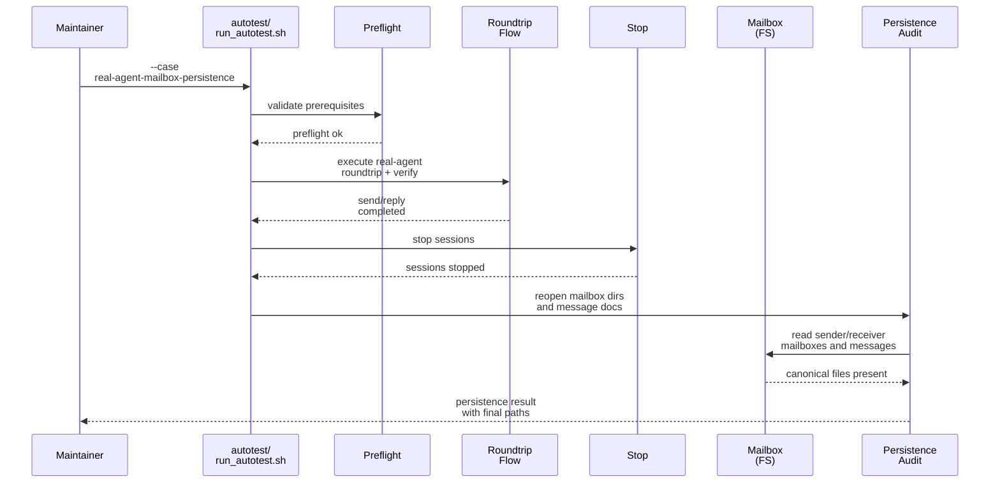

# Testplan: `real-agent-mailbox-persistence`

Status: pre-implementation design artifact for change `add-real-agent-mailbox-roundtrip-autotest`.

This file is a design-phase artifact. The final implemented `scripts/demo/mailbox-roundtrip-tutorial-pack/autotest/case-real-agent-mailbox-persistence.md` should be treated as an operator-facing companion/readme for the shipped case, and it does not need to match this design text line by line.

## Intended Implemented Assets

- `scripts/demo/mailbox-roundtrip-tutorial-pack/autotest/run_autotest.sh`
- `scripts/demo/mailbox-roundtrip-tutorial-pack/autotest/case-real-agent-mailbox-persistence.md`
- `scripts/demo/mailbox-roundtrip-tutorial-pack/autotest/case-real-agent-mailbox-persistence.sh`
- `scripts/demo/mailbox-roundtrip-tutorial-pack/autotest/helpers/`

## Goal

Prove that a successful real-agent mailbox roundtrip leaves final mail files on disk after the run has already stopped, so a maintainer can inspect the completed send and reply without re-running the demo.

## Preconditions

- The same real-agent prerequisites required by `real-agent-roundtrip` are available.
- The case owns one selected `<demo-output-dir>` for the entire run.
- The raw mailbox tree is expected to remain under `<demo-output-dir>/mailbox/` after `stop`.

## Intended Runner Surface

```bash
scripts/demo/mailbox-roundtrip-tutorial-pack/autotest/run_autotest.sh \
  --case real-agent-mailbox-persistence \
  --demo-output-dir <path>
```

The implemented `case-real-agent-mailbox-persistence.sh` script should provide the pack-owned shell steps that `autotest/run_autotest.sh --case real-agent-mailbox-persistence` dispatches to. Shared helper functions needed by this case should live under `autotest/helpers/`.

## Sequence Diagram



## Ordered Steps

1. Run the same real-agent preflight used by the canonical roundtrip case.
2. Execute the full direct-path sender-to-receiver roundtrip through real local agents.
3. Run `verify` and then `stop`.
4. After `stop` has completed, reopen the sender and receiver mailbox directories from disk.
5. Reopen the canonical send and reply Markdown message documents from disk.
6. Confirm that the mailbox directories and message documents remain readable and still point to the completed roundtrip thread.
7. Write a machine-readable result that records the mailbox-directory paths, message-document paths, and any post-stop inspection failures.

## Expected Evidence

- `<demo-output-dir>/mailbox/mailboxes/<sender-address>/` remains present after `stop`.
- `<demo-output-dir>/mailbox/mailboxes/<receiver-address>/` remains present after `stop`.
- The canonical send and reply Markdown documents remain readable after `stop`.
- The case result records the exact mailbox and message-document paths that a maintainer should inspect next.

## Failure Signals

- `stop` removes or invalidates the mailbox tree needed for post-run inspection.
- The send or reply message documents are missing, unreadable, or no longer linked to the completed thread.
- The case reports success without recording the final inspection paths.
