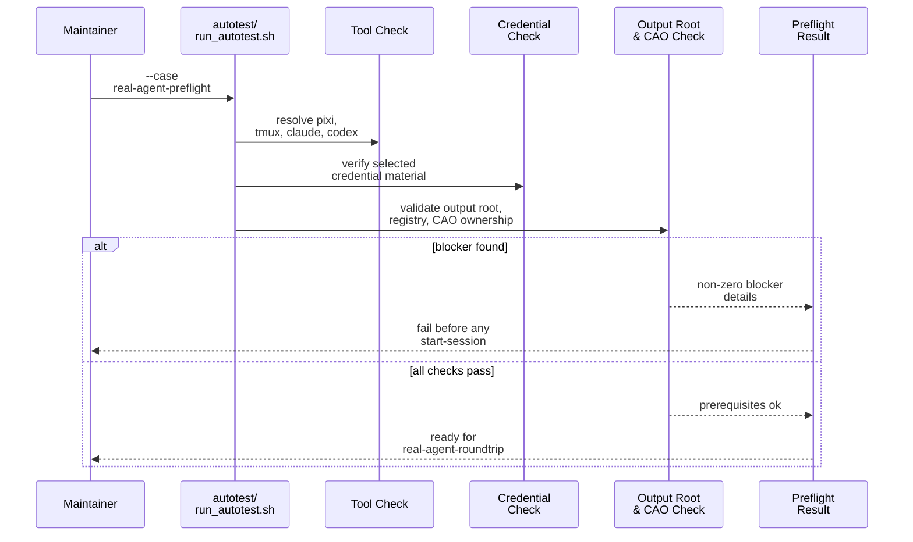

# Testplan: `real-agent-preflight`

Status: pre-implementation design artifact for change `add-real-agent-mailbox-roundtrip-autotest`.

This file is a design-phase artifact. The final implemented `scripts/demo/mailbox-roundtrip-tutorial-pack/autotest/case-real-agent-preflight.md` should be treated as an operator-facing companion/readme for the shipped case, and it does not need to match this design text line by line.

## Intended Implemented Assets

- `scripts/demo/mailbox-roundtrip-tutorial-pack/autotest/run_autotest.sh`
- `scripts/demo/mailbox-roundtrip-tutorial-pack/autotest/case-real-agent-preflight.md`
- `scripts/demo/mailbox-roundtrip-tutorial-pack/autotest/case-real-agent-preflight.sh`
- `scripts/demo/mailbox-roundtrip-tutorial-pack/autotest/helpers/`

## Goal

Fail fast on local blockers before any sender or receiver session is started for the real-agent mailbox roundtrip path.

## Preconditions

- The case uses the same demo parameters and output-root policy that `real-agent-roundtrip` would use.
- The case may read local tool and credential locations, but it must not start live sessions or send mail.

## Intended Runner Surface

```bash
scripts/demo/mailbox-roundtrip-tutorial-pack/autotest/run_autotest.sh \
  --case real-agent-preflight \
  --demo-output-dir <path>
```

The implemented `case-real-agent-preflight.sh` script should provide the pack-owned shell steps that `autotest/run_autotest.sh --case real-agent-preflight` dispatches to. Shared helper functions needed by this case should live under `autotest/helpers/`.

## Sequence Diagram



## Ordered Steps

1. Resolve the actual local `claude` and `codex` executables that the pack would use for the real-agent roundtrip.
2. Verify that the selected credential-profile files are present and readable.
3. Verify that `<demo-output-dir>` is fresh or safely reusable for the selected case.
4. Verify that the selected CAO base URL, CAO profile-store ownership, and any registry/runtime roots are compatible with a pack-owned run.
5. Emit a machine-readable preflight result that names every satisfied prerequisite and every blocker.
6. Exit without calling `start-session`, `mail send`, `mail check`, `mail reply`, or `stop-session`.

## Expected Evidence

- The case exits with status `0` only when every required prerequisite is satisfied.
- No sender or receiver session manifests are created.
- No mailbox message documents are created.
- The case result identifies the resolved tool paths, credential-profile identifiers, and owned demo output directory that would be used by `real-agent-roundtrip`.

## Failure Signals

- One or more required local executables are missing.
- Credential material is absent, unreadable, or incompatible with the selected demo blueprints.
- The selected output root or CAO/runtime ownership is unsafe or incompatible.
- The case starts a live session instead of stopping at preflight.
