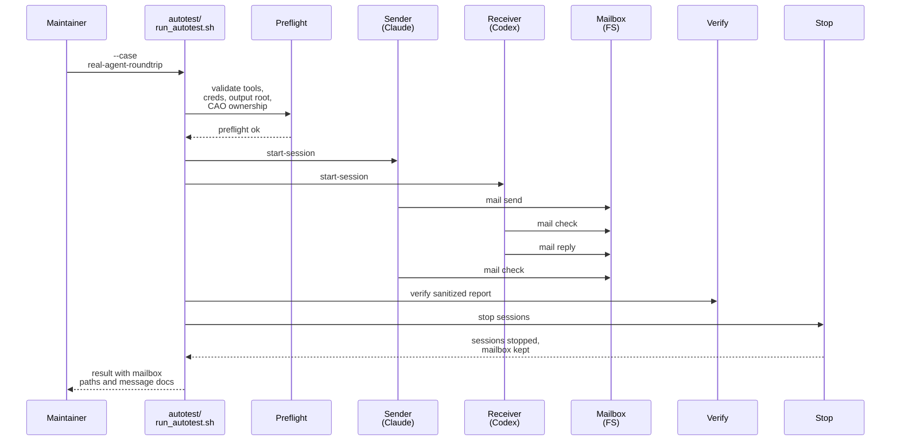

# Testplan: `real-agent-roundtrip`

Status: pre-implementation design artifact for change `add-real-agent-mailbox-roundtrip-autotest`.

This file is a design-phase artifact. The final implemented `scripts/demo/mailbox-roundtrip-tutorial-pack/autotest/case-real-agent-roundtrip.md` should be treated as an operator-facing companion/readme for the shipped case, and it does not need to match this design text line by line.

## Intended Implemented Assets

- `scripts/demo/mailbox-roundtrip-tutorial-pack/autotest/run_autotest.sh`
- `scripts/demo/mailbox-roundtrip-tutorial-pack/autotest/case-real-agent-roundtrip.md`
- `scripts/demo/mailbox-roundtrip-tutorial-pack/autotest/case-real-agent-roundtrip.sh`
- `scripts/demo/mailbox-roundtrip-tutorial-pack/autotest/helpers/`

## Goal

Drive one full sender-to-receiver mailbox roundtrip through the direct runtime mail path using the actual local `claude` and `codex` executables plus real credential profiles, then leave the final mailbox files on disk for inspection.

## Preconditions

- `pixi`, `tmux`, `claude`, and `codex` are installed and resolvable on `PATH`.
- The selected real credential profiles for sender and receiver are present and readable.
- The selected `<demo-output-dir>` is fresh or explicitly owned by this case.
- The selected CAO base URL, CAO profile store, and registry/runtime roots are compatible with one pack-owned run.

## Intended Runner Surface

```bash
scripts/demo/mailbox-roundtrip-tutorial-pack/autotest/run_autotest.sh \
  --case real-agent-roundtrip \
  --demo-output-dir <path>
```

The implemented `case-real-agent-roundtrip.sh` script should provide the pack-owned shell steps that `autotest/run_autotest.sh --case real-agent-roundtrip` dispatches to. Shared helper functions needed by this case should live under `autotest/helpers/`.

## Sequence Diagram



## Ordered Steps

1. Run real-agent preflight and stop immediately if any required tool, credential, CAO ownership, or output-root prerequisite is missing.
2. Start sender and receiver through the normal `start-session` path using the actual local `claude` and `codex` executables.
3. Emit pack-local `inspect` commands or equivalent persisted coordinates for both agents before the first mail turn starts.
4. Send the tracked initial mailbox message from sender to receiver through the direct runtime mail path.
5. Run receiver `mail check`, then `mail reply` in the same thread, then sender `mail check`.
6. Run `verify` so the sanitized report contract still passes.
7. Run `stop` without deleting the mailbox tree or canonical message documents.
8. Write machine-readable case evidence that records the final mailbox paths and canonical send/reply message-document paths.

## Expected Evidence

- `<demo-output-dir>/mailbox/mailboxes/<sender-address>/` exists after the run.
- `<demo-output-dir>/mailbox/mailboxes/<receiver-address>/` exists after the run.
- Canonical send and reply Markdown message documents exist under `<demo-output-dir>/mailbox/messages/<YYYY-MM-DD>/`.
- The send body matches the tracked initial-message Markdown input.
- The reply remains threaded to the original send message.
- The case result records the send/reply message ids plus the resolved mailbox and message-document paths.

## Failure Signals

- Missing `claude`, `codex`, credential material, or compatible CAO/runtime ownership.
- Any direct-path mailbox failure, including missing sentinel output, malformed result payloads, or reply-parent mismatches.
- Timeout exhaustion for any live phase.
- A nominally successful roundtrip that does not leave readable mailbox files on disk.
