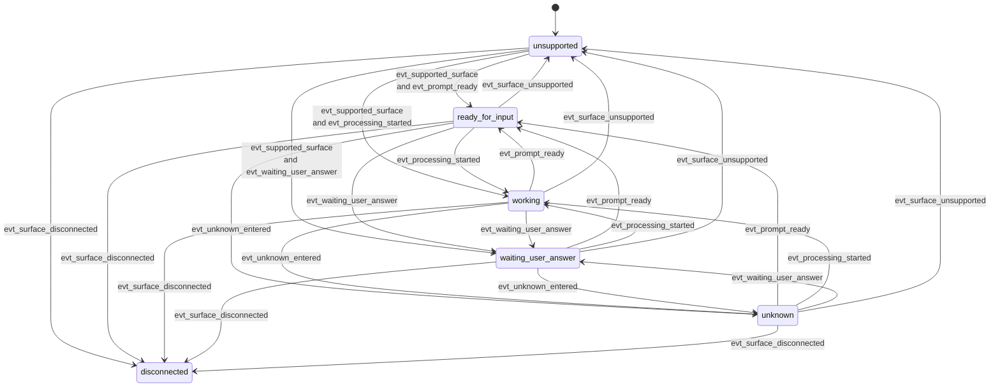
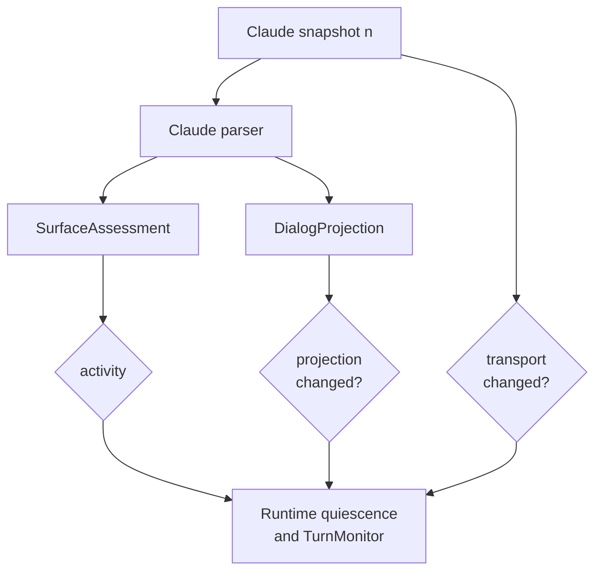

# Claude Code State Contracts

## Purpose

This note defines the Claude Code parser-state contract for the `add-shadow-output-quiescence-monitor` change.

It focuses on:

- how Claude snapshot states are defined,
- which transition facts the Claude parser may emit across ordered snapshots,
- how those facts relate to runtime-owned quiescence handling, and
- which claims Claude parsing must not make.

It intentionally does **not** define quiet-window timing or submit/completion lifecycle as parser-owned behavior.

## Design Position

The core design assumption is:

> Claude parsing owns one-snapshot interpretation. Runtime owns time-based quiescence and submit-aware lifecycle.

Claude parsing therefore owns:

- version-aware output-family detection,
- snapshot normalization,
- single-snapshot `SurfaceAssessment`,
- single-snapshot `DialogProjection`,
- parser metadata and anomalies.

Claude parsing does **not** own:

- restartable quiet-window timers,
- deciding that a ready-looking prompt is settled enough to submit immediately,
- deciding that a post-submit ready prompt is complete without runtime quiescence guards,
- prompt-to-answer association for the most recent turn.

## Ownership Boundary

| Layer | Owns | Must not own |
|-------|------|--------------|
| `ClaudeCodeShadowParser` | one-snapshot Claude state/projection | quiet-window timing |
| Runtime quiescence layer | tmux change detection and quiet timers | provider regexes and Claude syntax |
| Runtime `TurnMonitor` | submit-aware lifecycle and terminality | provider parsing details |

The important boundary for this change is:

- Claude parser can say `ready_for_input`.
- Runtime decides whether that ready surface has been quiet long enough to count as settled readiness or settled completion.

## Normalized Inputs

The parser contract is defined over:

- `T_n`: normalized ANSI-stripped snapshot text at observation `n`
- `P_n`: projected dialog text derived from `T_n`
- `V`: resolved Claude parser preset version
- `W(T_n)`: provider-aware tail/status window used for state detection

Runtime may derive additional quiescence facts from the same observations:

- `transport_changed(n)`: whether normalized snapshot content changed between `T_(n-1)` and `T_n`
- `projection_changed(n)`: whether projected dialog changed between `P_(n-1)` and `P_n`

Those change facts are runtime-owned even though they are computed from parser outputs.

## State Model

Claude binds the shared state contract with these values:

### `availability`

Allowed values:

- `supported`
- `unsupported`
- `disconnected`
- `unknown`

### `activity`

Allowed values:

- `ready_for_input`
- `working`
- `waiting_user_answer`
- `unknown`

### `ui_context`

Allowed values:

- `normal_prompt`
- `selection_menu`
- `slash_command`
- `trust_prompt`
- `error_banner`
- `unknown`

### `accepts_input`

`accepts_input=true` only when:

- `availability=supported`,
- `activity=ready_for_input`, and
- no blocking Claude context such as selection/trust UI applies.

For this change, `accepts_input=true` means “Claude looks safe,” not “runtime must submit immediately.”

## Version-Bound Detection Predicates

Each Claude preset version `V` supplies concrete detectors for these placeholders.

| Placeholder | Meaning |
|-------------|---------|
| `SUPPORTED_OUTPUT_FAMILY(V)` | Snapshot matches a supported Claude TUI family |
| `IDLE_PROMPT_LINE(V)` | Snapshot shows a Claude prompt that is input-ready |
| `PROCESSING_SPINNER_LINE(V)` | Snapshot shows Claude actively processing |
| `WAITING_MENU_BLOCK(V)` | Snapshot shows a user-choice menu |
| `TRUST_PROMPT_BLOCK(V)` | Snapshot shows trust/approval UI |
| `SLASH_COMMAND_CONTEXT(V)` | Snapshot shows active slash-command UI |
| `ERROR_BANNER_BLOCK(V)` | Snapshot shows Claude-side error UI |
| `DISCONNECTED_SIGNAL(V)` | Snapshot shows detachment/loss of terminal |
| `DIALOG_LINE_KEEP(V)` | Line stays in projected dialog |
| `DIALOG_LINE_DROP(V)` | Line is Claude chrome and should be dropped |

## State Priority

When multiple detectors fire, evaluation priority is:

1. `disconnected`
2. `unsupported`
3. `waiting_user_answer`
4. `working`
5. `ready_for_input`
6. `unknown`

## Transition Events

Claude parser transitions are defined across ordered snapshots.

| Event | Detection |
|-------|-----------|
| `evt_supported_surface` | `availability` becomes `supported` |
| `evt_surface_unsupported` | `availability` becomes `unsupported` |
| `evt_surface_disconnected` | `availability` becomes `disconnected` |
| `evt_processing_started` | `activity` changes to `working` |
| `evt_prompt_ready` | `activity` changes to `ready_for_input` and `accepts_input=true` |
| `evt_waiting_user_answer` | `activity` changes to `waiting_user_answer` |
| `evt_unknown_entered` | `activity` changes to `unknown` while `availability=supported` |
| `evt_context_changed` | `ui_context` changes between snapshots |
| `evt_projection_changed` | projected dialog text changes between snapshots |

## Parser Transition Graph

## Quiescence Boundary

This change adds a strict runtime boundary around Claude parser transitions:

- `evt_prompt_ready` means the Claude surface now looks ready.
- It does **not** mean the runtime may submit or complete immediately.
- Runtime waits for tmux-output quiescence before treating a ready surface as settled.

Runtime derives these additional facts from ordered Claude observations:

| Runtime Fact | Meaning |
|--------------|---------|
| `evt_transport_changed` | normalized Claude snapshot changed |
| `evt_ready_quiet_elapsed` | no new transport change for `ready_quiet_window_seconds` |
| `evt_completion_quiet_elapsed` | no new transport change for `completion_quiet_window_seconds` |

So the runtime contract becomes:

- parser `ready_for_input` is a ready candidate,
- parser `working` is progress evidence,
- parser `waiting_user_answer` is blocking evidence,
- quiescence determines when those parser facts are stable enough to drive readiness/completion transitions.

## Parser-To-Runtime Hand-off

## Dialog Projection Responsibility

Claude dialog projection should:

- preserve visible user/assistant dialog in order,
- remove Claude prompt-only lines, spinners, separators, and other chrome,
- provide `head` and `tail` slices,
- record projection provenance and anomalies.

Claude dialog projection should not:

- decide whether projected text is the authoritative answer for the current prompt,
- encode quiet-window timing,
- treat historical visible content as proof of current-turn causality.

## What This Contract Must Not Claim

The Claude parser contract must not claim:

- that `ready_for_input` by itself is idle enough for runtime action,
- that stable readiness can be inferred without repeated snapshots,
- that projected dialog belongs uniquely to the latest prompt,
- that quiescence is provider-specific rather than runtime-owned.
