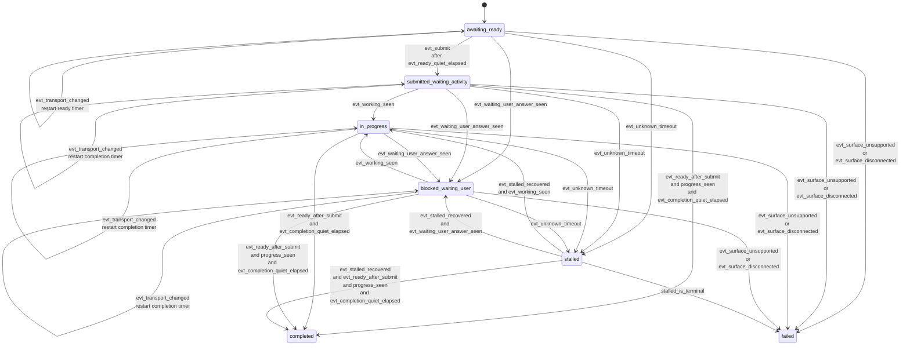
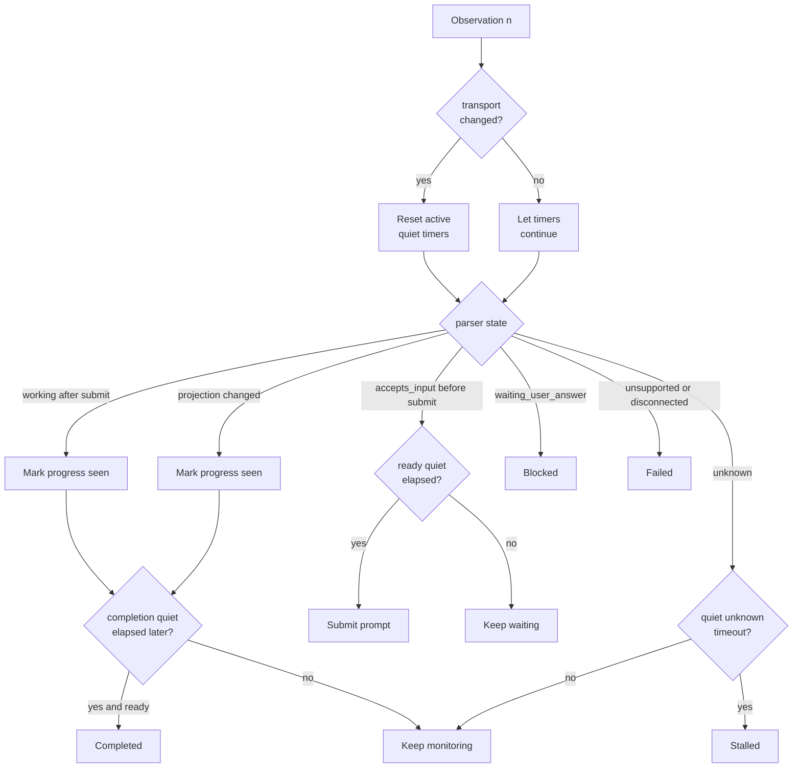

# TurnMonitor Contracts

## Purpose

This note defines the runtime-owned `TurnMonitor` contract for `shadow_only` CAO turns in the `add-shadow-output-quiescence-monitor` change.

It focuses on:

- how runtime derives lifecycle from ordered parser observations,
- how tmux-output quiescence changes readiness, completion, and stalled handling,
- which transition events are runtime-owned, and
- which states are terminal, blocking, or recoverable.

## Ownership Boundary

> Provider parsers classify snapshots. Runtime `TurnMonitor` interprets snapshot sequences plus quiescence timing.

The parser owns:

- one-snapshot `SurfaceAssessment`,
- one-snapshot `DialogProjection`,
- provider-specific unsupported/disconnected detection,
- parser metadata and anomalies.

`TurnMonitor` owns:

- pre-submit readiness,
- post-submit lifecycle,
- quiescence timers,
- unknown-to-stalled timing,
- success terminality,
- runtime anomalies and diagnostics.

`TurnMonitor` does **not** own:

- provider-specific regexes,
- parser preset selection,
- prompt-to-answer association.

## Inputs

`TurnMonitor` evaluates an ordered stream of observations:

- `submit_time` once a prompt is sent,
- `SurfaceAssessment_n`,
- `DialogProjection_n`,
- `transport_changed(n)` derived from normalized tmux snapshot comparison,
- `projection_changed(n)` derived from projected dialog comparison,
- effective shadow timing policy:
  - `ready_quiet_window_seconds`,
  - `completion_quiet_window_seconds`,
  - `unknown_to_stalled_timeout_seconds`,
  - `stalled_is_terminal`.

It also maintains turn-local memory:

- `saw_working_after_submit`,
- `saw_projection_change_after_submit`,
- `last_transport_change_at`,
- `last_unknown_change_at`,
- `baseline_projection`,
- `anomalies`.

## Runtime Lifecycle States

The runtime lifecycle state machine is:

- `awaiting_ready`
- `submitted_waiting_activity`
- `in_progress`
- `blocked_waiting_user`
- `stalled`
- `completed`
- `failed`

These are runtime states, not parser states.

## Runtime Events

| Event | Detection |
|-------|-----------|
| `evt_transport_changed` | normalized tmux snapshot changed between ordered observations |
| `evt_ready_quiet_elapsed` | no new transport change for `ready_quiet_window_seconds` while `accepts_input=true` |
| `evt_submit` | runtime sends terminal input after ready quiet has elapsed |
| `evt_working_seen` | post-submit `SurfaceAssessment.activity=working` |
| `evt_waiting_user_answer_seen` | post-submit `SurfaceAssessment.activity=waiting_user_answer` |
| `evt_projection_changed` | post-submit projected dialog differs from the pre-submit baseline or later observation |
| `evt_ready_after_submit` | post-submit `accepts_input=true` |
| `evt_completion_quiet_elapsed` | no new transport change for `completion_quiet_window_seconds` after post-submit progress evidence |
| `evt_unknown_timeout` | unknown remains active without intervening transport change for `unknown_to_stalled_timeout_seconds` |
| `evt_stalled_recovered` | a known non-stalled state is observed after stalled tracking was active |
| `evt_surface_unsupported` | `availability=unsupported` |
| `evt_surface_disconnected` | `availability=disconnected` |

## Terminality Contract

Success terminality is intentionally stronger than “the parser says ready.”

After submit, runtime SHALL treat a turn as success-terminal only when all of these are true:

- the current surface accepts input again,
- runtime has observed at least one post-submit progress signal:
  - `evt_projection_changed`, or
  - `evt_working_seen`,
- no new transport change has occurred for `completion_quiet_window_seconds`.

This rule prevents early completion when the UI briefly looks ready while output is still changing.

## Quiescence Contract

Quiescence is runtime-owned and restartable:

- any `evt_transport_changed` before a quiet-window threshold is reached restarts the active quiet countdown,
- readiness quiescence and completion quiescence are separate windows,
- unknown-to-stalled timing also restarts when new transport change is observed during `unknown`.

This means:

- `ready_for_input` is a ready candidate, not settled readiness by itself,
- `unknown` with ongoing output churn is active-but-unclassified, not stalled,
- stalled represents quiet unknown, not merely long unknown with visible activity.

## Failure And Blocking Contract

Runtime SHALL interpret parser states this way:

- `waiting_user_answer` -> `blocked_waiting_user`
- `unsupported` -> `failed`
- `disconnected` -> `failed`
- quiet `unknown` beyond timeout -> `stalled`
- `stalled` with `stalled_is_terminal=true` -> `failed`
- `stalled` with `stalled_is_terminal=false` -> keep polling for recovery until outer timeout or known state

`blocked_waiting_user` is not success-terminal and is not equivalent to completion.

## Transition Graph

## Quiescence Evaluation Flow

## Result Surface Contract

When `TurnMonitor` reaches successful completion for `shadow_only`, runtime surfaces:

- `dialog_projection`,
- `surface_assessment`,
- parser/runtime provenance metadata,
- effective timing diagnostics,
- anomalies.

It does **not** surface a shadow-mode `output_text` compatibility alias, and it does **not** claim that projected dialog is the authoritative answer to the submitted prompt.
