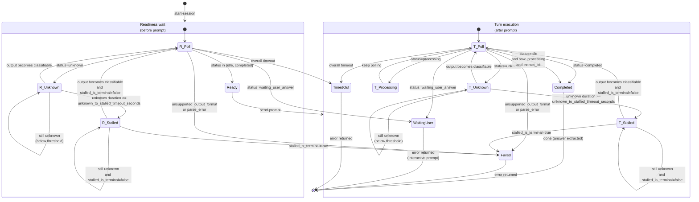

## Context

`brain_launch_runtime` currently builds fresh tool homes and launches sessions across `codex_app_server` and `cao_rest`. For Codex CAO flows, trust-prompt suppression is still partially handled by demo-only post-build edits instead of runtime-owned launch behavior, so real launches can still require interactive user confirmation.

Shadow parsing already has explicit unsupported-format failures, but when output remains recognizable yet not classifiable into known activity states, runtime behavior collapses into generic polling timeout without a first-class stalled lifecycle. This makes operator diagnosis harder and conflates true failures with temporary unrecognized busy UI states.

This change is cross-cutting across launch bootstrap, shadow parser contracts, CAO polling behavior, metadata, tests, and troubleshooting docs.

## Goals / Non-Goals

**Goals:**
- Ensure Codex runtime homes are bootstrapped for non-interactive orchestrated use at launch time, not only in demo scripts.
- Introduce explicit `unknown` and `stalled` shadow lifecycle behavior with configurable unknown-to-stalled timeout.
- Support configurable stalled terminality:
  - terminal mode: fail immediately on stalled,
  - non-terminal mode: continue periodic polling and allow automatic recovery.
- Preserve explicit `unsupported_output_format` failure behavior for truly unsupported variants.
- Document operations and troubleshooting under `docs/reference`.

**Non-Goals:**
- Removing existing global turn timeout safeguards.
- Adding parser-family mixing or automatic fallback from `shadow_only` to `cao_only` within a turn.
- Reworking Gemini parser architecture.
- Introducing a background daemon/watcher outside active turn loops.

## Decisions

### 1) Add runtime-owned Codex bootstrap helper for `config.toml`
- Decision:
  - Add a Codex bootstrap helper (parallel to Claude bootstrap pattern) and invoke it in both Codex launch paths before tool start.
  - Helper is idempotent and only patches runtime-home config state required for non-interactive orchestration.
  - Bootstrap is policy-driven: always seed launch-context trust and required notice state; only apply `approval_policy` / `sandbox_mode` defaults when explicitly present in the selected Codex config profile (do not hardcode new defaults in runtime).
- Rationale:
  - Eliminates drift between demos and real runtime behavior.
  - Keeps policy in one place instead of shell-script postprocessing.
- Alternative considered:
  - Static config profile only. Rejected because trust entry is workdir-dependent and must be resolved at launch.

### 2) Resolve trust target deterministically from launch context
- Decision:
  - Resolve trust target from launch working directory using repository root when discoverable, otherwise the explicit workdir.
  - Seed `[projects."<resolved-path>"] trust_level = "trusted"` in runtime home config.
- Rationale:
  - Matches Codex trust behavior and avoids prompt loops for the active workspace.
- Alternative considered:
  - Trust only exact cwd path always. Rejected due weaker stability when CLI resolves project roots.

### 3) Keep unsupported format as explicit parse error; add separate unknown/stalled lifecycle
- Decision:
  - Continue treating unsupported format as `unsupported_output_format` error.
  - Add `unknown` for recognized-format snapshots that cannot be safely classified.
  - Promote to runtime `stalled` when `unknown` duration crosses threshold.
- Rationale:
  - Preserves fail-fast drift detection while adding visibility for ambiguous but potentially recoverable states.
- Alternative considered:
  - Replace unsupported-format with unknown. Rejected because unsupported format should remain explicit and actionable.

### 4) Make stalled terminality configurable, default non-terminal
- Decision:
  - Add `stalled_is_terminal` config.
  - Default behavior keeps stalled non-terminal (`false`), continues polling, and allows transition back to known states.
  - Existing overall turn timeout remains hard stop.
- Rationale:
  - Supports real-world cases where TUI is busy in transient unrecognized states and later recovers.
- Alternative considered:
  - Always terminal stalled. Rejected as too aggressive for transient parser blind spots.

### 5) Add explicit shadow stall policy config under runtime CAO settings
- Decision:
  - Add runtime configuration keys:
    - `runtime.cao.shadow.unknown_to_stalled_timeout_seconds` (default: 30; applies to both readiness and completion polling)
    - `runtime.cao.shadow.stalled_is_terminal` (default: false)
  - Wire these through launch-plan metadata into CAO session behavior.
- Rationale:
  - Keeps policy explicit, per-brain configurable, and observable.
- Alternative considered:
  - Hardcoded constants only. Rejected due operational tuning needs.

### 6) Surface stall lifecycle in parser metadata and errors
- Decision:
  - Emit metadata/anomaly fields for unknown/stalled entry, elapsed unknown duration, and recovery events.
  - Use dedicated anomaly codes for stalled lifecycle transitions:
    - `stalled_entered` (include `phase={readiness|completion}`, `elapsed_unknown_seconds`, `parser_family`)
    - `stalled_recovered` (include `phase={readiness|completion}`, `elapsed_stalled_seconds`, `parser_family`, `recovered_to`)
  - When terminal stalled mode triggers failure, include parser family/status and tail excerpt in error.
- Rationale:
  - Enables actionable troubleshooting and better incident triage.

## External Status Lifecycle (Caller View)

This diagram describes the caller-visible status lifecycle when using CAO in `parsing_mode=shadow_only`.

## Risks / Trade-offs

- [Risk] Over-eager trust seeding may reduce safeguards in unexpected directories.
  - Mitigation: restrict to runtime-selected working directory resolution path; document behavior and override knobs.

- [Risk] Non-terminal stalled mode may delay explicit failure and increase turn latency.
  - Mitigation: keep global turn timeout as hard cap; expose unknown-to-stalled threshold tuning.

- [Risk] Unknown classification may be too permissive or too strict across providers.
  - Mitigation: add fixture coverage for transient unknown, stalled transition, and recovery for Codex and Claude.

- [Risk] Additional config keys can drift if not validated.
  - Mitigation: parse/validate in launch/runtime boundary and fail fast on invalid types/ranges.

## Migration Plan

1. Add Codex bootstrap helper and hook into Codex runtime launch paths.
2. Add shadow status contract updates (`unknown`, `stalled`) and runtime stall tracking in CAO shadow polling loops.
3. Add runtime config plumbing for stall policy and defaults.
4. Update metadata/error payloads and troubleshooting docs.
5. Add tests for:
   - Codex bootstrap config projection,
   - unknown->stalled transition,
   - non-terminal stalled recovery to known states,
   - terminal stalled failure mode.
6. Rollout notes:
   - default non-terminal stalled mode with existing global timeout retained,
   - operators can set terminal stalled mode during incidents requiring fail-fast behavior.

Rollback:
- Disable stalled behavior by setting large threshold and/or force terminal behavior,
- or revert to pre-change status mapping while preserving unsupported-format fail-fast.

## Open Questions

- (none) Resolved via `discuss/discuss-20260303-183220.md` and captured above as explicit decisions/defaults.
