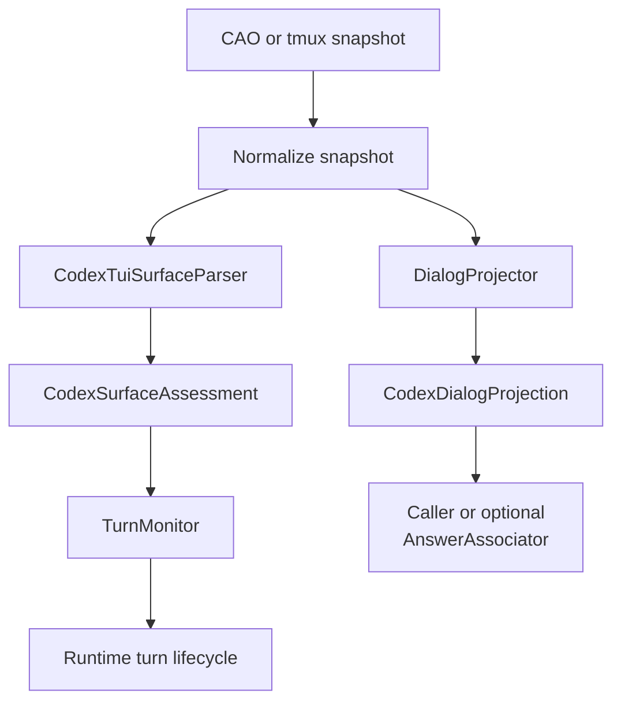
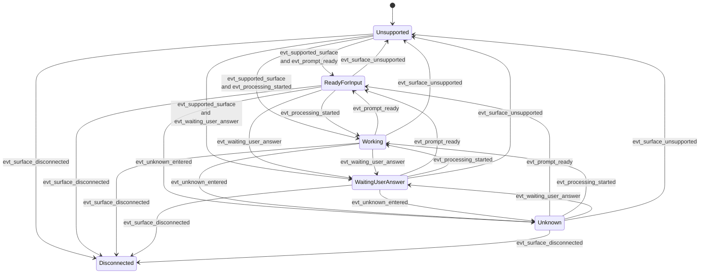

# Codex State Contracts

## Purpose

This note defines the proposed Codex TUI state contract for the `decouple-shadow-state-from-answer-association` change.

It focuses on:

- how Codex TUI states are defined,
- how those states are detected from CAO/tmux snapshots,
- how state transitions are interpreted over time, and
- which architecture layer is responsible for which concern.

It intentionally does **not** define generic prompt-to-answer association as part of the core shadow parser contract.

## Design Position

The core design assumption is:

> Reliable prompt-to-answer association from raw Codex TUI snapshots is not a stable provider-parser guarantee.

The parser therefore owns:

- provider-aware snapshot normalization,
- version-aware output-family detection,
- surface-state assessment,
- dialog projection, and
- diagnostics/anomalies.

The parser does **not** own:

- proving that projected dialog is the authoritative answer for the most recent prompt,
- separating current-turn answer text from all historical visible content,
- task-specific or prompt-specific output interpretation.

## Shared Model Binding

This document defines the Codex-specific binding of the shared frozen value-object contract:

- `SurfaceAssessment` is the shared base shape.
- `CodexSurfaceAssessment` is the Codex-specific subclass that refines `ui_context` and Codex evidence.
- `DialogProjection` is the shared base shape.
- `CodexDialogProjection` is the Codex-specific subclass that refines projection evidence/metadata.

The shared base model and subclassing rules are defined in the change design and in the `versioned-shadow-parser-stack` / `shadow-dialog-projection` delta specs. This document focuses on how Codex populates those fields.

## Layered Architecture

| Layer | Owns | Must not own |
|-------|------|--------------|
| `CodexTuiSurfaceParser` | version-aware state detection from one snapshot | prompt-specific answer association |
| `DialogProjector` | stripping ANSI/TUI chrome and preserving essential dialog content | deciding which projected text is "the answer" |
| `TurnMonitor` | runtime lifecycle over multiple snapshots, including readiness, working, blocked, and completion-like terminality | parsing provider-specific TUI syntax directly |
| `AnswerAssociator` | caller-specific or optional prompt-to-answer association heuristics | provider-owned TUI state detection |

## Normalized Inputs

The state contract is defined over:

- `T`: normalized ANSI-stripped snapshot text
- `V`: resolved parser preset version
- `W(T)`: bounded provider-aware window used for state classification
- `t_n`: observation time for snapshot `T_n`

The parser contract should depend on named version-bound predicates rather than hard-coded regexes in the spec.

## Version-Bound Detection Predicates

Each Codex preset version `V` supplies concrete detectors for the following placeholders.

| Placeholder | Meaning |
|-------------|---------|
| `SUPPORTED_OUTPUT_FAMILY(V)` | Snapshot shape is recognized as a supported Codex output family |
| `CODEX_IDLE_PROMPT(V)` | A line proves Codex is at an input-ready prompt |
| `CODEX_PROCESSING_SIGNAL(V)` | A line proves Codex is actively working |
| `CODEX_SELECTION_MENU(V)` | Snapshot contains a selection menu requiring user action |
| `CODEX_APPROVAL_PROMPT(V)` | Snapshot contains an approval/trust prompt rather than normal prompt flow |
| `CODEX_SLASH_COMMAND_CONTEXT(V)` | Snapshot shows Codex inside slash-command or command-palette style UI |
| `CODEX_LABEL_ASSISTANT_LINE(V)` | Snapshot contains supported label-style assistant transcript output |
| `CODEX_TUI_BULLET_LINE(V)` | Snapshot contains supported TUI-style assistant bullet output |
| `CODEX_ERROR_BANNER(V)` | Snapshot indicates a visible Codex-side error state |
| `DISCONNECTED_SIGNAL(V)` | Snapshot indicates connection loss or terminal detachment |
| `DIALOG_LINE_KEEP(V)` | A visible line should be preserved in dialog projection |
| `DIALOG_LINE_DROP(V)` | A visible line is TUI chrome and should be dropped from dialog projection |

These predicates may be implemented with regexes, structural matchers, or mixed logic, but the contract should name the predicates rather than embedding concrete regex syntax into the state definition itself.

## State Model

The proposed model separates surface concerns into four dimensions.

### 1. `availability`

Allowed values:

- `supported`
- `unsupported`
- `disconnected`
- `unknown`

Detection rules:

- `supported` when `SUPPORTED_OUTPUT_FAMILY(V)` is true and no stronger unavailability condition applies
- `unsupported` when `SUPPORTED_OUTPUT_FAMILY(V)` is false
- `disconnected` when `DISCONNECTED_SIGNAL(V)` is true
- `unknown` when the parser cannot safely determine support or liveness

### 2. `activity`

Allowed values:

- `ready_for_input`
- `working`
- `waiting_user_answer`
- `unknown`

Detection rules:

- `waiting_user_answer` when `CODEX_SELECTION_MENU(V)` or `CODEX_APPROVAL_PROMPT(V)` is true
- `working` when `CODEX_PROCESSING_SIGNAL(V)` is true and no higher-priority blocking condition applies
- `ready_for_input` when `CODEX_IDLE_PROMPT(V)` is true and no higher-priority state applies
- `unknown` otherwise

### 3. `ui_context`

`ui_context` uses the shared base vocabulary and Codex-specific extensions.

Allowed values:

- `normal_prompt`
- `selection_menu`
- `slash_command`
- `approval_prompt`
- `error_banner`
- `unknown`

Detection rules:

- `selection_menu` when `CODEX_SELECTION_MENU(V)` is true
- `slash_command` when `CODEX_SLASH_COMMAND_CONTEXT(V)` is true
- `approval_prompt` when `CODEX_APPROVAL_PROMPT(V)` is true
- `error_banner` when `CODEX_ERROR_BANNER(V)` is true
- `normal_prompt` when input-ready or working evidence is present without a stronger context
- `unknown` otherwise

### 4. `accepts_input`

Allowed values:

- `true`
- `false`

Detection rules:

- `true` when `availability=supported`, `activity=ready_for_input`, and no blocking `ui_context` applies
- `false` otherwise

## State Definitions In Contract Form

### State: `ready_for_input`

`ready_for_input` holds when all of the following are true:

- `availability = supported`
- `CODEX_IDLE_PROMPT(V)` is present in `W(T)`
- `CODEX_SELECTION_MENU(V)` is false
- `CODEX_APPROVAL_PROMPT(V)` is false
- `CODEX_PROCESSING_SIGNAL(V)` is false

Contract meaning:

- Codex appears idle and interactive
- runtime may submit the next prompt

### State: `working`

`working` holds when all of the following are true:

- `availability = supported`
- `CODEX_PROCESSING_SIGNAL(V)` is present in `W(T)`
- no blocking higher-priority UI state applies

Contract meaning:

- Codex is actively processing or generating
- runtime should keep monitoring

### State: `waiting_user_answer`

`waiting_user_answer` holds when all of the following are true:

- `availability = supported`
- `CODEX_SELECTION_MENU(V)` or `CODEX_APPROVAL_PROMPT(V)` is true

Contract meaning:

- Codex requires explicit human choice or approval
- runtime must not treat the turn as generically complete

### State: `unknown`

`unknown` holds when all of the following are true:

- `availability = supported`
- none of `ready_for_input`, `working`, or `waiting_user_answer` hold

Contract meaning:

- the snapshot is still recognized as supported Codex output
- but it lacks sufficient safe evidence for a stronger activity state

### State: `unsupported`

`unsupported` holds when:

- `SUPPORTED_OUTPUT_FAMILY(V)` is false

Contract meaning:

- parser/version contract does not recognize the snapshot
- the runtime should fail explicitly instead of guessing

### State: `disconnected`

`disconnected` holds when:

- `DISCONNECTED_SIGNAL(V)` is true

Contract meaning:

- the runtime should treat the TUI surface as unavailable
- this is distinct from merely being `unknown`

## State Priority

When multiple detectors fire, evaluation priority should be:

1. `disconnected`
2. `unsupported`
3. `waiting_user_answer`
4. `working`
5. `ready_for_input`
6. `unknown`

## Transition Events

State transitions are not defined from one snapshot alone; they are defined from changes across ordered snapshots.

| Event | Detection |
|-------|-----------|
| `evt_supported_surface` | `availability` becomes `supported` |
| `evt_surface_unsupported` | `availability` becomes `unsupported` |
| `evt_surface_disconnected` | `availability` becomes `disconnected` |
| `evt_processing_started` | `activity` changes to `working` |
| `evt_prompt_ready` | `activity` changes to `ready_for_input` and `accepts_input=true` |
| `evt_waiting_user_answer` | `activity` changes to `waiting_user_answer` |
| `evt_unknown_entered` | `activity` changes to `unknown` while `availability=supported` |
| `evt_context_changed` | `ui_context` changes between two snapshots |
| `evt_projection_changed` | `DialogProjection.dialog_text` changes between two snapshots |

## Transition Interpretation

The parser owns transition **detection inputs**, while runtime owns transition **meaning for turn lifecycle**.

The parser can legitimately say:

- the surface changed from `working` to `ready_for_input`
- the UI moved from `normal_prompt` to `slash_command`
- the UI moved from `normal_prompt` to `approval_prompt`
- the snapshot became `unsupported`
- the projected dialog changed or did not change

The parser should not decide that a visible answer belongs to the current prompt.

## Transition Graph

## Dialog Projection Responsibility

`DialogProjector` should:

- preserve supported label-style and TUI-style assistant/user dialog lines,
- remove prompt/footer/spinner chrome using version-bound projection rules,
- provide `head` and `tail` slices,
- preserve ordering, and
- record which projection rules were applied.

`DialogProjector` should not:

- infer prompt-specific answer ownership,
- remove all historical dialog content,
- promise separation of current-turn vs prior-turn visible text.
