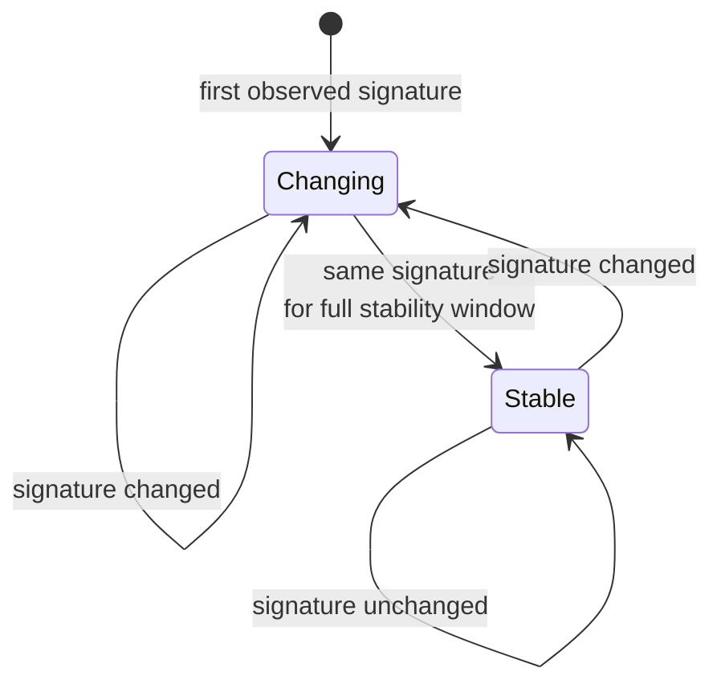
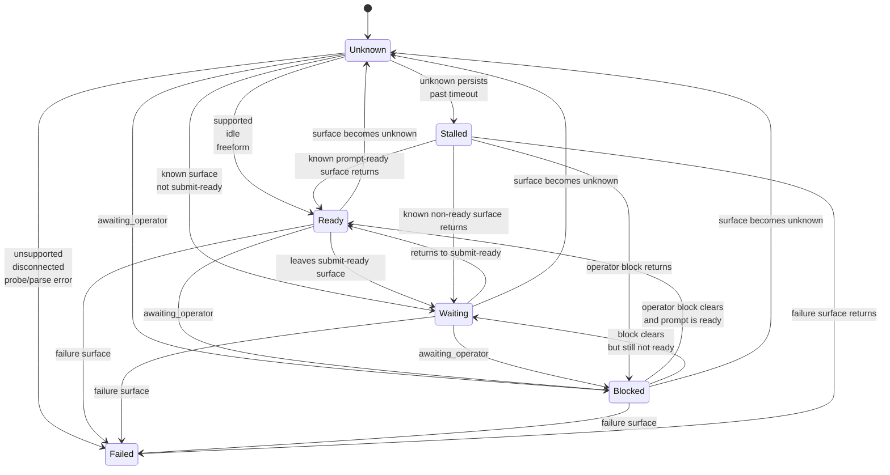
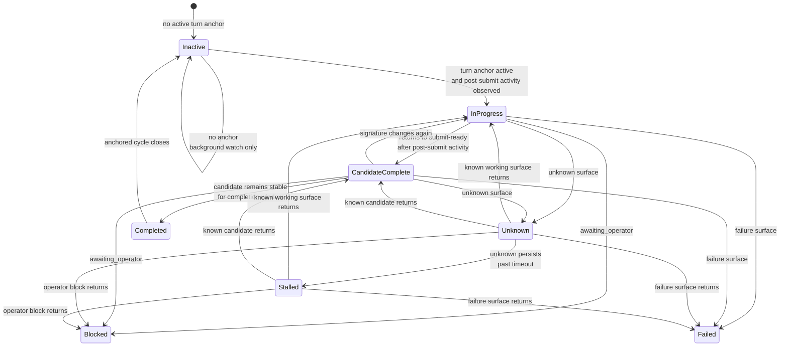

# State Tracking Logics

## Purpose

This note explains the state-tracking logic proposed by [proposal.md](/data1/huangzhe/code/houmao/openspec/changes/fix-houmao-server-rx-lifecycle-tracking/proposal.md) and [design.md](/data1/huangzhe/code/houmao/openspec/changes/fix-houmao-server-rx-lifecycle-tracking/design.md).

The core idea is that `houmao-server` should not use one reducer to answer every question about a live TUI. We have at least two different questions:

1. Is the visible TUI surface changing over time?
2. Is the current TUI surface semantically ready for input?

Those questions use the same ordered observation stream, but they are not the same state machine.

## One Observation Stream, Two State Layers

The server worker still owns tmux/process/parser polling. Each poll produces one ordered observation:

- transport facts
- process facts
- parse status
- parsed surface axes such as `availability`, `business_state`, `input_mode`, and `ui_context`
- normalized projection key or hash

That observation stream is then reduced into two different layers:

```text
ordered observations
    |
    +--> visible-signature layer  -> changing / stable
    |
    +--> semantic readiness layer -> ready / waiting / blocked / failed / unknown / stalled
    |
    +--> anchored completion layer -> only when a real turn anchor exists
```

The first two layers are always present. The completion layer is only authoritative when the server owns a real turn anchor.

## Layer 1: Visible TUI Change Tracking

This layer answers a mechanical question:

> Has the operator-visible TUI signature changed?

It does not answer whether the tool is safe to submit into. It only answers whether the visible surface is still moving.

### Inputs

The layer derives a visible signature from operator-relevant fields, for example:

- transport/process/parse status
- readiness/completion summary fields
- `business_state`
- `input_mode`
- `ui_context`
- blocked-vs-not-blocked
- normalized projection key or its hash

### Logic

- if the signature changes, the layer resets `stable_since`
- if the signature stays the same, the layer accumulates `stable_for_seconds`
- if the unchanged duration crosses the configured threshold, the state becomes `stable`
- any later signature change returns the state to `changing`

This is a descriptive layer. It is useful for:

- operator dashboards
- flicker smoothing
- “wait until quiet” policies
- explaining why a session is still moving even if it already looks typeable

### Mermaid State Diagram



## Layer 2: Semantic Readiness Tracking

This layer answers a semantic question:

> Is the current surface ready for the next input?

This is where the parser axes matter. The design keeps the same submit-ready predicate used by CAO runtime semantics:

- `availability = supported`
- `business_state = idle`
- `input_mode = freeform`

Only then is the TUI truly `ready`.

### Readiness States

- `ready`
  - supported, idle, freeform
- `waiting`
  - known surface, but not yet ready for submission
- `blocked`
  - explicit operator intervention required, such as `awaiting_operator`
- `failed`
  - unsupported, disconnected, probe error, or parse failure
- `unknown`
  - the surface is not classifiable enough to trust
- `stalled`
  - unknown persisted across the configured timeout

### Logic

This layer is normative. Controllers can use it to decide whether input is allowed.

- ready is driven by semantic surface classification, not by quietness
- stalled is driven by overtime unknown behavior, not by one bad sample
- recovery from stalled happens when a later known observation arrives

### Mermaid State Diagram



## Why These Two Layers Must Stay Separate

The key rule is:

- `stable` does not imply `ready`
- `ready` does not imply `stable`

Examples:

- `ready + changing`
  - the prompt is back, but footer chrome or tip banners are still moving
- `waiting + stable`
  - a slash-command surface or modal surface is sitting still, but the tool is not ready
- `blocked + stable`
  - the tool is calmly waiting for approval
- `unknown + changing`
  - the surface is redrawing and the parser cannot classify it yet

If we collapse these questions into one reducer, we lose precision and start inventing unsafe shortcuts such as “it looks stable, so it must be ready” or “it looks ready again, so it must be completed.”

## Completion Is A Third Derived Layer

Completion is not the same as either of the first two layers.

Completion asks:

> Did a specific anchored turn show post-submit activity and then return to a stable submit-ready surface?

That question only makes sense when the server owns a real anchor, such as a server-accepted input submission. Without an anchor, the background watcher may still report:

- changing vs stable
- ready vs waiting vs blocked vs unknown vs stalled

But it must not manufacture authoritative `candidate_complete` or `completed` from ready-surface churn alone.

### Mermaid State Diagram



## Proposed Reduction Model

The new design therefore reduces the same observation stream in layers:

1. **Visible-signature stability layer**
   - mechanical
   - “is it changing?”
2. **Semantic readiness layer**
   - normative
   - “is it safe to submit?”
3. **Anchored completion layer**
   - only active with a real turn anchor
   - “did this anchored turn complete?”

ReactiveX is the correct timing substrate for all overtime logic in these layers because the logic depends on:

- elapsed quiet periods
- timeout and recovery
- signature changes over time
- resettable debounce windows

Those are exactly the semantics that previously justified the Rx move in CAO runtime.

## Practical Interpretation For Clients

Clients should read the layers like this:

- use readiness to decide whether input is allowed
- use stability to decide whether the current visible surface has settled
- use completion only when lifecycle authority says the state is `turn_anchored`

That means a future client policy can be explicit instead of heuristic:

```text
allow submit when:
    readiness == ready

allow "safe and quiet" submit when:
    readiness == ready
    AND stability == stable

treat completion as authoritative only when:
    completion_authority == turn_anchored
```

This separation is the main reason the new design avoids both false completion on startup churn and missed fast-turn behavior in submit-blind background watch.
