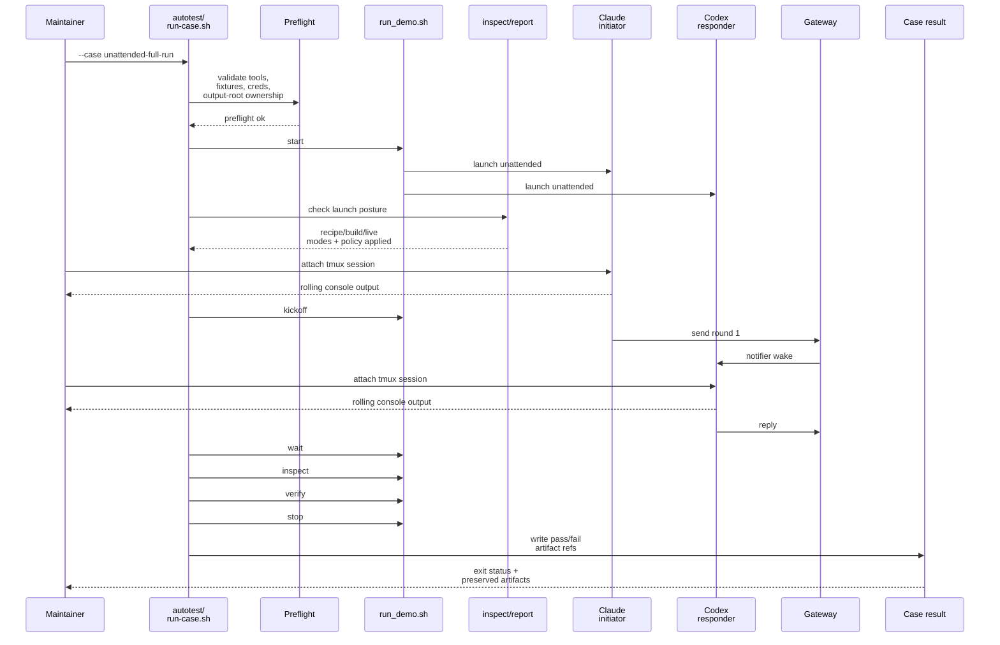

# Testplan: `unattended-full-run`

Status: pre-implementation design artifact for change `preserve-mail-ping-pong-operator-prompt-mode`.

This file is a design-phase artifact. The final implemented `scripts/demo/mail-ping-pong-gateway-demo-pack/autotest/case-unattended-full-run.md` should be treated as an operator-facing companion for the shipped case, and it does not need to match this design text line by line.

## Intended Implemented Assets

- `scripts/demo/mail-ping-pong-gateway-demo-pack/autotest/run-case.sh`
- `scripts/demo/mail-ping-pong-gateway-demo-pack/autotest/case-unattended-full-run.sh`
- `scripts/demo/mail-ping-pong-gateway-demo-pack/autotest/case-unattended-full-run.md`
- `scripts/demo/mail-ping-pong-gateway-demo-pack/autotest/helpers/`

## Goal

Drive one full unattended mail ping-pong demo run with the actual local `claude` and `codex` executables, prove that the tracked unattended operator prompt mode survives from recipe through live launch, and preserve the resulting demo artifacts so the next real blocker remains inspectable if the run fails after startup. When an operator attaches to a live participant tmux session, the pane should show rolling console output from the active CLI execution.

## Preconditions

- `pixi`, `git`, `tmux`, `claude`, and `codex` are installed and resolvable on `PATH`.
- The tracked parameter file and tracked ping-pong recipe files are present and readable.
- The tracked config and credential roots referenced by those recipes are present and readable enough for a real local launch.
- The selected `<demo-output-dir>` is either absent or owned by this case so the harness can stop or clean stale demo-owned state before reuse.

## Intended Runner Surface

```bash
scripts/demo/mail-ping-pong-gateway-demo-pack/autotest/run-case.sh \
  --case unattended-full-run \
  [--demo-output-dir <path>]
```

The implemented `case-unattended-full-run.sh` script should provide the pack-owned shell steps that `autotest/run-case.sh --case unattended-full-run` dispatches to. Shared helper functions needed by this case should live under `autotest/helpers/`.

Default output root:

```text
.agent-automation/hacktest/mail-ping-pong-gateway-demo-pack/live/demo-output
```

## Sequence Diagram



## Ordered Steps

1. Run preflight and fail immediately if any required command, tracked fixture input, or tracked credential/config root is missing.
2. If the selected output root already contains a stale demo state created by this harness, stop or clean that state before starting a new run.
3. Run `scripts/demo/mail-ping-pong-gateway-demo-pack/run_demo.sh start --demo-output-dir <path>`.
4. Read `control/inspect.json` or other pack-owned control artifacts and verify, per role, that:
   - the tracked recipe operator prompt mode is `unattended`
   - the built brain manifest operator prompt mode is `unattended`
   - the live launch request operator prompt mode is `unattended`
   - launch policy was applied
5. Attach to the initiator tmux session and confirm the pane is watchable before kickoff.
6. Run `kickoff` exactly once through the pack-owned command surface.
7. While the conversation is active, attach to either participant tmux session and confirm the pane shows rolling console output from the active CLI turn.
8. Run bounded `wait` until the fixed-round conversation completes or fails.
9. Run `inspect` and `verify` so the pack-owned report artifacts are refreshed and the sanitized report contract is checked.
10. Run `stop` so the demo-owned server and managed agents are torn down cleanly.
11. Write one machine-readable case result payload under `<output-root>/control/autotest/` that records pass/fail plus the key artifact paths, and preserve bounded tmux pane snapshots if the run failed after launch.

The implemented interactive guide should walk the same case as a user-observed procedure. It should instruct the agent to perform each step, explain what to look for in the tmux panes and control artifacts, and call out continue/retry/investigate decision points instead of telling the operator to just run the automatic case script.

## Expected Evidence

- `<demo-output-dir>/control/demo_state.json` exists after `start`.
- `<demo-output-dir>/control/inspect.json` records per-role launch posture summaries.
- Those launch posture summaries show unattended mode at the tracked recipe, built brain manifest, and live launch request layers, with launch policy applied.
- While a turn is active, attaching to a participant tmux session shows rolling console output from the live CLI execution.
- `<demo-output-dir>/control/report.json` and `report.sanitized.json` exist after `inspect` and `verify`.
- `<demo-output-dir>/control/autotest/case-unattended-full-run.result.json` records the final status, failure reason when present, and pointers to the key control artifacts.
- If the run fails after launch, bounded tmux pane snapshots are preserved with the case evidence.
- On success, the final report still reflects the tracked one-thread, ten-message, eleven-turn contract.

## Failure Signals

- Missing `pixi`, `git`, `tmux`, `claude`, `codex`, tracked fixture files, or tracked credential/config roots.
- Stale output-root state that cannot be safely stopped or cleaned.
- Any mismatch between tracked recipe mode, built brain manifest mode, live launch request mode, and launch-policy-applied evidence.
- An attached tmux pane for an active participant remains blank, frozen, or otherwise fails to show rolling console output during live execution.
- Failure in `start`, `kickoff`, `wait`, `inspect`, `verify`, or `stop`.
- A nominally successful run that does not leave the required control artifacts or case result payload on disk.
