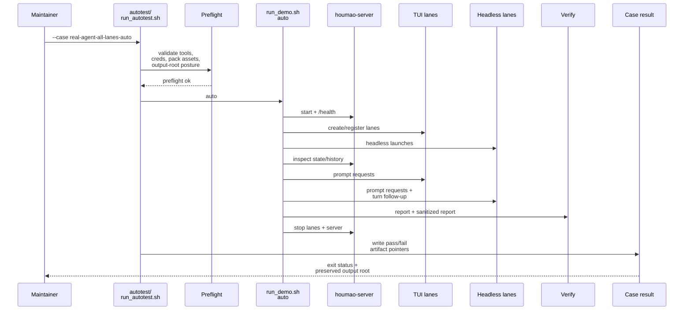

# Testplan: `real-agent-all-lanes-auto`

Status: pre-implementation design artifact for change `move-houmao-server-agent-api-suite-to-demo-pack`.

This file is a design-phase artifact. The final implemented `scripts/demo/houmao-server-agent-api-demo-pack/autotest/case-real-agent-all-lanes-auto.md` should be treated as an operator-facing companion for the shipped case, and it does not need to match this design text line by line.

## Intended Implemented Assets

- `scripts/demo/houmao-server-agent-api-demo-pack/autotest/run_autotest.sh`
- `scripts/demo/houmao-server-agent-api-demo-pack/autotest/case-real-agent-all-lanes-auto.sh`
- `scripts/demo/houmao-server-agent-api-demo-pack/autotest/case-real-agent-all-lanes-auto.md`
- `scripts/demo/houmao-server-agent-api-demo-pack/autotest/helpers/`
- `scripts/demo/houmao-server-agent-api-demo-pack/run_demo.sh`

## Goal

Drive the canonical direct `houmao-server` managed-agent API validation path end to end across all four supported live lanes, then leave one inspectable demo output tree with raw artifacts, sanitized verification output, and a machine-readable case result.

## Preconditions

- `pixi`, `tmux`, `claude`, and `codex` are installed and resolvable on `PATH`.
- Required credential inputs for all four supported lanes are present and readable.
- The selected `<demo-output-dir>` is fresh or explicitly owned by this harness.
- The local machine is allowed to make the bounded live provider calls required by the tracked prompt fixtures.

## Intended Runner Surface

```bash
scripts/demo/houmao-server-agent-api-demo-pack/autotest/run_autotest.sh \
  --case real-agent-all-lanes-auto \
  [--demo-output-dir <path>]
```

The implemented `case-real-agent-all-lanes-auto.sh` script should provide the pack-owned shell steps that `autotest/run_autotest.sh --case real-agent-all-lanes-auto` dispatches to. It should drive the same canonical flow as `scripts/demo/houmao-server-agent-api-demo-pack/run_demo.sh auto`, not a divergent private path.

## Sequence Diagram



## Ordered Steps

1. Run the shared preflight checks and stop immediately if any required tool, credential, pack asset, or output-root prerequisite is missing.
2. Start the pack-owned `houmao-server` and verify `/health` before any lane provisioning begins.
3. Provision all four supported lanes:
   - Claude TUI
   - Codex TUI
   - Claude headless
   - Codex headless
4. Run inspect through the public `houmao-server` routes and persist list/detail/state/history evidence for every launched lane.
5. Submit the tracked canonical prompt fixture across all launched lanes through `POST /houmao/agents/{agent_ref}/requests`.
6. Follow headless turn artifacts when a headless turn handle is returned and wait for bounded terminal outcomes.
7. Run `verify` so the raw report and sanitized report are both written and the sanitized report is compared against the tracked expected report.
8. Run `stop` so all launched lanes and the owned `houmao-server` are torn down cleanly while preserving the output tree.
9. Write one machine-readable case result that records the final status and points to the key control, report, and lane artifacts.

The implemented interactive guide should walk the same case step by step, telling the operator what the agent should run and what to inspect after each phase instead of reducing the procedure to "run the automatic script."

## Expected Evidence

- `<demo-output-dir>/control/demo_state.json` exists after startup.
- `<demo-output-dir>/control/report.json` and `<demo-output-dir>/control/report.sanitized.json` exist after verification.
- The sanitized report compares against `expected_report/report.json`.
- Per-lane launch, inspect, request, turn, and stop artifacts exist under the output root for all four lanes.
- `<demo-output-dir>/control/autotest/case-real-agent-all-lanes-auto.result.json` records the final status and key artifact pointers.
- `<demo-output-dir>/logs/autotest/real-agent-all-lanes-auto/` preserves per-phase logs.

## Failure Signals

- Any preflight failure before startup.
- Failure to start the owned `houmao-server` or failure of `/health`.
- Failure to create or register any selected TUI lane.
- Failure to launch any selected headless lane.
- Inspect evidence that does not match the expected transport or history contract.
- Prompt rejection, missing headless turn evidence, or timeout exhaustion during bounded wait phases.
- Verification mismatch against the sanitized expected report.
- Stop failure that leaves the case without durable cleanup evidence.
