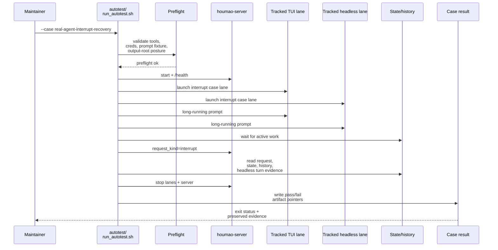

# Testplan: `real-agent-interrupt-recovery`

Status: pre-implementation design artifact for change `move-houmao-server-agent-api-suite-to-demo-pack`.

This file is a design-phase artifact. The final implemented `scripts/demo/houmao-server-agent-api-demo-pack/autotest/case-real-agent-interrupt-recovery.md` should be treated as an operator-facing companion for the shipped case, and it does not need to match this design text line by line.

## Intended Implemented Assets

- `scripts/demo/houmao-server-agent-api-demo-pack/autotest/run_autotest.sh`
- `scripts/demo/houmao-server-agent-api-demo-pack/autotest/case-real-agent-interrupt-recovery.sh`
- `scripts/demo/houmao-server-agent-api-demo-pack/autotest/case-real-agent-interrupt-recovery.md`
- `scripts/demo/houmao-server-agent-api-demo-pack/autotest/helpers/`

## Goal

Verify that the direct managed-agent request route can interrupt active work, leave observable post-interrupt state/history evidence, and still allow the owned demo run to stop cleanly without losing the interrupt artifacts.

## Preconditions

- The shared preflight checks for live lanes pass.
- The demo pack contains a tracked long-running prompt fixture intended to keep at least one selected lane active long enough for an interrupt request.
- The selected interrupt lane set covers at least one TUI lane and one headless lane while staying small enough for a bounded live run.

## Intended Runner Surface

```bash
scripts/demo/houmao-server-agent-api-demo-pack/autotest/run_autotest.sh \
  --case real-agent-interrupt-recovery \
  [--demo-output-dir <path>]
```

The implemented `case-real-agent-interrupt-recovery.sh` script should provide the pack-owned shell steps that `autotest/run_autotest.sh --case real-agent-interrupt-recovery` dispatches to. Shared helper functions needed by this case should live under `autotest/helpers/`.

## Sequence Diagram



## Ordered Steps

1. Run shared preflight and fail immediately if the tracked interrupt prompt fixture, tools, credentials, or output-root posture are not valid.
2. Start the owned `houmao-server` and verify `/health`.
3. Launch the tracked interrupt lane set, which should include at least one TUI lane and one headless lane.
4. Submit the tracked long-running prompt fixture through `POST /houmao/agents/{agent_ref}/requests` to the selected lanes.
5. Poll bounded state and history until the case observes interruptible active work or the case times out waiting for an interrupt window.
6. Submit `request_kind = interrupt` through the same managed-agent request route for the selected lanes.
7. Persist the interrupt request artifact, follow-up state, bounded history, and headless turn evidence that show what happened after the interrupt.
8. Stop the launched lanes and the owned `houmao-server` while preserving the interrupt artifacts.
9. Write one machine-readable case result that records the selected lanes, interrupt dispositions, and key artifact paths.

The implemented interactive guide should explain how to watch the same interrupt case step by step, what live evidence to inspect after the interrupt, and when to continue, retry, or investigate rather than instructing the operator to just invoke the automatic case script.

## Expected Evidence

- Request artifacts for the long-running prompt and the interrupt exist under the selected output root.
- Bounded state and history artifacts show that work became active before the interrupt was sent.
- Follow-up state/history artifacts record the server-returned interrupt disposition and later lane progression.
- When a headless turn handle exists, the case preserves the post-interrupt headless turn evidence under the output root.
- `<demo-output-dir>/control/autotest/case-real-agent-interrupt-recovery.result.json` records the final status and key artifact pointers.

## Failure Signals

- The interrupt prompt fixture never reaches an observable active phase before the bounded wait expires.
- The interrupt request is rejected or cannot be delivered through the shared managed-agent request route.
- Post-interrupt state, history, or headless turn evidence is missing or inconsistent with the recorded request outcome.
- Stop fails without leaving durable cleanup evidence.
