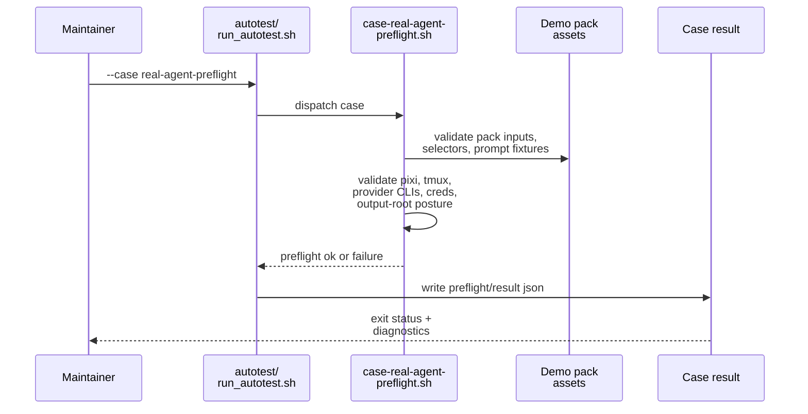

# Testplan: `real-agent-preflight`

Status: pre-implementation design artifact for change `move-houmao-server-agent-api-suite-to-demo-pack`.

This file is a design-phase artifact. The final implemented `scripts/demo/houmao-server-agent-api-demo-pack/autotest/case-real-agent-preflight.md` should be treated as an operator-facing companion for the shipped case, and it does not need to match this design text line by line.

## Intended Implemented Assets

- `scripts/demo/houmao-server-agent-api-demo-pack/autotest/run_autotest.sh`
- `scripts/demo/houmao-server-agent-api-demo-pack/autotest/case-real-agent-preflight.sh`
- `scripts/demo/houmao-server-agent-api-demo-pack/autotest/case-real-agent-preflight.md`
- `scripts/demo/houmao-server-agent-api-demo-pack/autotest/helpers/`

## Goal

Prove that the demo pack can validate all prerequisites needed for the real direct `houmao-server` managed-agent API workflow before any live `houmao-server` startup or managed-agent lane launch begins.

## Preconditions

- The demo pack directory exists with tracked `agents/`, `inputs/`, and `autotest/` content.
- The caller chooses either a fresh `<demo-output-dir>` or one that is explicitly owned by this harness.
- The caller expects the case to succeed only when the required tools and credential inputs are available for the selected lane set.

## Intended Runner Surface

```bash
scripts/demo/houmao-server-agent-api-demo-pack/autotest/run_autotest.sh \
  --case real-agent-preflight \
  [--demo-output-dir <path>]
```

The implemented `case-real-agent-preflight.sh` script should provide the pack-owned shell steps that `autotest/run_autotest.sh --case real-agent-preflight` dispatches to. Shared helper functions needed by this case should live under `autotest/helpers/`.

## Sequence Diagram



## Ordered Steps

1. Resolve the demo-pack root and selected demo output directory, and fail if the output root is unsafe to reuse.
2. Validate that tracked pack assets required by the live flow exist and are readable, including:
   - the pack-owned `agents/` tree,
   - the tracked prompt fixtures used by the automatic cases, and
   - the minimal dummy-project template under `inputs/`.
3. Validate the required local commands for the selected lane set, including `pixi`, `tmux`, and the selected provider executables.
4. Validate the required credential inputs for the selected live lanes without attempting a live provider turn.
5. Validate that selector resolution will use the pack-owned `agents/` tree instead of ambient shell state.
6. Write machine-readable preflight evidence and exit zero when all checks pass.
7. Exit non-zero before any `houmao-server` startup or lane launch if any prerequisite is missing or unsafe.

The implemented interactive guide should walk the same preflight procedure step by step, explain what the operator should check, and call out continue/retry/investigate decision points instead of telling the operator to just run the automatic script.

## Expected Evidence

- `<demo-output-dir>/control/autotest/case-real-agent-preflight.preflight.json` records the resolved pack paths, selected lane set, and per-check pass/fail status.
- `<demo-output-dir>/control/autotest/case-real-agent-preflight.result.json` records the final pass/fail disposition.
- No launched-lane artifacts are present when the case fails before startup.

## Failure Signals

- Missing `pixi`, `tmux`, or one required provider executable.
- Missing, unreadable, or incompatible credential material for one selected live lane.
- Missing pack-owned selector assets, prompt fixtures, or dummy-project inputs.
- An unsafe or stale output-root posture that the harness refuses to reuse.
- Any condition that would require the case to guess at selector resolution from ambient shell state.
