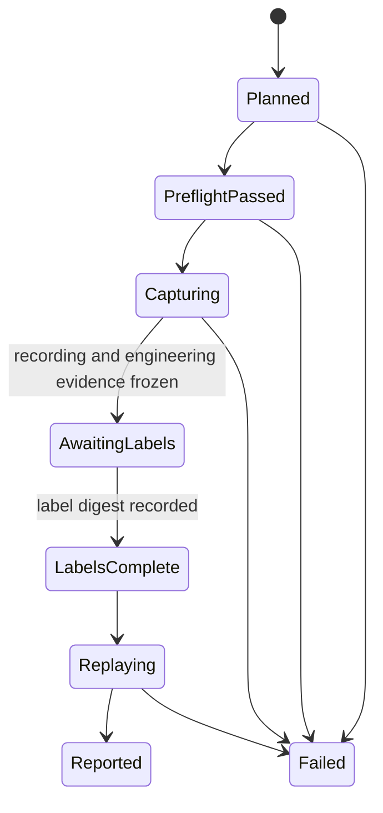

## Context

UC-02 defines five concrete long-horizon procedures against the vendored Boltons fixture. Applying its provider assignments creates 12 live sessions and 242 recorded user operations: Claude runs ST-01 through ST-04, Codex runs ST-01 through ST-05, and Kimi runs ST-03 through ST-05. The procedures mix draft editing, turns, tools, interruption, overlays, pane control, restart, project mutations, and downstream state consumption.

Houmao already has most low-level pieces. The shared TUI tracking demo pack can build isolated provider homes, launch Claude, Codex, and Kimi in tmux, record terminal sessions, persist authoritative input, replay recordings, compare labels, sweep capture frequency, and clean up owned tmux resources. Its current scenario model is intentionally small, however. It has no suite matrix, copied-project baseline, engineering checkpoints, blind-label phase boundary, attempt/resume model, or aggregate qualification gate. Its capture driver also uses the tracker detector for several waits, which would make the implementation under test influence a qualification stimulus.

This workflow is developer qualification infrastructure, not a public Houmao runtime API. Live execution uses local credential fixtures and external model services, can take hours, and can create large recordings. Every mutable path must therefore remain under one repository-local `tmp/<subdir>` root. The vendored Boltons tree and credential fixtures remain read-only inputs.

The ordinary provider TUI must receive no Houmao role prompt, tracking result, bootstrap chat message, or projected skill. Launch-policy setup is still required to create an isolated home and enforce unattended behavior, but the provider must see the same initial chat surface as a normal unprompted TUI session.

## Goals / Non-Goals

**Goals:**

- Make the exact UC-02 matrix executable, inspectable, resumable, and suitable for a release qualification decision.
- Keep copied projects, transient provider state, recordings, labels, replays, diffs, logs, and reports under a caller-selected `tmp/<subdir>` root.
- Preserve the independence of native-TUI recording, manual ground truth, engineering validation, and tracker replay.
- Reuse the existing terminal recorder, launch-policy registry, ownership logic, tracker reducer, comparison logic, and sweep machinery.
- Reject avoidable confirmation surfaces and prove that Claude, Codex, and Kimi use maintained unattended strategies. Codex must use the proxy on port 7990.
- Preserve every attempt and make failures attributable to the provider task, stimulus, capture, tracker, or harness.

**Non-Goals:**

- Running live provider sessions from `pixi run test` or ordinary CI.
- Supporting Gemini CLI, headless provider surfaces, CAO, or a compatibility interface for older scenario formats.
- Committing generated projects, provider homes, recordings, labels, or reports to the repository.
- Using UC-02 to replace the focused UC-01 transition contracts.
- Automatically repairing a provider response, changing a prompt, or substituting a navigation action after a live attempt begins.
- Treating model output quality as tracker correctness.

## Decisions

### 1. Add a Long-Horizon Layer to the Shared Demo Pack

Add a `long_horizon` subpackage beneath `src/houmao/demo/shared_tui_tracking_demo_pack/`. It will own catalog models, path validation, project preparation, provider preflight, operation driving, checkpoint evaluation, phase persistence, replay schedules, and aggregate reporting. Low-level recorder, input, launch, ownership, ground-truth, comparison, and tracker code will remain shared with the existing demo workflows.

Expose the layer through one nested command family:

```text
scripts/demo/shared-tui-tracking-demo-pack/run_demo.sh long-horizon plan
scripts/demo/shared-tui-tracking-demo-pack/run_demo.sh long-horizon preflight
scripts/demo/shared-tui-tracking-demo-pack/run_demo.sh long-horizon capture
scripts/demo/shared-tui-tracking-demo-pack/run_demo.sh long-horizon label-status
scripts/demo/shared-tui-tracking-demo-pack/run_demo.sh long-horizon replay
scripts/demo/shared-tui-tracking-demo-pack/run_demo.sh long-horizon report
scripts/demo/shared-tui-tracking-demo-pack/run_demo.sh long-horizon cleanup
```

Every command except `plan` takes an existing `--run-root tmp/<subdir>`. Cell-oriented commands accept an explicit `--cell <provider>:<st-id>` or `--all`. Live capture defaults to serial execution. Diagnostic cell selection is useful during development, but only the complete matrix can pass aggregation.

This design keeps qualification near the code it exercises and avoids a separate shell harness that would duplicate ownership and replay behavior. Extending the current `ScenarioDefinition` directly was rejected because UC-02 needs operation identity, provider variants, checkpoint contracts, retries, and suite-level metadata that do not belong in the small recorded-fixture DSL.

### 2. Keep a Reviewed Machine-Readable Catalog

Store a checked-in long-horizon suite catalog under `scripts/demo/shared-tui-tracking-demo-pack/long-horizon/`. It contains:

- the exact ST-01 through ST-05 prompts and semantic actions;
- provider assignments and provider-specific placeholder values;
- engineering and tracker checkpoint descriptions;
- mutation scopes and final worktree contracts;
- capture, hold, and stabilization conditions;
- focused-contract and transition-family mappings;
- the UC-02 source path and SHA-256 digest.

The runtime never parses Markdown tables. The planner compares the recorded UC-02 digest with the current source document, validates all catalog schemas, expands the provider matrix, and snapshots the reviewed catalog into the run root. A document change therefore stops execution until a developer reviews and updates the machine-readable catalog and digest.

Only four tokens are legal: `{{SAFE}}`, `{{PLACEHOLDER_LITERAL}}`, `{{PANE}}`, and `{{LAUNCH_COMMAND}}`. Expansion rejects unknown or remaining tokens. Every expanded operation receives a stable id such as `codex:st-05:attempt-001:op-020`, and the exact text or control sequence is written before delivery.

Generating operations by scraping UC-02 at runtime was rejected because Markdown is not a stable execution interface. Maintaining hand-written provider scripts was also rejected because it would duplicate prompts and make matrix drift difficult to detect.

### 3. Use One Strictly Owned Run Tree

The path layer resolves the repository root and requires the selected run root to be a proper descendant of `<repo>/tmp`. It rejects `tmp` itself, `..` escapes, output symlinks whose resolved target leaves the run root, and reuse of a non-empty directory without the expected ownership marker. The root is created with restrictive permissions because provider homes temporarily contain credential material.

The planned layout is:

```text
tmp/<subdir>/
  ownership.json
  suite-manifest.json
  phase-state.json
  catalog-snapshot/
  preflight/
    providers/<provider>/
  projects/<provider>-<st-id>-aNNN/boltons/
  provider-homes/<provider>-<st-id>-aNNN/
  sessions/<provider>-<st-id>/
    cell-manifest.json
    attempts/aNNN/
      attempt-state.json
      expanded-operations.ndjson
      runtime/
      recording/
      labels/
      engineering/
      replay/<schedule-id>/
      logs/
      issues/
  aggregate/
    stress-summary.json
    downstream-consumer-trace.ndjson
    confirmation-violations.ndjson
    artifact-inventory.json
    summary-report.md
```

Each retry creates a new attempt, copied project, provider home, and recording. Old attempts remain immutable. The cell manifest explicitly selects the attempt eligible for aggregation, and selection never hides prior failures.

An approach that reused one Boltons copy across providers was rejected because provider task divergence or mutation would contaminate later cells. Scattering `--output-root` values across the existing recorder and sweep defaults was rejected because cleanup and result provenance would be unreliable.

### 4. Prepare a Fresh Boltons Baseline Per Attempt

Project preparation computes a cache-excluding digest of `tests/fixtures/test-projects/boltons`, verifies the pinned upstream revision in its README, copies the tree into the attempt project path, removes generated caches from the copy, and computes a second digest. It initializes Git with a run-local identity and commits all files as `houmao-baseline`. The preflight runs the fixture collection command through Pixi's managed Python and requires 437 collected tests without installing dependencies or enabling network access.

The project manifest records source and destination paths, both digests, baseline commit, Python executable, collection result, allowed final paths, and initial status. Post-attempt validation records status and binary-safe diff artifacts, runs procedure-specific deterministic checks, and verifies the source fixture digest again.

The harness will implement checkpoint primitives for worktree state, file content, command exit/output, visible response patterns, pane geometry, process liveness, and explicit operator review. Every checkpoint records its evaluator and evidence. Provider task failures become engineering results and never tracker mismatches.

### 5. Launch an Unprompted TUI Through Maintained Unattended Policy

The qualification builder uses the existing launch-policy registry and local auth fixtures:

- Claude: `tests/fixtures/auth-bundles/claude/kimi-coding/`
- Codex: `tests/fixtures/auth-bundles/codex/yunwu-openai/`
- Kimi: the maintained local Kimi auth fixture selected by the demo asset resolver

Qualification presets select `unattended`, no skills, no mailbox, and no role prompt. Before launch, the harness inspects the built manifest to confirm the absence of projected skills and provider-visible Houmao prompt content. It records only sanitized version, strategy, command digest, and non-secret launch fields.

Codex preflight requires a successful TCP reachability check for `127.0.0.1:7990`. Its launch receives the repository's standard upper- and lower-case HTTP, HTTPS, and all-proxy environment projection for `http://127.0.0.1:7990`, with loopback exclusions preserved where required by local control paths. The harness stops rather than attempting a direct connection when this check fails.

Provider preflight uses disposable, owned probe sessions to prove prompt-free readiness and the exact surfaces needed by assigned procedures. It checks steering support for ST-02 variants, `/model Enter` and cancel for ST-04, and empty-editor `Ctrl+D` exit for Codex and Kimi ST-05. A raw-screen confirmation watchdog remains armed throughout preflight and capture. An unsupported exact surface produces the declared result; the driver never experiments with alternatives during the recorded attempt.

Directly launching vendor CLIs without the policy registry was rejected because it would bypass the unattended and isolated-home contracts. Injecting a helpful test system prompt was rejected because it would no longer test an ordinary native TUI.

### 6. Drive Semantic Operations Without Running the Public Tracker

The long-horizon driver uses a typed operation model separate from tracker states. Supported operation intents include text without submit, submitted text, exact key sequences, provider interruption, pane resize, tmux copy mode, raw-surface wait, bounded hold, shell-side provider restart, and engineering checkpoint. Provider adapters translate only reviewed semantic intents into exact native keys.

Capture-time synchronization reads the raw visible pane and process state through narrow predicates, such as a literal response marker, a visible first response line, an empty editor, a shell prompt, or provider-specific native busy evidence. It does not instantiate the public state reducer or write public tracker predictions. Raw predicates, timeouts, and source frames are persisted so the operator can judge whether stimulus timing was valid.

This separation is important for scheduled steering and interruption. If a target turn settles before the raw active checkpoint, the driver records `stimulus_too_short`, stops the unchanged attempt, and requires a fresh attempt. It does not lengthen or replace the prompt.

Reusing `DetectorProfileRegistry` and `replay_timeline()` during capture was rejected because a detector defect could alter the stimulus and then validate its own result. Fully manual keystroke timing was also rejected because 242 operations would be difficult to reproduce and correlate.

### 7. Freeze Capture Before Blind Manual Labels

Each attempt follows a persisted state machine:



Every transition uses atomic replacement and records input artifact digests. Resume first validates those digests. Completed phases are idempotent and cannot overwrite their outputs without an explicit new attempt.

After capture, the workflow renders the existing review frames/video and creates a label template from recorder timestamps. It does not create tracker timelines or comparison files. `label-status` validates label schema and complete, non-overlapping sample coverage. The operator then writes a small completion record containing recording and label digests. Only that record unlocks replay.

Keeping tracker output in a hidden directory during labeling was rejected because accidental exposure would remain possible. The workflow instead does not compute it.

### 8. Reuse Replay With Explicit Schedule Derivation

Canonical replay consumes every authoritative recorded observation in timestamp order. Fixed schedules derive observations at 10 Hz, 5 Hz, and 2 Hz with zero and half-interval phase offsets. The schedule layer also supports seeded jitter, one isolated gap, and the UC-02 burst pattern when the underlying derivation interface supports them. Every derived row records its source sample id, source timestamp, target timestamp, and selection rule.

Canonical comparison uses the existing complete ground-truth timeline and requires exact public-state agreement unless an issue is explicitly classified and reviewed. Delayed schedules use transition and safety invariants rather than requiring every transient label. Their oracle rejects fabricated terminal outcomes, order reversal, stale submit-safe readiness through liveness loss, turn misassociation, non-monotonic transition indices, schema-invalid downstream admission, and multiple terminal outcomes for one turn.

The existing capture-frequency sweep will be factored so both the original demo command and the long-horizon workflow share schedule derivation and invariant evaluation. Missing jitter, gap, or burst capability remains explicit as `not_run_capability_missing`; fixed 10 Hz, 5 Hz, and 2 Hz schedules are mandatory.

Comparing every delayed sample directly with the high-frequency label was rejected because phase shifts legitimately omit short-lived states. Accepting any delayed divergence was rejected because unsafe stale or fabricated state would then pass.

### 9. Separate Attempt Evidence From Qualification Verdicts

Every attempt produces two independent verdict documents:

- `engineering-verdict.json` covers operation completeness, exact input, native stimulus validity, provider response and project checkpoints, unattended policy, mutation scope, and final diff.
- `tracker-verdict.json` covers canonical comparison, degraded schedule safety, transition-family coverage, liveness, state authority, downstream admission, and terminal-outcome uniqueness.

Tracker qualification is `not_qualified` when engineering does not pass. This includes `scenario_task_divergence`, `stimulus_too_short`, `fixture_preflight_failed`, unsupported surfaces, confirmation violations, and incomplete recordings. When engineering passes but tracking fails, the report preserves the preceding operation, first divergent source sample, and following stabilization point.

The aggregate report requires 12 selected qualifying attempts and 242 operations. It lists every retry and exclusion, validates transition-family coverage, verifies the vendored source digest and cleanup inventory, and issues no pass for missing, unsupported, quarantined, or awaiting-label cells.

One combined pass/fail field was rejected because it would turn provider task failures into false tracker defects and could hide unsafe tracking behind a successful project edit.

### 10. Preserve Evidence but Remove Sensitive Runtime State

Run roots and provider-home directories use restrictive permissions. Credential fixtures are declared read-only inputs. Generated homes and credential staging stay under the run root while their provider process is live. After a cell stops, normal cleanup removes credential-bearing provider state and records the deletion in the artifact inventory; recordings, copied projects, diffs, labels, sanitized launch manifests, logs, and reports remain. Debug retention of sensitive homes is not part of the standard workflow.

Manifests serialize allowlisted environment names and redacted values, never whole environments or credential contents. Owned tmux cleanup reuses recovery pointers and validates run identity before stopping a resource. Filesystem cleanup requires an explicit command, validates every selected path beneath the run root, and preserves reports by default unless the caller requests full deletion.

Retaining complete provider homes for convenience was rejected because temporary qualification evidence may be shared during debugging. Deleting all evidence automatically was rejected because failed replay and transition slices must remain inspectable.

### 11. Test Orchestration Hermetically and Run Providers Explicitly

Unit tests will use temporary repositories, fake provider adapters, fake clocks, small fixture trees, synthetic recordings, and deterministic checkpoint results. They cover catalog counts, exact expansion, path escapes, copy/baseline integrity, phase resume, attempt selection, confirmation failure, stimulus failure, label gating, schedule derivation, verdict separation, and aggregate completeness. Existing recorder and tracker tests continue to cover their lower-level contracts.

Live qualification remains an explicit manual/integration activity. The operator plans one run, performs provider preflight, captures cells serially, labels frozen recordings, replays them, and aggregates the result. A machine-readable status command makes it safe to resume this sequence across multiple work sessions.

Making the full matrix a normal integration test was rejected because credentials, model nondeterminism, proxy availability, time, and cost make it unsuitable for unattended CI.

## Risks / Trade-offs

- [Catalog duplicates UC-02 text] → Pin the document digest, snapshot the catalog, validate exact operation counts, and require reviewed catalog updates whenever UC-02 changes.
- [A capture-time predicate resembles detector logic] → Keep predicates narrow, raw, provider-specific, and stateless; persist their frames; never expose a public tracker state before labeling.
- [Provider responses complete before steering or interruption] → Use the exact long prompts, stop with `stimulus_too_short`, and rerun the unchanged cell from a fresh attempt.
- [A provider version changes navigation or exit behavior] → Probe the exact surface before capture and report an incomplete matrix instead of substituting keys.
- [Manual labeling is expensive for 12 high-frequency recordings] → Generate timestamp-aligned templates and review media, support resume, and keep one immutable label set per attempt. Do not weaken blind labeling.
- [Recordings consume substantial disk space] → Check available space before capture, record usage per attempt, execute serially, and support owned artifact cleanup after reports are exported.
- [Long runs amplify API cost and rate limits] → Plan all cells before launch, show the 242-operation total, resume by cell, and never auto-retry provider attempts.
- [Codex bypasses the required proxy] → Validate port 7990 and the resolved launch environment before creating a Codex attempt; fail closed when either is absent.
- [Credential data leaks into retained artifacts] → Restrict root permissions, sanitize manifests and logs, delete provider homes after process cleanup, and test redaction with canary secrets.
- [Provider task divergence is mistaken for tracker failure] → Evaluate and persist engineering results before replay, then mark tracker qualification unavailable for failed engineering attempts.
- [A stale process or tmux pane survives a crash] → Persist ownership before launch, publish recovery pointers, and make `cleanup` idempotent and identity-checked.
- [Fixed-rate replay looks worse than manual labels because it misses transients] → Use semantic delayed-cadence invariants while keeping canonical replay sample-aligned and strict.
- [Resource-growth thresholds are host-dependent] → Record wall time, sample count, transition count, memory high-water mark, and artifact bytes in the first baseline run, then set reviewed qualification ceilings before using the suite as a release gate.

## Migration Plan

1. Add the catalog, schemas, path and phase models, and hermetic planner tests without changing existing recorded-capture behavior.
2. Add project preparation, unattended provider preflight, long-horizon operation driving, and sensitive-runtime cleanup.
3. Add blind label gating, shared schedule derivation, separate verdicts, and aggregate reporting.
4. Document the command sequence and update stale demo text so every TUI qualification example states `unattended` for Claude, Codex, and Kimi.
5. Run one diagnostic cell per provider, then execute and label the complete 12-cell matrix under a new `tmp/<subdir>` root.
6. Calibrate resource ceilings from the first complete baseline and record them in the reviewed suite catalog before declaring the workflow a release gate.

No stored production data or public API requires migration. Rollback removes the long-horizon command family and catalog; existing run roots remain ordinary ignored `tmp/` data and can be removed only through owned cleanup.

## Open Questions

- What disk-space floor and memory, transition-count, and duration ceilings should the first qualification host establish for subsequent release runs?
- Does the current sweep derivation support every seeded jitter, isolated-gap, and burst schedule directly, or will the shared schedule interface need all three additions during implementation?
- Which operator-facing label editor, if any, should supplement the existing review video and `labels.json` workflow after the first full labeling pass?
