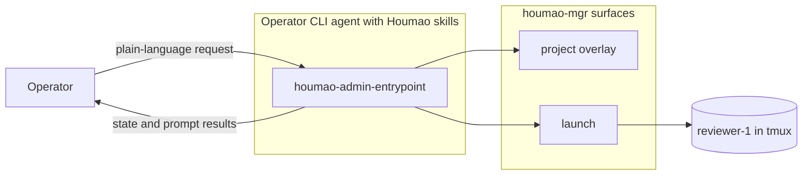

# Use Case 01: First Managed Agent

## Actor Goal

As a human operator new to Houmao, I want my CLI agent to create a reusable specialist, launch it as a live managed agent, and have it do a first real task, so that I see the full Houmao value arc in one request.

## Use Case

The operator has installed Houmao, verified `tmux`, and installed the admin skill pack. From a project directory they describe an outcome in plain language. Their CLI agent — routed by `houmao-admin-entrypoint` — initializes or inspects the `.houmao/` project overlay, creates a specialist, creates a project profile over it, launches a tmux-backed managed agent with a loopback gateway, delivers the first prompt, and reports the managed agent's state back. The operator never types a `houmao-mgr` command.

## Supported Actions

### Create And Launch A Managed Agent

The operator describes a role and a first task; the system turns it into a running managed agent.

- context
  - Actor **has** a project directory, `houmao` installed, `tmux` available, the admin skill pack installed, and a provider CLI (`codex`) with credentials.
  - System **has** the `houmao-admin-entrypoint` router and the `agent-definition` / `agent-instance` shared routines, backed by `houmao-mgr project` and `houmao-mgr agents` surfaces.
- intent
  - Actor **wants** a live agent doing real review work with reusable setup.
  - Actor **wonders** "can you set up a reviewer for this repo and have it look at my working tree?"
- action
  - Actor then **asks** the system to create the specialist, prepare a reusable profile, launch the agent, and send the review prompt.
- result
  - Actor **gets** a named managed agent (`reviewer-1`) running in tmux, a reusable specialist and profile stored in the project catalog, and a plain-language report of what was created and the agent's current state.

### Inspect The Managed Agent

The operator asks how the launched agent is doing.

- context
  - Actor **has** a running managed agent from the previous action.
  - System **has** the gateway and `agent-inspect` read-only surfaces over the agent's tmux session and turn evidence.
- intent
  - Actor **wants** confirmation the agent is alive and its last turn finished.
  - Actor **wonders** "did it finish the review, and where do I see the answer?"
- action
  - Actor then **asks** the system to show the agent's current state.
- result
  - Actor **gets** a plain-language state summary (running, last turn complete, response ready) and where the turn evidence lives.

## Main Flow

1. The operator states the outcome request in chat.
2. The CLI agent routes through `houmao-admin-entrypoint` to `agent-definition` and initializes or inspects the `.houmao/` overlay (`houmao-mgr project init` / `project status`).
3. The CLI agent creates the `backend-reviewer` specialist with tool `codex` and a review system prompt (`houmao-mgr project specialist create ...`).
4. The CLI agent creates the reusable project profile `backend-reviewer-default` with agent name `reviewer-1`, the project workdir, unattended prompt mode, and a memo seed (`houmao-mgr project profile create ...`).
5. The CLI agent launches the profile (`houmao-mgr project agents launch --profile backend-reviewer-default`); a tmux session, gateway, mailbox binding, and managed memory come up.
6. The CLI agent sends the review prompt through the maintained messaging surface (`houmao-mgr agents single --agent-name reviewer-1 prompt ...`).
7. The CLI agent reports each step and the agent's state to the operator in plain language.

## Alternative And Exception Flows

- **Provider CLI missing**: `command -v codex` fails → the CLI agent reports the missing tool and proposes an available one (`claude` or `kimi`) before creating anything.
- **Overlay already exists**: `project init` detects an existing `.houmao/` overlay → the CLI agent inspects and reuses it, saying so explicitly.
- **Specialist already defined**: the CLI agent selects the existing specialist instead of duplicating it, and tells the operator.

## Mermaid Flow Diagram

## Durable Outputs

- `.houmao/` project overlay (created or reused).
- `backend-reviewer` specialist and `backend-reviewer-default` project profile in the project catalog.
- Running managed agent `reviewer-1`: tmux session, loopback gateway, mailbox binding, managed memory directory.
- First review turn evidence retrievable through gateway/inspection surfaces.

## Example Prompt And Expected AI Response

### Event 001 - Zero To First Reviewer

> Time: `first session` · Session: `operator CLI agent, admin pack installed, empty or new project directory`

User Prompt:

> $houmao-admin-entrypoint create a houmao Codex backend-reviewer specialist for this repo, make a reusable launch profile, launch it, and ask it to review the current working tree.

AI:
> Done. I initialized the Houmao project overlay, created specialist `backend-reviewer` (tool: codex), prepared profile `backend-reviewer-default`, launched managed agent `reviewer-1` with its gateway attached, and sent the review prompt. The agent is running; I will report when the turn completes.
>
> Response contract notes: the reply names each concrete step taken (overlay, specialist, profile, launch, gateway, prompt) in past tense, names the created entities, and states the agent's current posture. It does not dump raw `houmao-mgr` output unless asked.
>
> Invocation notes: the first prompt of a session invokes the entrypoint skill explicitly so routing is unambiguous (ADR-0001). Later prompts drop the handle and keep the keyword `houmao`.

### Event 002 - State Check

> Time: `minutes later` · Session: `same session`

User Prompt:

> Did the houmao agent reviewer-1 finish? Show me its state and summarize the review.

AI:
> `reviewer-1` is running and its last turn is complete. The review found two release-blocking risks: an unguarded migration in `src/houmao/...` and a missing rollback note. Full turn evidence is available through the gateway if you want the verbatim text.
>
> Response contract notes: state first, then the summary, then a pointer to the evidence surface. The AI offers but does not force the next action (stop, follow-up prompt, mail).

## Assumptions And Open Questions

- Assumes the beginner example in the README Quick Start uses this exact exchange (spec delta: "create a reviewer specialist, launch it, ask for a review"), possibly shortened to fit the golden-path flow.
- Open: whether the README shows the stop/cleanup step inline or leaves it as a follow-up mention.
