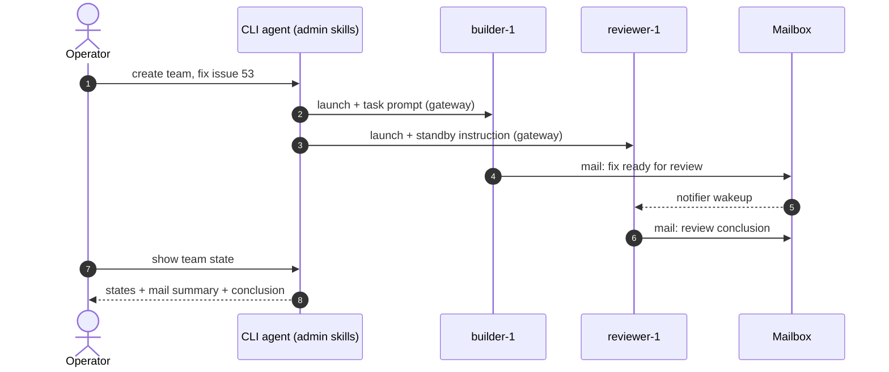

# Use Case 02: Operator-Coordinated Team

## Actor Goal

As a human operator, I want two managed agents with separate workspaces — one building, one reviewing — coordinated through gateway prompts and mailbox messages, so that I can run a small team on one repository without driving either agent by hand.

## Use Case

Building on uc-01, the operator asks for a builder/reviewer pair. Their CLI agent plans isolated workspaces, creates two specialists and profiles, launches both managed agents with their own gateways and mailbox identities, dispatches the work through operator messaging, and lets the agents hand results to each other by mail. The operator watches from outside: they ask for state, read the mailbox traffic through their agent, and get a consolidated report. This is the welcome tour's intermediate path ("Operator-Controlled Agent Team").

## Supported Actions

### Launch A Two-Agent Team With Separate Workspaces

The operator describes the team and the task split; the system prepares and launches it.

- context
  - Actor **has** a project with the `.houmao/` overlay and credentials for the chosen provider CLIs.
  - System **has** the `utils-workspace-mgr`, `agent-definition`, and `agent-instance` routines for workspace planning, specialist/profile creation, and launch.
- intent
  - Actor **wants** a builder and a reviewer working the same issue without stepping on each other's files.
  - Actor **wonders** "can a builder fix issue 53 in its own worktree while a reviewer waits to check the result?"
- action
  - Actor then **asks** the system to create both specialists, prepare separate workspaces, launch both agents, and dispatch the work.
- result
  - Actor **gets** two running managed agents with named workspaces, mailbox addresses, and a confirmation that the builder received the task and the reviewer received its standby instruction.

### Coordinate Through Mailbox And Inspect From Outside

The operator follows the collaboration without entering either agent's session.

- context
  - Actor **has** a running two-agent team from the previous action.
  - System **has** per-agent gateways with notifier wakeups and the shared mailbox (`agent-email-comms`, `agent-inspect`, `operator-messaging` routines).
- intent
  - Actor **wants** the agents to hand work to each other and to see progress on demand.
  - Actor **wonders** "has the builder mailed the reviewer yet, and what did the reviewer conclude?"
- action
  - Actor then **asks** the system for the team's current state and the latest mailbox traffic.
- result
  - Actor **gets** a consolidated report: each agent's state, the mail exchange between builder and reviewer, and the reviewer's conclusion when its turn completes.

## Main Flow

1. The operator states the team request in chat.
2. The CLI agent plans two isolated workspaces through `utils-workspace-mgr`.
3. The CLI agent creates the `builder` and `reviewer` specialists and their profiles (separate workdirs, unattended prompt mode, mailbox posture enabled).
4. The CLI agent launches both managed agents; each comes up with its own tmux session, gateway, mailbox identity, and managed memory.
5. The CLI agent dispatches the issue-53 task to `builder-1` and the standby review instruction to `reviewer-1` through operator messaging / gateway prompts.
6. `builder-1` completes the fix and mails `reviewer-1`; the reviewer's gateway notifier wakes it for one bounded unread-mail round.
7. `reviewer-1` reviews and mails its conclusion back.
8. The operator asks for status; the CLI agent inspects both agents and the mailbox and summarizes.

## Alternative And Exception Flows

- **Shared workdir preferred**: the operator asks both agents to work in the same directory → the CLI agent skips workspace isolation and says what that risks.
- **Prompt arrives while an agent is busy**: gateway admission policy `ready-only` queues or defers the prompt → the CLI agent reports the queue instead of interrupting, unless the operator asks for an interrupt.
- **Reviewer finds the fix inadequate**: the reviewer mails findings back to the builder; the CLI agent surfaces the disagreement and asks the operator whether to iterate or stop.

## Mermaid Sequence Diagram

## Durable Outputs

- Two specialists (`builder`, `reviewer`), two profiles, two workspace worktrees.
- Two running managed agents with gateways, mailbox identities, and managed memory.
- Mailbox records of the builder→reviewer handoff and the review conclusion.
- Operator-visible state and mail summaries (read-only inspection).

## Example Prompt And Expected AI Response

### Event 001 - Stand Up The Team

> Time: `after uc-01` · Session: `operator CLI agent, admin pack, project overlay present`

User Prompt:

> Use houmao to set up a two-agent team: create builder and reviewer specialists, prepare separate workspaces, launch both, have the builder fix issue 53 and the reviewer check the fix, and keep me posted.

AI:
> Team is up. I planned two isolated worktrees, created specialists `builder` and `reviewer` with profiles `builder-default` and `reviewer-default`, and launched `builder-1` and `reviewer-1`, each with its own gateway and mailbox identity. `builder-1` has the issue-53 task; `reviewer-1` is standing by for the builder's mail. I will report when the review lands.
>
> Response contract notes: names workspaces, specialists, profiles, agent names, and mailbox posture; states what each agent was told; commits to a report trigger. Does not paste command output.
>
> Invocation notes: this is a later-session prompt — natural language plus the keyword `houmao`, no handle (ADR-0001). In a fresh session with no routing context, the same request would start `$houmao-admin-entrypoint`.

### Event 002 - Mid-Run Status

> Time: `during the run` · Session: `same session`

User Prompt:

> Where is the houmao team now? Did the reviewer get the builder's mail?

AI:
> `builder-1` finished its turn and mailed `reviewer-1` ten minutes ago; the reviewer's gateway notifier woke it and it is mid-review now. Both agents are running, no queued prompts. I will summarize the review conclusion as soon as its turn completes.
>
> Response contract notes: answers the mailbox question first, then agent states, then what happens next. Offers follow-ups (interrupt, stop, iterate) only as options.

## Assumptions And Open Questions

- Assumes the README keeps this as the later "Agent-Driven Examples" section content (per design decision: gateway-interaction example stays, no duplication of the Quick Start exchange).
- Open: whether the README version names a concrete issue number or stays generic ("a bug you choose").
