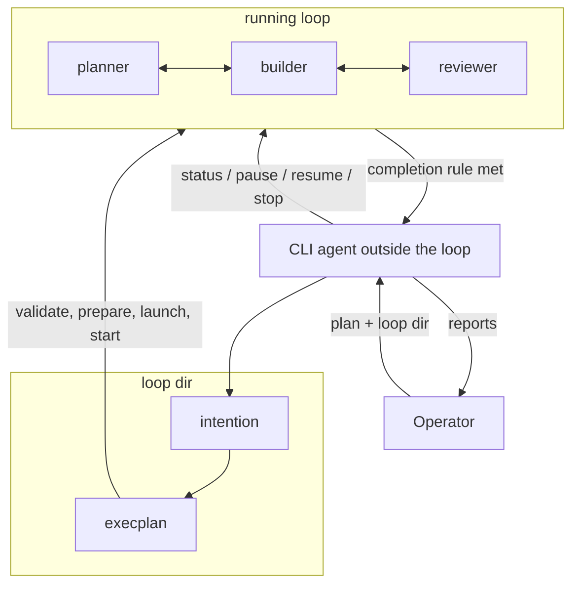

# Use Case 03: Pro Agent Loop Run

## Actor Goal

As a human operator with a complex multi-agent plan, I want my CLI agent to turn that plan into a validated, running loop with explicit participants and a completion rule, so that the team executes autonomously while I observe and control the run from outside.

## Use Case

The operator brings a plan that is too structured for ad-hoc prompting: multiple roles, a completion rule, and artifacts that must exist before stop. They invoke `$houmao-agent-loop-pro` explicitly with a loop directory. Their CLI agent authors the loop intention, clarifies topology and responsibilities, generates and validates the execplan, prepares specialists, profiles, workspaces, mailbox and gateway posture, launches the participants, and starts the run. The operator's agent stays outside the execution loop and reports status; the operator can pause, resume, recover, or stop the run at any time. This mirrors the welcome tour's advanced path and the `examples/writer-team/` template.

## Supported Actions

### Author And Validate The Loop

The operator hands over a plan; the system turns it into a validated loop definition.

- context
  - Actor **has** a complex multi-agent plan and an explicit loop directory in mind.
  - System **has** the `houmao-agent-loop-pro` skill (explicit-only) with intention, execplan, and validation stages.
- intent
  - Actor **wants** a runnable team workflow with a clear stop condition.
  - Actor **wonders** "can three agents design, implement, and review this migration, stopping only when tests and review notes are done?"
- action
  - Actor then **asks** the system to create the loop in the named directory, clarify the intention, generate the execplan, and validate it.
- result
  - Actor **gets** an intention document with a completion rule, a chosen topology (`tree-loop` or `generic-loop`), generated execplan artifacts, and a validation verdict.

### Launch And Operate The Run

The operator starts the loop and supervises it from outside.

- context
  - Actor **has** a validated loop execplan from the previous action.
  - System **has** the loop execution stages (`prepare-agents`, `prepare-workspace`, `validate-loop`, `launch-agents`, `start`) and run controls (`status`, `pause`, `resume`, `recover`, `stop`).
- intent
  - Actor **wants** the team running autonomously with lifecycle control retained.
  - Actor **wonders** "is the run healthy, and can I pause it if the review agent goes wrong?"
- action
  - Actor then **asks** the system to prepare, launch, and start the loop, then report status on request.
- result
  - Actor **gets** launched participants, a started run, and periodic outside-the-loop status reports, plus working pause/resume/stop control.

## Main Flow

1. The operator invokes `$houmao-agent-loop-pro` with the plan and an explicit loop directory.
2. The CLI agent scaffolds the intention and records the objective, completion rule, participants, responsibilities, artifacts, and failure policy.
3. The CLI agent clarifies the topology choice (`tree-loop` for local-close ownership, `generic-loop` for graphs with cycles or relay lanes) and records the decision.
4. The CLI agent generates the execplan (mail families, process contracts, graph, generated skills, harness, state, agent bindings) and validates it.
5. The CLI agent prepares specialists, launch profiles, workspaces, and mailbox/gateway posture, then runs `validate-loop`.
6. The CLI agent launches the participants and starts the run (first trigger sent).
7. Participants execute autonomously, coordinating by mailbox and gateway notifier wakeups; the operator's agent stays outside the loop.
8. The operator requests status; the CLI agent reports run state, and pauses, resumes, recovers, or stops on request until the completion rule ends the run.

## Alternative And Exception Flows

- **Plan is too vague**: intention clarification asks the operator targeted questions and records each answer as a decision before execplan work begins.
- **Validation fails**: the CLI agent reports the failing contract or binding and offers `update-execplan` rather than launching a broken loop.
- **Lite path fits better**: the operator's plan needs no JSON schemas or generated harness → the CLI agent proposes `$houmao-agent-loop-lite` with the same intention/execplan/runs spine.
- **Participant failure mid-run**: `recover` rebuilds or relaunches the failed participant; the operator is told what was recovered and what state was preserved.

## Mermaid Flow Diagram

## Durable Outputs

- Loop directory with intention, recorded clarification decisions, and generated execplan artifacts (contracts, harness, skills, agent bindings).
- Prepared specialists, launch profiles, and workspaces for the participants.
- Running (then completed) loop run with state inspectable via `status`.
- Operator-visible status reports and a final completion summary against the completion rule.

## Example Prompt And Expected AI Response

### Event 001 - Create And Start The Loop

> Time: `advanced session` · Session: `operator CLI agent, admin pack, project overlay present`

User Action:

> $houmao-agent-loop-pro create a loop for this plan in .houmao/loops/migration-loop: three agents should design, implement, and review a migration. The planner decomposes the work, the builder edits code, the reviewer checks behavior, and the team should stop only after tests and review notes are complete.

AI:
> I created the loop intention with your completion rule, chose `tree-loop` topology (the planner owns decomposition and each review closes back to it), generated and validated the execplan, prepared the three specialists and their launch profiles, checked workspace and mailbox/gateway posture, launched the participants, and started the run. I will report status from outside the execution loop; you can ask me to pause, resume, recover, or stop it at any time.
>
> Response contract notes: mirrors the plan's roles back as named participants, states the topology choice and why, confirms the completion rule, lists the stages completed, and names the run controls. Reports from outside the loop — never narrates as a participant.
>
> Invocation notes: loop skills are explicit-only, so the `$houmao-agent-loop-pro` handle is always required regardless of session history (ADR-0001).

### Event 002 - Outside-The-Loop Status

> Time: `during the run` · Session: `same session`

User Prompt:

> How is the houmao migration loop doing?

AI:
> The run is active. The planner decomposed the migration into four work items, the builder has completed two, and the reviewer signed off on the first. No failed participants, no pending recovery. Two work items and the final review note remain before the completion rule stops the run.
>
> Response contract notes: progress against the completion rule first, participant health second, remaining work last. Run controls are restated only when relevant (for example after a failure).

## Assumptions And Open Questions

- Assumes the README Agent Loops section quotes a condensed form of Event 001 (the current README already shows a similar exchange; the revision keeps it and aligns it with this contract).
- Assumes `examples/writer-team/` remains the linked reusable template for readers who want a concrete loop to run.
- Open: whether the README shows any run-control follow-up (Event 002) or leaves run control to the Loop Authoring Guide.
