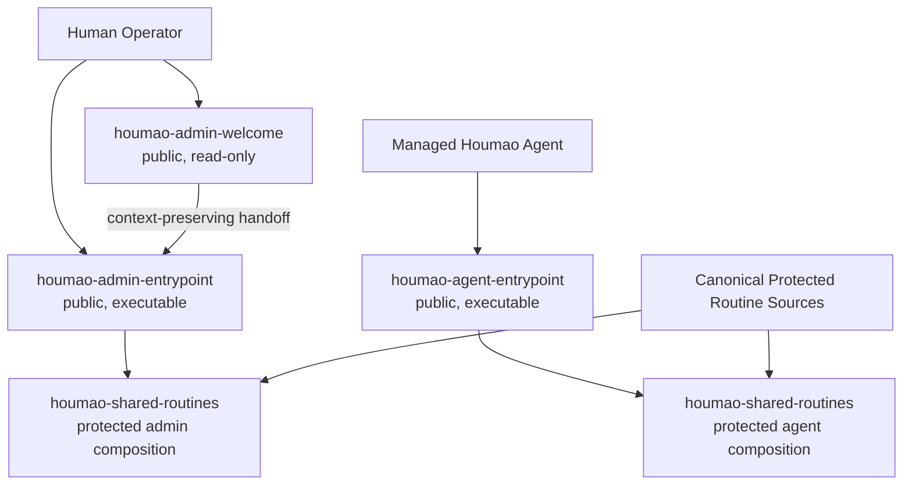

## Context

Houmao packages twenty current system skills as flat peers under `src/houmao/agents/assets/system_skills/`. `catalog.toml` describes individual skills and the fixed `core`, `extensions`, and `all` sets, while `src/houmao/agents/system_skills.py` copies or links each selected skill directly into a tool-native skill root. Managed launch and join currently resolve the same broad skill selection that the external-home CLI installs.

This shape does not establish an actor boundary before operational guidance loads. An assistant acting for a human operator and a managed Houmao agent can discover the same peer skills, although self-scoped and operator-scoped commands require different target logic. The flat projection also makes internal procedure owners public and forces cross-skill guidance to repeat routing context.

Two local references inform the replacement design. `extern/orphan/isomer-labs/src/isomer_labs/assets/system_skills/manifest.toml` demonstrates public welcome and entrypoint siblings with protected nested capabilities and pack-atomic lifecycle management. `extern/orphan/houmao-agents/skillset/imsight-skills/imsight-agent-skill-handling/references/skill-layout.md` distinguishes lean skill routers, parent-owned commands, supporting references, and true subskills that own a `SKILL.md` plus private resources. Houmao adopts those principles, but it uses two alternative actor packs and mounts one canonical protected bundle beneath both entrypoints.

The managed `houmao-auto-system-prompt` skill remains a separate bootstrap asset. Protected placement is a discovery and routing convention, not an authorization mechanism; `houmao-mgr` and runtime services continue to enforce target validity and permissions.

## Goals / Non-Goals

**Goals:**

- Expose only three public Houmao system skills: `houmao-admin-welcome`, `houmao-admin-entrypoint`, and `houmao-agent-entrypoint`.
- Install `houmao-admin-welcome` and `houmao-admin-entrypoint` as one atomic admin pack, while installing the agent entrypoint through a separate managed-agent pack.
- Establish and preserve an immutable admin or managed-agent actor context before routing to operational guidance.
- Keep one canonical protected routine source and compose only audience-eligible routines beneath each executable entrypoint.
- Preserve maintained routine behavior while changing its public discovery, invocation, and packaging model.
- Apply the Imsight command, reference, and subskill ownership rules to large skill packages.
- Make install, status, upgrade, and uninstall pack-aware, transactional, and ownership-safe.

**Non-Goals:**

- Treat protected skill placement or actor prose as a security boundary.
- Preserve direct public invocation of the old flat skill names or the `core`, `extensions`, and `all` selector interface.
- Add an agent-facing welcome skill in this change.
- Merge `houmao-auto-system-prompt` into the system-skill manifest.
- Preserve `houmao-specialist-mgr` as a compatibility wrapper.
- Redesign the command semantics owned by each maintained routine except where actor scope requires a distinct branch.

## Decisions

### 1. Use Two Alternative Actor Packs and Three Public Skills

The manifest defines an `admin` pack and an `agent` pack. The admin pack contains the public roles `welcome` and `entrypoint`; both roles are required and are installed, upgraded, and removed together. The agent pack contains one required public `entrypoint` role and no welcome role.



CLI-default external-home installation selects the admin pack. Managed launch, rebuild, relaunch, and join select the agent pack. An explicit, repeatable `--pack admin|agent` selector can install either or both packs for development and diagnostic homes. Selecting a public skill by internal API resolves its owning pack and cannot produce a partial admin installation.

This differs from treating admin and agent entrypoints as complementary members of one pack. They represent alternative actor identities and must not be installed automatically into the same managed home. It also differs from applying Isomer's two-public-role cardinality to every pack: Houmao validates role requirements per pack kind, so the admin pack requires welcome plus entrypoint while the agent pack requires only entrypoint.

### 2. Separate Canonical Sources From Composed Projections

The checked-in source layout becomes:

```text
system_skills/
  manifest.toml
  manifest.schema.json
  public/
    houmao-admin-welcome/
    houmao-admin-entrypoint/
    houmao-agent-entrypoint/
  protected/
    houmao-shared-routines/
      routes/
        admin/SKILL.md
        agent/SKILL.md
      commands/
      references/
      subskills/
        houmao-agent-instance/SKILL.md
        ...
```

The protected source is a composable bundle rather than a directly installable skill. Its two checked-in route files share a small common contract but list only the subskills eligible for that actor. During staging, the materializer installs the appropriate route file as `subskills/houmao-shared-routines/SKILL.md`, copies shared commands and references, and includes only the eligible subskills plus their declared dependency closure. The welcome projection never receives a `subskills/` mount.

The visible projection therefore remains tool-native and shallow while the implementation is nested:

```text
skills/houmao-admin-welcome/SKILL.md
skills/houmao-admin-entrypoint/SKILL.md
skills/houmao-admin-entrypoint/subskills/houmao-shared-routines/SKILL.md
skills/houmao-admin-entrypoint/subskills/houmao-shared-routines/subskills/houmao-agent-inspect/SKILL.md
```

The agent pack uses the same shape under `skills/houmao-agent-entrypoint/`. Supported tools substitute their established skill-root prefix.

Keeping separate checked-in admin and agent route files avoids runtime Markdown synthesis and makes both routing surfaces reviewable. Copying the entire protected tree under both entrypoints was rejected because it would expose ineligible routines to recursive host discovery and make a prose-only denial carry more risk than necessary.

### 3. Model Logical Routines Independently From Invocation Designators

The replacement manifest uses a versioned schema with three record types:

- Packs declare `pack_id`, audience, required public roles, public members, protected mount ids, and default lanes.
- Public skills declare stable name, pack, role, source path, public commands, and handoff or entrypoint relationships.
- Protected routines declare stable logical id, source path, route member name, eligible audiences, dependencies, and command metadata.

One protected logical id can produce more than one invocation designator. For example, `houmao-agent-inspect` maps to both `houmao-admin-entrypoint->houmao-shared-routines->agent-inspect` and `houmao-agent-entrypoint->houmao-shared-routines->agent-inspect`. A command trace appends parentheses, such as `houmao-agent-entrypoint->houmao-shared-routines->agent-inspect->status()`. User-facing prompts invoke only the public skill, for example `$houmao-agent-entrypoint agent-inspect status`.

The loader validates unique pack ids and public names, unique logical ids, source containment, required `SKILL.md` files, public-role cardinality, dependency closure per audience, command-map coverage, route-name uniqueness within an actor, and the absence of protected capabilities from standalone install selectors. It also recursively validates every included nested skill.

Stable logical ids preserve specification and implementation ownership without preserving the old public namespace. Deriving actor-specific invocation designators avoids duplicating protected source records.

### 4. Duplicate the Small Actor Guard and Share Operational Detail

Both executable entrypoints intentionally contain overlapping routing instructions because the actor declaration must load before any protected routine. They do not delegate identity establishment to shared content.

The admin entrypoint declares: the assistant acts for a human operator, is not the managed agent being administered, and must use an explicit project or managed-agent target for target-sensitive work. It can recover a target from an explicit prompt or recent unambiguous context, perform read-only discovery, or ask the required/optional input question. It does not reinterpret the current shell or tmux session as self.

The agent entrypoint declares: the assistant is the managed Houmao agent attached to the current session. Before each substantive route, it runs `houmao-mgr --print-json agents self identity`. Failure, empty output, or a mismatch with retained session context stops routing and reports that the managed identity cannot be verified. A verified identity becomes the default self target. Cross-agent operations retain the agent actor and require an explicit route and target; they never promote the caller into the admin actor.

Each entrypoint creates a routing frame with `actor_kind`, `entrypoint_name`, verified self identity when applicable, requested target, and selected routine. Protected routers and subskills must preserve that frame. If a protected routine is discovered without a frame, it refuses standalone execution and directs the caller to the appropriate public entrypoint.

The only actor transition is explicit joined-session adoption. When a human operator asks the admin entrypoint to adopt the current session through the supported `agents self join` workflow, the admin frame remains active until join succeeds. The skill then ends the admin route, refreshes public-skill discovery as needed, verifies managed self identity, and hands subsequent work to `houmao-agent-entrypoint`; it does not mutate the existing frame in place.

### 5. Use an Explicit Audience Routing Matrix

The protected bundle contains the maintained routines below. The manifest is authoritative for inclusion and route eligibility.

| Eligibility | Routine Logical IDs |
|---|---|
| Admin only | `houmao-project-mgr`, `houmao-credential-mgr`, `houmao-agent-definition`, `houmao-operator-messaging` |
| Agent only | `houmao-process-emails-via-gateway` |
| Admin and agent, with actor branches where target semantics differ | `houmao-agent-email-comms`, `houmao-adv-usage-pattern`, `houmao-utils-workspace-mgr`, `houmao-ext-graphing`, `houmao-mailbox-mgr`, `houmao-memory-mgr`, `houmao-agent-loop-pro`, `houmao-agent-loop-lite`, `houmao-agent-instance`, `houmao-agent-inspect`, `houmao-agent-messaging`, `houmao-agent-gateway`, `houmao-interop-ag-ui` |

`houmao-touring` is replaced by the public welcome skill. `houmao-specialist-mgr` is removed; its maintained workflows remain under the canonical `houmao-agent-definition` routine.

Audience eligibility controls composition, not authorization. Each shared routine documents its admin target branch and managed-agent self branch where they differ. Routines with identical behavior still validate the actor frame so recursive discovery cannot silently bypass the public boundary.

### 6. Make the Welcome a Self-Contained Read-Only Sibling

`houmao-admin-welcome` owns first-use teaching content instead of wrapping `houmao-shared-routines`. It can answer orientation, comparison, discovery, and how-to questions, and it can run narrowly scoped read-only inspection when that improves the tour. It cannot mutate files, credentials, mailboxes, gateways, or agent lifecycle state.

The welcome exposes `help`, `show-options`, `choose-path`, `show-command-map`, `next-step`, and `start-guided-tour`. Its curated paths are Single Agent Full Run, Operator-Controlled Agent Team, Pro Agent Loop, Subsystem Exploration, and Existing Project Reorientation. Each path teaches concepts and produces an exact `$houmao-admin-entrypoint ...` invocation for concrete work. If the user asks to perform the task, the welcome hands off the selected path, targets, constraints, and confirmed choices instead of executing it.

Empty admin-entrypoint invocation and the welcome-oriented commands delegate to `$houmao-admin-welcome`; the entrypoint does not copy the welcome content. The agent entrypoint has no equivalent delegation.

Implicit welcome triggering is limited to first-use orientation and choice intent. Concrete operational requests go directly to the admin entrypoint. This keeps the welcome useful without allowing it to intercept ordinary execution.

### 7. Apply Command and Subskill Ownership Rules Recursively

Every public or protected `SKILL.md` is a lean router. A procedure that operates on resources owned by its parent becomes `commands/<command>.md`. Supporting facts, schemas, examples, and policy become `references/`. A nested directory is a subskill only when it contains its own `SKILL.md`, owns a coherent private resource set, and can state when the parent routes to it.

Parent routers list every direct subskill with one synthesized “When to Route Here” sentence. Commands may own nested command pages, but once a route enters command notation, later segments remain commands. Existing `actions/*.md` pages move to `commands/*.md`. Existing `subskills/*.md` procedure pages move to commands or references unless the refactor gives them a real nested skill package.

This structure keeps startup-visible instructions small and makes resource ownership testable. Treating every detailed page as a subskill was rejected because it blurs invocation boundaries and does not provide independent ownership.

### 8. Replace Stateless Projection With Pack Transactions and Receipts

The installer resolves packs, composes every selected public skill in a staging directory on the target filesystem, validates the staged trees recursively, and preflights all destination collisions before mutation. It then backs up receipt-owned destinations, commits all selected pack members, writes one versioned receipt, and removes backups. A failure before receipt durability restores all destinations and the previous receipt.

The receipt records manifest schema version, package version, tool, home, selected packs, public roles and paths, projection mode, content digests, protected logical ids mounted under each entrypoint, materialization paths, and safely removed legacy paths. Status classifies each pack as absent, complete, incomplete, drifted, or conflicting. Uninstall removes only receipt-owned paths and materializations.

Copy remains the default and the only managed-home mode. Explicit symlink mode stages a receipt-owned composed tree under `<tool-home>/.houmao/system-skills/<tool>/materialized/` and points each public tool-native path at that composed tree. This keeps a public skill atomic even though it contains sources from both `public/` and `protected/`; it also avoids linking an incomplete source entrypoint that lacks its protected mount.

Old flat installations have no reliable receipt. Upgrade classifies known old `houmao-*` paths as safely removable only when they are symlinks to the packaged asset root or match a known packaged content digest. Modified or unrecognized paths are reported as conflicts and preserved until the operator resolves them explicitly. Fresh install does not silently delete legacy paths.

### 9. Replace Set Selection With Pack Selection Throughout Managed Policy

The `houmao-mgr system-skills` surface becomes pack-oriented:

- `list` reports packs, public roles, protected routine eligibility, and defaults.
- `install --pack <id>` installs complete packs; omission selects `admin` for an external home.
- `status` reports receipt and per-pack integrity.
- `upgrade` migrates or refreshes owned pack projections transactionally.
- `uninstall --pack <id>` removes complete owned packs.

Stored source and launch-profile policy retains the existing `default`, `inherit`, `extend`, `replace`, and `none` mode concepts where applicable, but its payload selects `packs` rather than `sets` and `skills`. Managed defaults resolve only `agent`. Explicit admin-pack installation into a managed home remains possible for diagnostics but is not automatic.

Helpers that currently return individual skill references become public-skill and protected-designator helpers. CLI and structured output report public paths as install units; they can include protected logical ids for inspection but never claim those ids are independently installed.

### 10. Keep Auto Prompt Bootstrap Separate

`houmao-auto-system-prompt` remains under `assets/auto_skills` and loads the effective runtime prompt before substantive work. Managed launch and join install the agent pack in addition to that bootstrap skill. The manifest validator rejects the auto-skill name as a public or protected system-skill member, preserving separate ownership and collision handling.

## Risks / Trade-offs

- [Some hosts may recursively discover nested protected skills] → Compose only audience-eligible routines, add a standalone-execution guard to every protected router, and test each supported host's projection shape. Treat this as defense against accidental routing, not security.
- [Actor instructions can drift between entrypoints and routines] → Keep the actor frame schema and exact guard markers validator-owned, then test every route in the audience matrix.
- [The admin pack has two public paths and can become partially installed] → Stage, validate, commit, receipt, upgrade, and uninstall the complete pack as one transaction.
- [Canonical routines mounted twice can produce ambiguous invocation names] → Keep one logical id and derive entrypoint-qualified designators; expose only public entrypoint invocations to users.
- [Selective composition can omit a transitive dependency] → Validate audience-specific dependency closure before staging and record the mounted closure in the receipt.
- [Legacy flat paths may contain user edits] → Remove only digest-matched or package-linked legacy assets automatically; preserve and report every ambiguous path.
- [Symlink composition needs persistent hidden materialization] → Make the materialization receipt-owned, tool-scoped, and transactionally replaced with its public links.
- [Removing direct low-level invocation breaks saved prompts] → Document exact entrypoint-qualified replacements and provide migration diagnostics, but do not ship public compatibility wrappers.
- [Welcome guidance may intercept concrete work] → Restrict implicit triggers to orientation intent and require immediate context-preserving handoff for execution.

## Migration Plan

1. Add the new manifest schema, pack/public/protected data models, actor-route validation, and receipt model while retaining read-only knowledge of the old catalog for migration classification.
2. Create the three public source skills and the canonical protected bundle. Convert action pages to commands, convert eligible directories to true subskills, and add audience route metadata and actor guards.
3. Add the staged composer and transactional pack lifecycle, including copy, explicit symlink materialization, status, rollback, and safe legacy detection.
4. Switch the external CLI default to the admin pack and all managed launch, rebuild, relaunch, and join defaults to the agent pack. Replace stored selectors and CLI options with pack ids.
5. Transfer guided-tour content to `houmao-admin-welcome`, remove `houmao-touring` and `houmao-specialist-mgr`, and update runtime mailbox prompts to enter through `houmao-agent-entrypoint`.
6. Update unit, integration, content-validation, CLI, and managed-home tests. Add migration fixtures for clean, drifted, linked, partial, and conflicting legacy homes.
7. Update README and reference documentation with public invocation examples, pack lifecycle commands, protected route notation, and host-refresh guidance.
8. Validate the OpenSpec change, run focused tests, then run `pixi run lint`, `pixi run typecheck`, and `pixi run test` before release.

Rollback during an install or upgrade uses the transaction backups and previous receipt. Rolling back the released software requires removing the new receipt-owned packs before reinstalling an older release because the older installer does not understand the pack receipt; it must not mutate new pack state speculatively.

## Open Questions

None. The admin pack includes the standalone welcome and entrypoint, the agent pack includes only its entrypoint, and both executable entrypoints use audience-specific compositions of the canonical protected routine bundle.
