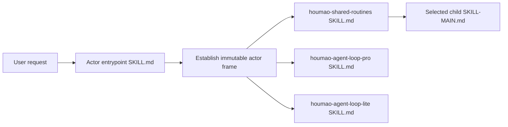

## Context

The current `houmao-system-skills.v3` implementation has three checked-in public roots and one separately checked-in protected tree. `compose_system_skill_pack()` copies a public entrypoint into a staging directory, selects one audience route, mounts `houmao-shared-routines` below that entrypoint, filters the routine set, and renders source-time placeholders. As a result, `src/houmao/agents/assets/system_skills/public/houmao-admin-entrypoint/SKILL.md` tells an agent to read `subskills/houmao-shared-routines/SKILL-MAIN.md`, but that path does not exist in the checked-in skill directory.

That projection works only through Houmao's installer. A user cannot copy the checked-in entrypoint and its declared resources as a normal Agent Skill, and an exact-`SKILL.md` scanner such as Skills CLI cannot discover a complete installable collection. It also makes source review differ from installed behavior.

The semantic source predates the actor compaction. Git commit `8f377c468bc7f87ff40dbf40c0a68327616112bd`, the parent of `adbdf84e`, contains the last flat tree before `feat: refactor system skills by actor`. That tree has twenty maintained standalone skills. The actor refactor intentionally changes discovery and actor scoping, but it must not erase the operational contracts in those sources.

Two local references define the target shape. Isomer's operator welcome and mega entrypoint demonstrate an independent newcomer surface plus a route index with one `When to Route Here` sentence per capability. The current `imsight-agent-skill-handling` format rules require standalone `SKILL.md`, parent-scoped `SKILL-MAIN.md`, a numbered `## Workflow` near the top of every executable instruction page, the correct subcommand flavor, standard arrow notation, and concise `DO NOT` guardrails.

## Goals / Non-Goals

**Goals:**

- Make the checked-in system-skill source the installed source of truth.
- Expose exactly six standalone public skills and sixteen parent-scoped shared routines.
- Let ordinary users enter through an actor-specific mega router while letting advanced users invoke shared routines or loop skills directly.
- Preserve admin versus verified-managed-agent posture across sibling-skill delegation.
- Preserve every original skill's operational meaning while rewriting its structure into current Imsight form.
- Support ordinary directory copying, Houmao copy or symlink installation, and Skills CLI discovery without runtime Markdown generation.
- Keep admin and agent packs atomic while safely sharing three top-level dependencies.
- Preserve the full guided-tour experience under `houmao-admin-welcome`.

**Non-Goals:**

- Treat skill placement or actor instructions as an authorization boundary.
- Preserve every old low-level skill as a top-level `SKILL.md` directory.
- Add a managed-agent welcome skill.
- Make Skills CLI understand Houmao pack dependencies automatically.
- Redesign Houmao runtime commands, mailbox protocols, loop artifacts, or other domain behavior.
- Copy Imsight `refactor-migrate` provenance directories into deployable skill roots. This suite uses the Imsight `format` contract and an immutable Git baseline; runtime skill directories remain minimal and installable.
- Reorganize the historical `legacy/` loop references or the separate `houmao-auto-system-prompt` asset.

## Decisions

### 1. Store One Static Public Collection

The checked-in source becomes:

```text
system_skills/
├── manifest.toml
├── manifest.schema.json
├── public/
│   ├── houmao-admin-welcome/
│   │   └── SKILL.md
│   ├── houmao-admin-entrypoint/
│   │   └── SKILL.md
│   ├── houmao-agent-entrypoint/
│   │   └── SKILL.md
│   ├── houmao-shared-routines/
│   │   ├── SKILL.md
│   │   └── subskills/
│   │       └── <sixteen-routine-id>/
│   │           └── SKILL-MAIN.md
│   ├── houmao-agent-loop-pro/
│   │   └── SKILL.md
│   └── houmao-agent-loop-lite/
│       └── SKILL.md
└── legacy/
```

There is no active `protected/` source tree. Protected is an ownership and discovery property of each child under `houmao-shared-routines/subskills/`, not a separate deployment unit. Every standalone directory is valid at rest and contains all of its local commands, references, scripts, templates, assets, and metadata. Cross-skill calls name installed sibling dependencies explicitly.

The loader rejects source-time placeholders, audience route entrypoint variants, and mount declarations. Installation copies or links source directories without changing their contents.

Alternatives rejected:

- Keep the protected source tree and copy it wholesale at install time. This still leaves the public source entrypoint incomplete and makes installed topology depend on custom assembly.
- Duplicate shared routines under both actor entrypoints. This makes copy-paste work but creates two semantic sources that will drift.
- Keep loops nested inside shared routines. This hides two skills that users invoke manually and breaks their original activation contract.

### 2. Expose Six Standalone Skills, but Control Implicit Activation Separately

Public means host-discoverable and manually invokable. It does not mean every skill should trigger implicitly.

| Standalone Skill | Role | Implicit Invocation |
| --- | --- | --- |
| `houmao-admin-welcome` | Read-only first-user orientation | Allowed for narrow first-use, orientation, comparison, and guided-tour intent |
| `houmao-admin-entrypoint` | Human-operator mega router | Disabled |
| `houmao-agent-entrypoint` | Verified managed-agent mega router | Disabled |
| `houmao-shared-routines` | Advanced direct route collection and actor-routed sibling | Disabled |
| `houmao-agent-loop-pro` | Manual pro-loop authoring and operation | Disabled |
| `houmao-agent-loop-lite` | Manual lite-loop authoring and operation | Disabled |

Each standalone root includes `agents/openai.yaml`. The three advanced/manual skills use `policy.allow_implicit_invocation: false`; the two entrypoints also remain explicit; welcome follows Isomer's narrow implicit orientation posture. This separates discoverability from auto-routing.

### 3. Make Actor Entrypoints Static Mega Routers

Both entrypoints contain overlapping actor instructions intentionally. The actor declaration must be visible before delegation.

The admin entrypoint establishes an immutable admin frame, resolves an explicit or unambiguously recovered target, and never treats the current shell or tmux session as managed self. The agent entrypoint runs `houmao-mgr --print-json agents self identity` before every substantive route, creates an immutable verified-agent frame, defaults eligible work to verified self, and fails closed when identity cannot be established.

Each entrypoint contains:

- a concise numbered workflow;
- a collection-of-routines `## Subcommands` table for its public route arguments;
- a shared-routine index that names each logical child, gives one distinguishing `When to Route Here` sentence, and names the sibling delegation target;
- direct loop rows that delegate to `houmao-agent-loop-pro` or `houmao-agent-loop-lite`;
- help and, for the admin entrypoint, welcome delegation;
- actor-specific target rules and `DO NOT` guardrails.

Ordinary route flow is:



The entrypoint never reads `subskills/...` relative to itself. It invokes the sibling shared skill, which explicitly loads its selected child. For internal documentation, entrypoint routes are subcommands and therefore use parenthesized notation, such as `houmao-admin-entrypoint->agent-inspect()`. The delegated owned child uses bare subskill notation followed by a parenthesized command, such as `houmao-shared-routines->houmao-agent-inspect->status()`.

The `houmao-specialist-mgr` compatibility meaning is preserved as an admin route alias. It reports that agent-definition is canonical and delegates to `houmao-shared-routines->houmao-agent-definition`; it does not become a seventeenth child or a seventh public skill.

### 4. Give Shared Routines a Direct Advanced-User Contract

`houmao-shared-routines` is a standalone public collection with sixteen owned children:

| Original Logical ID | Target Child |
| --- | --- |
| `houmao-adv-usage-pattern` | `subskills/houmao-adv-usage-pattern/SKILL-MAIN.md` |
| `houmao-agent-definition` | `subskills/houmao-agent-definition/SKILL-MAIN.md` |
| `houmao-agent-email-comms` | `subskills/houmao-agent-email-comms/SKILL-MAIN.md` |
| `houmao-agent-gateway` | `subskills/houmao-agent-gateway/SKILL-MAIN.md` |
| `houmao-agent-inspect` | `subskills/houmao-agent-inspect/SKILL-MAIN.md` |
| `houmao-agent-instance` | `subskills/houmao-agent-instance/SKILL-MAIN.md` |
| `houmao-agent-messaging` | `subskills/houmao-agent-messaging/SKILL-MAIN.md` |
| `houmao-credential-mgr` | `subskills/houmao-credential-mgr/SKILL-MAIN.md` |
| `houmao-ext-graphing` | `subskills/houmao-ext-graphing/SKILL-MAIN.md` |
| `houmao-interop-ag-ui` | `subskills/houmao-interop-ag-ui/SKILL-MAIN.md` |
| `houmao-mailbox-mgr` | `subskills/houmao-mailbox-mgr/SKILL-MAIN.md` |
| `houmao-memory-mgr` | `subskills/houmao-memory-mgr/SKILL-MAIN.md` |
| `houmao-operator-messaging` | `subskills/houmao-operator-messaging/SKILL-MAIN.md` |
| `houmao-process-emails-via-gateway` | `subskills/houmao-process-emails-via-gateway/SKILL-MAIN.md` |
| `houmao-project-mgr` | `subskills/houmao-project-mgr/SKILL-MAIN.md` |
| `houmao-utils-workspace-mgr` | `subskills/houmao-utils-workspace-mgr/SKILL-MAIN.md` |

When an actor entrypoint invokes shared routines, the shared root accepts and preserves the immutable frame. When a user invokes shared routines directly, it defaults to the human-operator posture because direct advanced use is normally operator-driven. An explicit leading `as-agent` qualifier requests managed-self posture and triggers fresh identity verification before child selection. The qualifier is invocation context, not an arrow-notation subcommand. A direct caller can bypass the actor entrypoint's route selection, but cannot bypass child eligibility, required targets, identity checks, command validation, or runtime authorization.

The shared root lists every child with one `When to Route Here` sentence and explicitly loads only the selected `SKILL-MAIN.md` plus required local resources. Pro and lite loop routes are sibling handoffs, not owned children.

### 5. Restore Pro and Lite as Top-Level Manual Skills

The two loop directories move from the composed shared tree to `public/` and regain standalone `SKILL.md` entrypoints. Their direct forms remain `$houmao-agent-loop-pro <operation>` and `$houmao-agent-loop-lite <operation>`. A no-operation invocation still means `init`, asks for `<loop-dir>`, and does not create files until that input exists. Help remains read-only, generic loop requests do not trigger either skill, and the pro/lite boundary remains unchanged.

Each loop uses the Imsight complex-procedure flavor. Public authoring and execution operations remain in workflow order, helper commands remain identified as helpers, and `help` plus aliases remain miscellaneous public commands. Existing scripts, scaffolds, command pages, references, output paths, validation stages, and run-control contracts remain owned by the corresponding top-level skill.

Direct loop invocation defaults to admin posture and accepts the same explicit `as-agent` qualifier with fresh identity verification. Entrypoint delegation passes its existing frame. Other shared routines route loop-shaped work to the top-level sibling instead of copying loop instructions.

### 6. Use the Pre-Compaction Tree as the Semantic Authority

The implementation begins by inventorying every file and executable behavior at Git commit `8f377c468bc7f87ff40dbf40c0a68327616112bd`. For each original skill, the implementer records triggers, help behavior, public operations and aliases, inputs, outputs, gates, blockers, evidence handoffs, side effects, target selection, stop conditions, and cross-skill boundaries before rewriting the target.

The target mapping is:

| Original Source | Target | Permitted Semantic Change |
| --- | --- | --- |
| Sixteen ordinary skills | Sixteen shared children | Actor eligibility and sibling-qualified routing only |
| `houmao-agent-loop-pro` | Top-level pro loop | Actor-frame intake and Imsight structure only |
| `houmao-agent-loop-lite` | Top-level lite loop | Actor-frame intake and Imsight structure only |
| `houmao-touring` | `houmao-admin-welcome` | Read-only admin handoff replaces direct peer invocation |
| `houmao-specialist-mgr` | Admin/shared compatibility alias to agent-definition | Packaging changes from wrapper directory to route alias |

Current actor-aware additions are retained when they narrow targets safely and do not contradict the source behavior. Any other difference must appear in a semantic-preservation ledger with an explicit justification; accidental omissions fail review.

Validation does not compare rewritten files byte for byte because Imsight formatting necessarily changes prose and paths. Instead, table-driven tests assert the preserved public operation inventory, aliases, default behavior, read-only help, critical gates, stop conditions, and route boundaries. Runtime tests do not require Git history; the exact commit is the authoring and review source used to construct those fixtures.

### 7. Apply the Current Imsight Format to Every Executable Page

The rewrite follows `imsight-agent-skill-handling`'s suite-level `format` contract:

- Standalone roots use `SKILL.md`; shared children use `SKILL-MAIN.md`; neither role keeps a compatibility copy.
- Every skill entrypoint and executable command page has a concise numbered `## Workflow` near the top and ends with the native-planning fallback.
- Collections use one peer `## Subcommands` table. Multi-stage loop procedures use procedural, helper, and miscellaneous subcommand groups.
- Every direct child row contains one original `When to Route Here` sentence, followed by explicit selective loading of the child entrypoint.
- Every page using arrow designators declares the standard `skill_invocation_notation` frontmatter value and uses bare components for skills or subskills and parentheses for every subcommand component.
- Every skill entrypoint has a concise `## Guardrails` section whose bullets begin `DO NOT`; positive requirements stay in workflow or contract sections.
- Frontmatter descriptions start with `Use when...`, describe trigger conditions rather than procedure, and preserve the original activation boundary.
- `agents/openai.yaml` metadata matches the skill's trigger posture and does not make manual skills implicit.
- Long domain procedures remain in owned command or reference pages. Formatting does not rename public operations, aliases, outputs, files, or domain terms unless the packaging decision requires a route-path update.

The applicable Imsight operation is `format`, not a runtime `refactor-migrate` package. No `org/`, `migrate/`, README, changelog, or installation guide is added inside a deployable skill directory.

### 8. Replace the Composer With Static Manifest Records

The manifest advances to `houmao-system-skills.v4` and records:

- six standalone skill names, source paths, roles, activation posture, and pack membership;
- sixteen shared child logical ids, child paths, route names, actor eligibility, commands, aliases, and logical dependencies;
- admin and agent pack member lists;
- default lanes and the auto-skill exclusion.

It no longer records protected mounts, audience route files, shared mount paths, placeholder rendering, or composition dependency closure. The loader validates exact standalone and child entrypoint roles, complete local links, child route uniqueness, dependency targets, actor eligibility, pack closure, and the exact six-root discovery set.

`compose_system_skill_pack()` and `_compose_protected_mount()` are removed rather than retained as misleading wrappers. A replacement staging function resolves a pack to a deduplicated tuple of static standalone records and copies or links each complete source directory.

### 9. Model Overlapping Pack Ownership Per Installed Skill

The static pack membership is:

| Pack | Standalone Members |
| --- | --- |
| `admin` | `houmao-admin-welcome`, `houmao-admin-entrypoint`, `houmao-shared-routines`, `houmao-agent-loop-pro`, `houmao-agent-loop-lite` |
| `agent` | `houmao-agent-entrypoint`, `houmao-shared-routines`, `houmao-agent-loop-pro`, `houmao-agent-loop-lite` |

Installing both produces six top-level directories, not nine. The receipt advances to a schema that records each projected skill once with its owning pack-id set, content digest, projection mode, and destination. Uninstall subtracts the selected pack owners and removes a projected skill only when no installed pack still owns it. Sync and upgrade stage the complete union, validate it, commit projections, then write the receipt last.

An untracked same-name destination still blocks installation. Modified receipt-owned content reports drift and is not silently discarded outside an explicit upgrade or sync operation. A home uses one projection mode for the owned static collection, avoiding one shared skill path with conflicting copy and symlink claims.

Alternatives rejected:

- Duplicate shared directories per pack under hidden materialization paths. This reintroduces composition and unclear source identity.
- Treat shared dependencies as unowned incidental files. This lets uninstalling either pack break the other.
- Keep receipt v1 and infer shared ownership from current pack selection. Historical receipts do not contain enough information for safe partial removal.

### 10. Make Copy-Paste and Skills CLI Installation Explicit

An exact recursive search for `SKILL.md` below `system_skills/public/` returns exactly six paths. Nested shared children use `SKILL-MAIN.md`, so Skills CLI does not register them as independent top-level skills.

Documentation provides:

- a copy-paste example that copies the selected pack's complete list of directories;
- `npx skills add <source> --skill '*'` for all six public skills;
- explicit admin installation listing welcome, admin entrypoint, shared routines, pro, and lite;
- explicit agent installation listing agent entrypoint, shared routines, pro, and lite.

Skills CLI is not assumed to resolve sibling dependencies. The entrypoint metadata and documentation name the required siblings, and Houmao's own installer continues to provide pack-aware installation.

### 11. Gate Generated Agent Prompts on Both Required Siblings

Mailbox command and notifier prompt generation continues to invoke `$houmao-agent-entrypoint`. The route is considered installed only when the tool-native skill root contains both `houmao-agent-entrypoint/SKILL.md` and `houmao-shared-routines/SKILL.md`. The static shared validator guarantees the mailbox child entrypoints in a healthy packaged source.

If either sibling is absent, generated text uses the existing API-oriented fallback and does not claim the skill route is available. Prompt text describes sibling delegation rather than protected traversal below the entrypoint. Loop prompts name the top-level loop skill when loop behavior is requested.

## Risks / Trade-offs

- [A user installs only one actor entrypoint through Skills CLI] → Document the sibling list in metadata and examples, fail with a clear missing-sibling blocker, and keep Houmao pack installation as the dependency-aware path.
- [Public shared routines can be invoked without the actor reminder] → Default direct invocation to admin, require explicit managed-self selection and fresh verification, retain every child gate, and state that discovery is not authorization.
- [Reformatting many skill pages accidentally drops behavior] → Use the exact Git baseline, a per-skill preservation ledger, table-driven operation and gate tests, and focused human review of every mapping.
- [The six public roots increase top-level discovery compared with the previous three] → Disable implicit invocation for entrypoints, shared routines, and loops; allow only the narrow welcome trigger.
- [Shared pack members complicate uninstall] → Use per-skill owner sets in a new receipt schema and commit receipts after successful projection changes.
- [Removing composition changes many tests and APIs] → Remove composer terminology consistently, retain transaction helpers where useful, and map every deleted composer assertion to static staging or identity coverage.
- [Static shared content contains both actor branches] → Keep actor eligibility in the manifest and child workflow, validate route matrices, and treat the runtime CLI as the final authority.
- [Migration provenance would make every copied skill much larger] → Keep Git as immutable source evidence and keep preservation fixtures outside runtime skill roots.

## Migration Plan

1. Capture the pre-compaction semantic inventory from commit `8f377c468bc7f87ff40dbf40c0a68327616112bd` and map every source file, operation, alias, gate, and output to its target owner.
2. Move shared routine and loop resources into the static public tree, restore pro and lite `SKILL.md`, and create the standalone shared `SKILL.md` with sixteen `SKILL-MAIN.md` children.
3. Rewrite all executable instruction pages to the current Imsight format, then validate semantic preservation before changing installer behavior.
4. Rewrite the actor entrypoints and welcome against the final sibling routes. Remove local-subskill references, protected route variants, source placeholders, and duplicate loop ownership.
5. Replace manifest v3 with v4 static records, remove composition code, and add static source and discovery validation.
6. Introduce the shared-owner receipt schema and update install, sync, status, upgrade, uninstall, CLI output, and managed-home integration.
7. Update generated prompts, documentation, package data, and focused tests.
8. Mark v3 receipt-owned installations drifted. Upgrade stages the selected v4 static union, validates it, replaces only receipt-owned paths, writes the new receipt last, and removes obsolete materialization data after commit.
9. Rollback restores the transaction backup and old receipt. Source rollback uses the preceding release; no compatibility composition code remains in v4.

## Open Questions

None. The public inventory, shared child set, direct-actor defaults, pack membership, semantic baseline, and static installation contract are fixed by this change.
