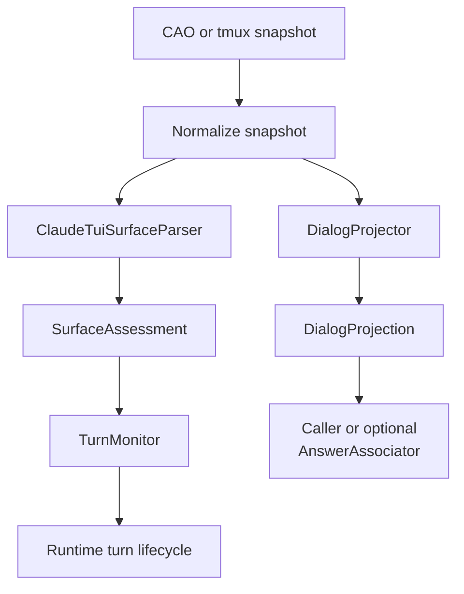
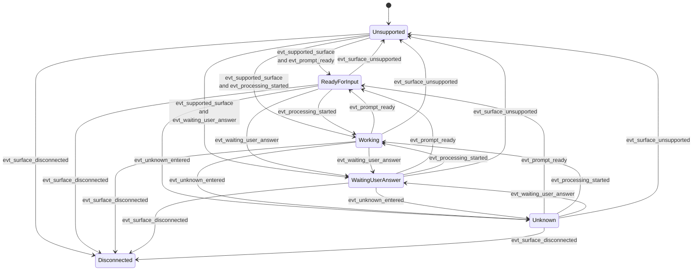
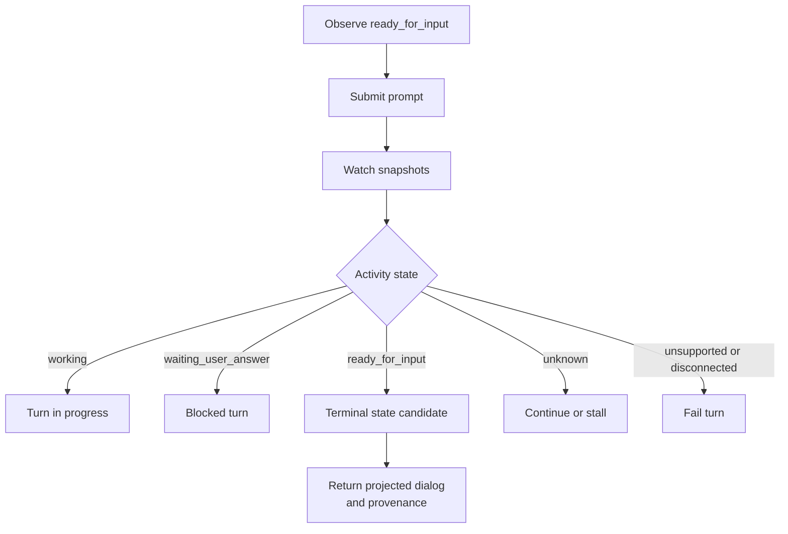

# Claude Code State Contracts

## Purpose

This note defines the proposed Claude Code TUI state contract for the `decouple-shadow-state-from-answer-association` change.

It focuses on:

- how Claude TUI states are defined,
- how those states are detected from CAO/tmux snapshots,
- how state transitions are interpreted over time, and
- which architecture layer is responsible for which concern.

It intentionally does **not** define generic prompt-to-answer association as part of the core shadow parser contract.

## Design Position

The core design assumption is:

> Reliable prompt-to-answer association from raw Claude Code TUI snapshots is not a stable provider-parser guarantee.

The parser therefore owns:

- provider-aware snapshot normalization,
- version-aware output-family detection,
- surface-state assessment,
- dialog projection, and
- diagnostics/anomalies.

The parser does **not** own:

- proving that projected dialog is the authoritative answer for the most recent prompt,
- separating current-turn answer text from all historical visible content,
- task-specific or prompt-specific output interpretation.

## Shared Model Binding

This document defines the Claude-specific binding of the shared frozen value-object contract:

- `SurfaceAssessment` is the shared base shape.
- `ClaudeSurfaceAssessment` is the Claude-specific subclass that refines `ui_context` and Claude evidence.
- `DialogProjection` is the shared base shape.
- `ClaudeDialogProjection` is the Claude-specific subclass that refines projection evidence/metadata.

The shared base model and subclassing rules are defined in the change design and in the `versioned-shadow-parser-stack` / `shadow-dialog-projection` delta specs. This document focuses on how Claude populates those fields.

## Layered Architecture

| Layer | Owns | Must not own |
|-------|------|--------------|
| `ClaudeTuiSurfaceParser` | version-aware state detection from one snapshot | prompt-specific answer association |
| `DialogProjector` | stripping ANSI/TUI chrome and preserving essential dialog content | deciding which projected text is "the answer" |
| `TurnMonitor` | runtime lifecycle over multiple snapshots, including readiness, working, blocked, and completion-like terminality | parsing provider-specific TUI syntax directly |
| `AnswerAssociator` | caller-specific or optional prompt-to-answer association heuristics | provider-owned TUI state detection |

## Core Contract Objects

### `SurfaceAssessment`

`SurfaceAssessment` is the provider-owned result of parsing a single normalized snapshot.

It should contain at least:

- `availability`
- `activity`
- `ui_context`
- `accepts_input`
- `parser_metadata`
- `anomalies`
- `evidence`

### `DialogProjection`

`DialogProjection` is the provider-owned dialog-oriented rendering of a single snapshot.

It should contain at least:

- `raw_text`
- `normalized_text`
- `dialog_text`
- `head`
- `tail`
- `projection_metadata`

`DialogProjection` is a projection of visible dialog content, not an authoritative current-turn answer.

## Normalized Inputs

The state contract is defined over:

- `T`: normalized ANSI-stripped snapshot text
- `V`: resolved parser preset version
- `W(T)`: bounded tail window used for state classification
- `t_n`: observation time for snapshot `T_n`

The parser contract should depend on named version-bound predicates rather than hard-coded regexes in the spec.

## Version-Bound Detection Predicates

Each Claude preset version `V` supplies concrete detectors for the following placeholders.

| Placeholder | Meaning |
|-------------|---------|
| `SUPPORTED_OUTPUT_FAMILY(V)` | Snapshot shape is recognized as a supported Claude Code TUI family |
| `IDLE_PROMPT_LINE(V)` | A line proves Claude is at an input-ready prompt |
| `PROCESSING_SPINNER_LINE(V)` | A line proves Claude is actively working |
| `WAITING_MENU_BLOCK(V)` | Snapshot contains a selection/approval menu requiring user action |
| `SLASH_COMMAND_CONTEXT(V)` | Snapshot shows Claude inside slash-command or command-palette style UI |
| `TRUST_PROMPT_BLOCK(V)` | Snapshot shows trust/onboarding/approval UI rather than normal prompt flow |
| `DISCONNECTED_SIGNAL(V)` | Snapshot indicates connection loss or terminal detachment |
| `ERROR_BANNER_BLOCK(V)` | Snapshot indicates a visible Claude-side error state |
| `DIALOG_LINE_KEEP(V)` | A visible line should be preserved in dialog projection |
| `DIALOG_LINE_DROP(V)` | A visible line is TUI chrome and should be dropped from dialog projection |

These predicates may be implemented with regexes, structural matchers, or mixed logic, but the contract should name the predicates rather than embedding concrete regex syntax into the state definition itself.

## State Model

The proposed model separates surface concerns into four dimensions.

### 1. `availability`

`availability` answers whether the parser trusts the snapshot surface at all.

Allowed values:

- `supported`
- `unsupported`
- `disconnected`
- `unknown`

Detection rules:

- `supported` when `SUPPORTED_OUTPUT_FAMILY(V)` is true and no stronger unavailability condition applies
- `unsupported` when `SUPPORTED_OUTPUT_FAMILY(V)` is false
- `disconnected` when `DISCONNECTED_SIGNAL(V)` is true
- `unknown` when the parser cannot safely determine support or liveness

### 2. `activity`

`activity` answers what Claude appears to be doing right now.

Allowed values:

- `ready_for_input`
- `working`
- `waiting_user_answer`
- `unknown`

Detection rules:

- `waiting_user_answer` when `WAITING_MENU_BLOCK(V)` or `TRUST_PROMPT_BLOCK(V)` is true
- `working` when `PROCESSING_SPINNER_LINE(V)` is true and no higher-priority blocking condition applies
- `ready_for_input` when `IDLE_PROMPT_LINE(V)` is true and no higher-priority state applies
- `unknown` otherwise

### 3. `ui_context`

`ui_context` answers which kind of Claude UI the snapshot belongs to.

Allowed values:

- `normal_prompt`
- `selection_menu`
- `slash_command`
- `trust_prompt`
- `error_banner`
- `unknown`

Detection rules:

- `selection_menu` when `WAITING_MENU_BLOCK(V)` is true
- `slash_command` when `SLASH_COMMAND_CONTEXT(V)` is true
- `trust_prompt` when `TRUST_PROMPT_BLOCK(V)` is true
- `error_banner` when `ERROR_BANNER_BLOCK(V)` is true
- `normal_prompt` when input-ready or working evidence is present without a stronger context
- `unknown` otherwise

### 4. `accepts_input`

`accepts_input` answers whether the runtime should consider it safe to send the next prompt.

Allowed values:

- `true`
- `false`

Detection rules:

- `true` when `availability=supported`, `activity=ready_for_input`, and no blocking `ui_context` applies
- `false` otherwise

## State Definitions In Contract Form

### State: `ready_for_input`

`ready_for_input` holds when all of the following are true:

- `availability = supported`
- `IDLE_PROMPT_LINE(V)` is present in `W(T)`
- `WAITING_MENU_BLOCK(V)` is false
- `TRUST_PROMPT_BLOCK(V)` is false
- `PROCESSING_SPINNER_LINE(V)` is false

Contract meaning:

- Claude appears idle and interactive
- runtime may submit the next prompt

### State: `working`

`working` holds when all of the following are true:

- `availability = supported`
- `PROCESSING_SPINNER_LINE(V)` is present in `W(T)`
- no blocking higher-priority UI state applies

Contract meaning:

- Claude is actively processing or generating
- runtime should keep monitoring

### State: `waiting_user_answer`

`waiting_user_answer` holds when all of the following are true:

- `availability = supported`
- `WAITING_MENU_BLOCK(V)` or `TRUST_PROMPT_BLOCK(V)` is true

Contract meaning:

- Claude requires explicit human choice or approval
- runtime must not treat the turn as generically complete

### State: `unknown`

`unknown` holds when all of the following are true:

- `availability = supported`
- none of `ready_for_input`, `working`, or `waiting_user_answer` hold

Contract meaning:

- the snapshot is still recognized as Claude TUI output
- but it lacks sufficient safe evidence for a stronger activity state

### State: `unsupported`

`unsupported` holds when:

- `SUPPORTED_OUTPUT_FAMILY(V)` is false

Contract meaning:

- parser/version contract does not recognize the snapshot
- the runtime should fail explicitly instead of guessing

### State: `disconnected`

`disconnected` holds when:

- `DISCONNECTED_SIGNAL(V)` is true

Contract meaning:

- the runtime should treat the TUI surface as unavailable
- this is distinct from merely being `unknown`

## State Priority

When multiple detectors fire, evaluation priority should be:

1. `disconnected`
2. `unsupported`
3. `waiting_user_answer`
4. `working`
5. `ready_for_input`
6. `unknown`

This keeps blocking/unavailable states from being mistaken for normal prompt readiness.

## Transition Events

State transitions are not defined from one snapshot alone; they are defined from changes across ordered snapshots.

### Event Vocabulary

| Event | Detection |
|-------|-----------|
| `evt_supported_surface` | `availability` becomes `supported` |
| `evt_surface_unsupported` | `availability` becomes `unsupported` |
| `evt_surface_disconnected` | `availability` becomes `disconnected` |
| `evt_processing_started` | `activity` changes to `working` |
| `evt_processing_stopped` | `activity` leaves `working` |
| `evt_prompt_ready` | `activity` changes to `ready_for_input` and `accepts_input=true` |
| `evt_waiting_user_answer` | `activity` changes to `waiting_user_answer` |
| `evt_unknown_entered` | `activity` changes to `unknown` while `availability=supported` |
| `evt_unknown_timeout` | runtime observes continuous `unknown` for configured timeout |
| `evt_context_changed` | `ui_context` changes between two snapshots |
| `evt_projection_changed` | `DialogProjection.dialog_text` changes between two snapshots |

## Transition Interpretation

The parser owns transition **detection inputs**, while runtime owns transition **meaning for turn lifecycle**.

### Parser-owned transition facts

The parser can legitimately say:

- the surface changed from `working` to `ready_for_input`
- the UI moved from `normal_prompt` to `selection_menu`
- the snapshot became `unsupported`
- the projected dialog changed or did not change

### Runtime-owned transition semantics

The runtime may interpret those facts as:

- safe to submit prompt
- turn appears to be in progress
- turn is blocked on user input
- turn appears to have reached a terminal lifecycle point
- turn is stalled or failed

The parser should not decide that a visible answer belongs to the current prompt.

## Transition Graph

## Runtime Turn Lifecycle Responsibility

The runtime should derive turn lifecycle from parser state transitions plus submission timing.

Important boundary:

- runtime may say a turn is complete enough to surface projected dialog
- runtime should not claim the projected dialog is the authoritative current-turn answer unless a separate associator does so

## Dialog Projection Responsibility

`DialogProjector` should:

- keep visible user/assistant dialog content,
- remove TUI chrome using version-bound projection rules,
- provide `head` and `tail` slices,
- preserve ordering,
- record which projection rules were applied.

`DialogProjector` should not:

- infer prompt-specific answer ownership,
- remove all historical dialog content,
- promise separation of current-turn vs prior-turn visible text.

## What Answer Association Must Not Depend On

The core parser/runtime contract should not require:

- baseline-based proof that visible answer text belongs to the last prompt
- generic suffix extraction as a provider guarantee
- one parser-owned "final answer" string for all callers

If a caller needs prompt-specific answer extraction, it should use a separate associator layer built on top of:

- `DialogProjection`
- runtime turn lifecycle
- caller knowledge of expected output shape

## Open Design Questions

- Should `waiting_user_answer` and trust/onboarding prompts remain one combined activity state or be split into separate blocking states?
- Should `slash_command` be standardized in the first cross-provider `ui_context` vocabulary or remain provider-specific metadata?
- Should the runtime expose raw CAO `tail` snapshots directly alongside projected dialog slices?
- Should `ready_for_input` require observed `evt_projection_changed` after submit before runtime marks a turn terminal?
