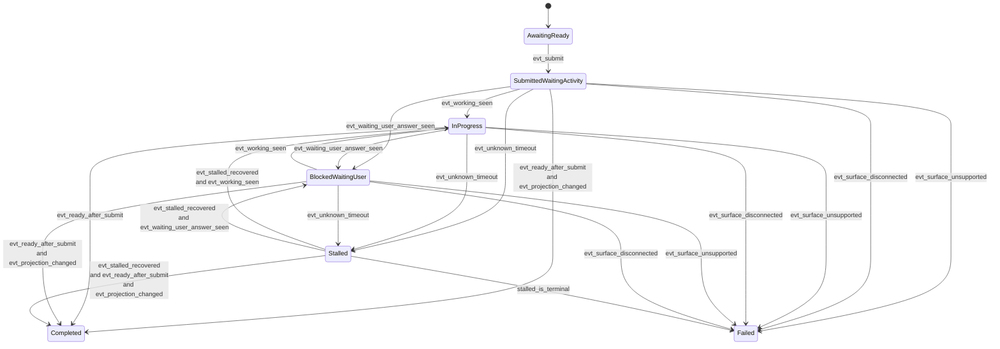
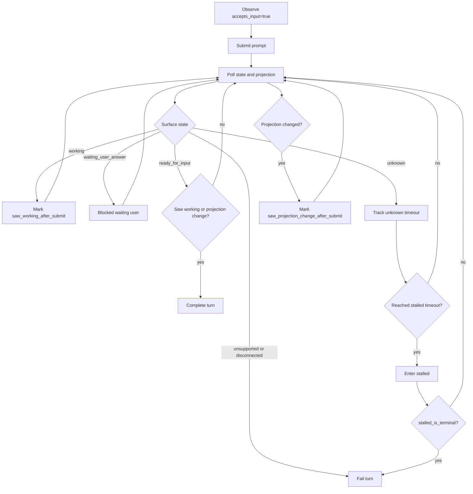

# TurnMonitor Contracts

## Purpose

This note defines the runtime-owned `TurnMonitor` contract for `shadow_only` CAO turns in the `decouple-shadow-state-from-answer-association` change.

It focuses on:

- what the runtime, not the provider parser, is responsible for,
- how submit-aware turn lifecycle is derived from ordered parser snapshots,
- how `TurnMonitor` relates to the existing `_ShadowLifecycleTracker`, and
- what conditions are required before a turn is treated as success-terminal.

## Ownership Boundary

> Provider parsers classify snapshots.
> Runtime `TurnMonitor` interprets snapshot sequences relative to one submit event.

The parser owns:

- one-snapshot `SurfaceAssessment`,
- one-snapshot `DialogProjection`,
- parser metadata/anomalies, and
- provider-specific unsupported/disconnected detection.

`TurnMonitor` owns:

- waiting for pre-submit readiness,
- tracking post-submit lifecycle over time,
- handling unknown→stalled runtime policy,
- deciding when a turn is blocked, failed, or success-terminal, and
- surfacing state/projection payloads to the caller.

`TurnMonitor` does **not** own:

- provider-specific TUI regexes or snapshot syntax rules,
- authoritative prompt-to-answer association.

## Relationship To `_ShadowLifecycleTracker`

`TurnMonitor` is the architectural successor to `_ShadowLifecycleTracker` in `cao_rest.py`; it is not a second parallel lifecycle mechanism.

The contract-level rule is:

- unknown→stalled timeout/recovery behavior remains part of runtime lifecycle semantics,
- `_ShadowLifecycleTracker` may survive as an internal helper or be absorbed into `TurnMonitor`,
- but externally there is one runtime lifecycle contract, not two competing abstractions.

## Inputs

`TurnMonitor` evaluates an ordered stream of observations:

- `submit_time`
- `SurfaceAssessment_n`
- `DialogProjection_n`
- parser metadata/anomalies
- runtime stall policy:
  - `unknown_to_stalled_timeout_seconds`
  - `stalled_is_terminal`

It also maintains internal turn-local memory:

- `saw_working_after_submit`
- `saw_projection_change_after_submit`
- `unknown_started_at`
- `stalled_started_at`
- `last_surface_assessment`
- `last_dialog_projection`

## Runtime Lifecycle States

The runtime lifecycle state machine is:

- `awaiting_ready`
- `submitted_waiting_activity`
- `in_progress`
- `blocked_waiting_user`
- `stalled`
- `completed`
- `failed`

These are runtime states, not parser states.

## Runtime Events

| Event | Detection |
|-------|-----------|
| `evt_ready_for_submit` | current `SurfaceAssessment.accepts_input` becomes `true` before submit |
| `evt_submit` | runtime sends terminal input |
| `evt_working_seen` | post-submit `SurfaceAssessment.activity = working` |
| `evt_waiting_user_answer_seen` | post-submit `SurfaceAssessment.activity = waiting_user_answer` |
| `evt_projection_changed` | post-submit `DialogProjection.dialog_text` differs from the pre-submit baseline or previous projection |
| `evt_ready_after_submit` | post-submit `SurfaceAssessment.activity = ready_for_input` and `accepts_input = true` |
| `evt_surface_unsupported` | post-submit `availability = unsupported` |
| `evt_surface_disconnected` | post-submit `availability = disconnected` |
| `evt_unknown_timeout` | continuous post-submit `unknown` reaches `unknown_to_stalled_timeout_seconds` |
| `evt_stalled_recovered` | a known post-submit state is observed after `stalled` |

## Terminality Contract

Success terminality is intentionally stronger than "the parser says ready."

After submit, the runtime SHALL treat a turn as success-terminal only when:

- the current surface returns to `ready_for_input`, and
- runtime has observed at least one of:
  - `evt_projection_changed` after submit, or
  - `evt_working_seen` after submit.

This rule avoids the stale-idle edge case where the UI may look ready again before polling captures active work.

## Failure And Blocking Contract

The runtime SHALL interpret states this way:

- `waiting_user_answer` → `blocked_waiting_user`
- `unsupported` → `failed`
- `disconnected` → `failed`
- continuous `unknown` beyond timeout → `stalled`
- `stalled` with `stalled_is_terminal = true` → `failed`
- `stalled` with `stalled_is_terminal = false` → keep polling until recovery or outer timeout

`blocked_waiting_user` is not success-terminal and is not equivalent to completion.

## Transition Graph

## Lifecycle Interpretation Flow

## Result Surface Contract

When `TurnMonitor` completes a successful `shadow_only` turn, the runtime surfaces:

- `dialog_projection`
- `surface_assessment`
- parser/runtime provenance metadata
- diagnostics/anomalies

It does **not** surface a shadow-mode `output_text` compatibility alias, and it does **not** claim that projected dialog is the authoritative answer to the submitted prompt.
