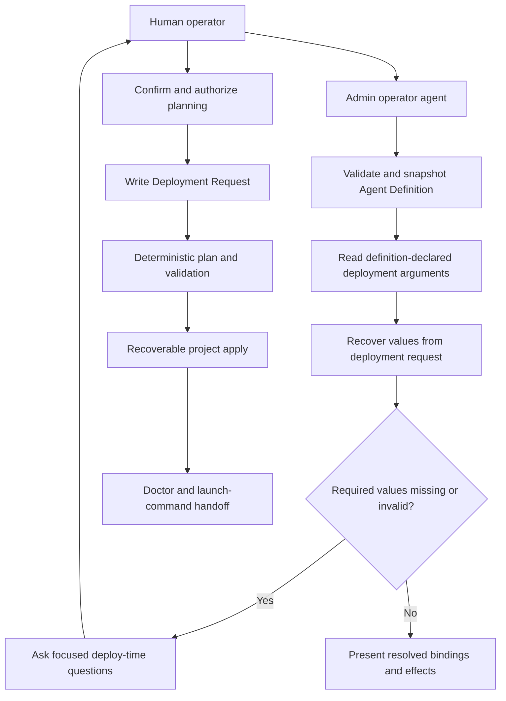
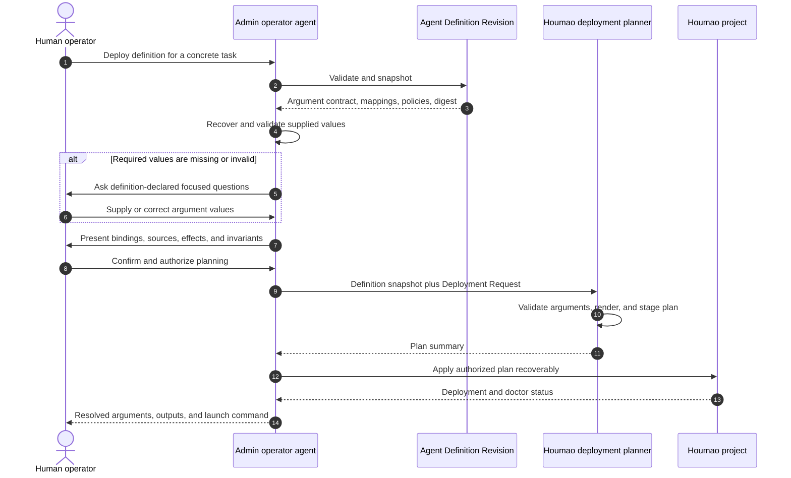

# Use Case UC-02: Deploy an Agent With Definition-Declared Arguments

## Actor Goal

As a human Houmao operator, I want each reusable Agent Definition to declare the values it needs at deployment time, so that the operator agent executing the deployment skill can collect my task-specific values immediately before planning and deploy the correct concrete agent into my selected Houmao project.

## Use Case

The definition author states that an agent varies by named deployment-time values, such as task objective, completion criteria, target repository area, review depth, or output language. Authoring turns those requirements into a typed `deploy-contract.toml` inside the materialized Agent Definition Revision. The contract explains each input, whether it is required, how to validate it, and which typed fields or exact text markers consume it.

At deployment, the human selects an exact definition and Houmao project. The operator agent validates and snapshots the definition before collecting values. It recovers explicitly supplied values, presents unresolved inputs, and asks focused questions immediately before planning. Once the human confirms the resolved values, the operator agent writes a Deployment Request. Deterministic planning then produces the only input accepted by apply.

Deployment arguments are not live process command-line arguments. They specialize the reusable definition into concrete project configuration before launch. The target project, source definition, plan/apply authorization, and later launch authority remain deployment controls outside the definition-declared argument contract.

## Supported Actions

### Declare Deployment Arguments in the Agent Definition

This action defines the reusable agent's task-specific input interface during authoring.

- context
  - Actor **has** requirements that identify which values vary each time the reusable agent is deployed.
  - System **has** an Agent Definition authoring workflow that can derive and materialize an immutable revision.
- intent
  - Actor **wants** future operators to know exactly what values this agent needs before deployment.
  - Actor **wonders** "Can this definition require `repository_area`, `review_depth`, and `done_when` without fixing those values during authoring?"
- action
  - Actor then **asks** the authoring workflow to declare those values as deployment arguments.
- result
  - Actor **gets** a materialized Agent Definition that contains a typed deployment-argument contract and deterministic bindings to allowed definition surfaces.

### Inspect Required Arguments Before Supplying Values

This action lets the human see the selected definition's input interface before project mutation.

- context
  - Actor **has** selected an exact materialized Agent Definition and target Houmao project.
  - System **has** validated and snapshotted the selected definition version.
- intent
  - Actor **wants** to understand every value that must be supplied, every declared default, and how each value affects deployment.
  - Actor **wonders** "What does this reviewer need from me before it can be deployed?"
- action
  - Actor then **asks** the operator agent to prepare deployment.
- result
  - Actor **gets** an ordered argument summary containing names, descriptions, types, required state, defaults, validation constraints, and deployment effects.

### Supply Deployment Arguments Immediately Before Planning

This action resolves the selected definition's required task-specific values at the deployment boundary.

- context
  - Actor **has** the definition-declared argument summary and concrete values for the current task.
  - System **has** recovered any explicit values already present in the current deployment request.
- intent
  - Actor **wants** to provide only the values still needed for this deployment.
  - Actor **wonders** "Can I set `repository_area=payments`, `review_depth=extended`, and `done_when=all changed payment paths are reviewed` now?"
- action
  - Actor then **asks** the operator agent to accept and validate the missing deployment argument values.
- result
  - Actor **gets** field-specific validation, a complete resolved-argument summary, and focused correction questions for any invalid or missing value.

### Deploy From the Confirmed Argument Bindings

This action turns confirmed argument values into one concrete Agent Deployment.

- context
  - Actor **has** confirmed all required argument bindings and requested deployment.
  - System **has** a current definition snapshot, selected project, valid Deployment Request, and unblocked Deployment Plan.
- intent
  - Actor **wants** the operator agent to deploy the selected definition according to the supplied values.
  - Actor **wonders** "Will Houmao use these exact values without inventing another task interpretation?"
- action
  - Actor then **asks** the operator agent to deploy the confirmed argument-resolved plan.
- result
  - Actor **gets** a recoverably published Agent Deployment, input-binding provenance, doctor results, and the exact profile launch command without automatic launch.

## Main Flow

1. During definition authoring, the human states which values must be supplied for each deployment and explains their intended effects.
2. The authoring operator agent preserves those requirements in `intent/src/agent-def-overview.md`.
3. Derivation proposes stable argument ids, descriptions, types, required state, optional non-secret defaults, prompt guidance, validation constraints, and definition-consumption mappings.
4. The human reviews the proposed deployment-input interface and every typed target binding.
5. Approved materialization writes the deployment-input contract into `deploy-contract.toml`.
6. Later, the human asks the admin operator agent to deploy one exact definition into one selected Houmao project.
7. `deploy-definition` verifies the admin actor frame, resolves the target project, validates the definition, and snapshots its identity, version, digest, argument contract, templates, skills, and policies.
8. The operator agent distinguishes definition-declared deployment arguments from deployment controls such as project selection, deployment name, apply authorization, and live launch.
9. The operator agent recovers argument values explicitly supplied in the current deployment request.
10. It validates recovered values against the snapshotted argument definitions.
11. It presents an ordered summary of all declared arguments, marking each value as supplied, defaulted, optional and omitted, or required and missing.
12. Immediately before planning, it asks focused questions only for required unresolved arguments or invalid supplied values.
13. The human supplies or corrects those values.
14. The operator agent validates types, constraints, allowed alternatives, target mappings, and non-secret posture.
15. It shows the complete resolved input set, the source of each value, and every affected target binding.
16. The human confirms the bindings and authorizes planning.
17. The operator agent writes a Deployment Request containing the exact user instruction, definition identity and digest, typed input bindings, and maintained project selections.
18. The deterministic planner verifies that every argument binding was declared by the snapshotted definition and that every required argument is resolved.
19. The planner applies definition-declared mappings, resolves all markers, validates rendered specialist/profile/skill content, and writes a digest-protected Deployment Plan.
20. The operator agent presents the plan summary and requests apply authorization when the current invocation does not already carry it.
21. Recoverable apply stages managed content, makes the Agent Deployment catalog-visible after every artifact is ready, and records definition, request, plan, generated-object, and content digests.
22. Deployment doctor validates the resulting relationships and argument-resolution provenance.
23. The operator agent reports the concrete specialist, profile, skills, resolved argument summary, doctor status, and exact launch command.
24. The workflow stops before live managed-agent launch.

## Alternative and Exception Flows

- If all required argument values are explicit and valid in the initial deployment request, the operator agent presents them for confirmation and does not ask redundant questions.
- If a required argument is missing, deployment remains in argument collection and no deployment plan is created.
- If an optional argument is omitted, the operator agent applies only a definition-declared default or records the argument as omitted.
- If a supplied argument name is not declared by the selected definition, the operator agent reports it as unknown and does not silently convert it into a content edit.
- If a value fails its declared type, enum, pattern, range, path, tool, credential-reference, or skill-selection constraint, the operator agent identifies that argument and asks for a corrected value.
- If a user attempts to supply a credential secret as an argument, the operator agent rejects the secret value and requests a maintained non-secret credential reference where the definition permits one.
- If an argument would affect an undeclared marker, immutable surface, or disallowed alternative, definition or request validation blocks planning.
- If a user asks for a content change beyond declared bindings, the operator agent directs the user to revise and rematerialize the definition.
- If the selected definition changes after argument collection begins, the operator agent invalidates the pending bindings, revalidates the new definition snapshot, and recollects values whose declaration changed.
- If project context can resolve a declared argument, the operator agent reports the resolution source and asks for confirmation when the declaration requires explicit human confirmation.
- If the human cancels during argument collection or confirmation, no plan, project specialist, project profile, deployment record, or live agent is created.
- If apply is interrupted, the operation journal and plan retain diagnostics so doctor can complete publication or remove operation-owned staging.

## Flow Diagram

## Sequence Diagram

## Durable Outputs

- A versioned `deploy-contract.toml` inside the materialized Agent Definition Revision.
- Definition provenance tying the argument contract to approved source and derived intent.
- A Deployment Request containing each input id, typed value, resolution source, validation status, and definition version.
- Deterministically derived placeholder bindings and selectable choices.
- A Deployment Plan bound to the exact definition and request digests.
- A project Agent Deployment containing concrete specialist, profile, prompt, memo, and skill material with no unresolved deployment arguments or `{{houmao.deploy.*}}` placeholders. Declared `{{houmao.runtime.*}}` launch-snapshot references remain a separate per-instance contract.
- Catalog provenance and doctor evidence for the applied argument bindings.
- An exact profile-backed launch command, with no automatic live launch.

## Example Prompt and Expected AI Response

### Event 001: Author Definition-Declared Deployment Arguments

> Time: `design example` · Session: `human operator authoring a reusable agent`

User Prompt:

> `$houmao-admin-entrypoint define a repository reviewer. The agent will have runtime parameters during deploy: repository_area, review_depth, and done_when. These deploy arguments must be defined inside the Agent Definition and specified right before deployment so the operator agent deploys the correct task-specific agent into my Houmao project.`

AI:

> The assistant preserves the request in `agent-def-overview.md` and derives `repository_area`, `review_depth`, and `done_when` as proposed deployment inputs rather than fixing their values during authoring. It proposes stable ids, types, required state, non-secret defaults, validation constraints, and typed target bindings. It presents that interface for review before materializing `deploy-contract.toml`. It does not deploy a project agent during authoring.

### Event 002: Deploy With Definition-Declared Arguments

> Time: `design example` · Session: `human operator deploying a task-specific reviewer`

User Prompt:

> `$houmao-admin-entrypoint deploy builtin:repository-reviewer into the current project. For this deployment, repository_area is payments, review_depth is extended, and done_when is "every changed payment path has an evidence-backed finding or an explicit no-finding result".`

AI:

> The assistant validates and snapshots `builtin:repository-reviewer`, then reads its deploy contract. It reports supplied values with their declared types and effects, applies only declared defaults, and asks only for required inputs still missing. It rejects unknown parameters instead of treating them as arbitrary task control. After confirmation, it writes the Deployment Request, previews the deterministic Plan, applies it recoverably, runs doctor, and prints the exact profile launch command. It does not launch the agent.

### Event 003: Required Argument Is Missing

> Time: `design example` · Session: `human operator preparing deployment`

User Prompt:

> `$houmao-admin-entrypoint deploy builtin:repository-reviewer into the current project with repository_area=payments.`

AI:

> The assistant validates the selected definition and shows its ordered deployment arguments. It acknowledges `repository_area`, reports which values are defaulted or optional, and asks a focused question for each required unresolved value such as `done_when`. It does not create a deployment plan until the required definition-declared arguments are valid and confirmed.

## Assumptions and Open Questions

- The canonical term is **deployment argument**. “Runtime parameter during deploy” is user-facing language for a value resolved while specializing the definition, not a live process argument supplied after launch.
- The materialized definition owns the complete deployment-argument schema. Ambient chat may provide values but cannot add undeclared arguments.
- Definition selection, target project selection, deployment naming, plan/apply authorization, and live-launch authority are deployment controls rather than definition-declared arguments.
- Argument values are non-secret. Credential selection uses a typed credential reference to a maintained project credential.
- One input may feed multiple declared structured fields or exact text markers. Every consumption site remains explicit in the definition.
- V1 has no freeform semantic adaptation during deployment. Changes outside declared bindings require a new revision.
- Argument collection is bound to an exact definition version and digest so a changed contract cannot reuse stale values silently.

## Relationship to Existing Work

- UC-01 establishes definition authoring, bundle materialization, copied skills, concrete project deployment, and later skill discovery.
- This use case specializes the UC-01 deployment boundary by making the reusable definition, rather than the operator agent's intuition, authoritative for the task-specific values that must be collected.
- `deploy-contract.toml` is the single human-facing and rendering contract. It maps typed inputs to structured fields or exact text markers.
- The Deployment Request is the operator-authored boundary, and the Deployment Plan is the deterministic apply boundary.
