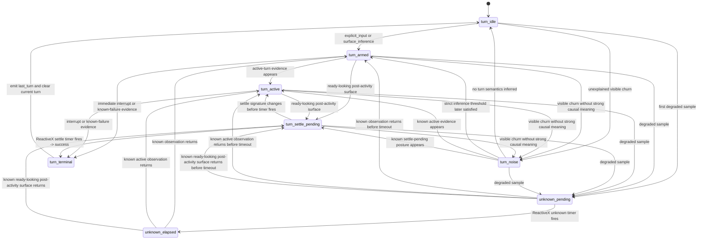

## Context

The current `houmao-server` tracked-state payload exposes several overlapping layers:

- direct observation and parser output (`transport_state`, `process_state`, `parse_status`, `parsed_surface`)
- reducer-level lifecycle classification (`readiness_state`, `completion_state`)
- authority bookkeeping (`completion_authority`, `turn_anchor_state`)
- operator summary (`operator_state.status`)
- separate visible-state stability metadata

That structure is internally useful, but it is not the clearest public contract.

The earlier simplification draft also made two assumptions that do not hold reliably enough for the primary API:

- command-looking input is not a safe semantic discriminator
  A prompt shaped like `/<command-name>` may be a built-in slash command, a user-defined subcommand that still sends a predefined prompt to the model, or a typo that the TUI forwards literally.
- progress or spinner signals are not a required observable for active-turn detection
  They are strong evidence when present, but they may be absent or too brief to observe even while a turn is genuinely active.
- operator-handoff UI is not a stable semantic contract
  Menus, selection boxes, permission prompts, and similar surfaces are too tool-specific and version-sensitive to justify a dedicated public ask-user state or outcome.
- failure signatures are only partially reliable
  Some failures are important and recognizable through specific patterns or signals, but many failure-looking surfaces are unstable or version-specific and should degrade to `unknown` unless they match a supported known-failure rule.

The target model is therefore:

- one unified turn lifecycle rather than separate chat and command lifecycles
- foundational state built only from directly observable surface facts
- active-turn inference based on combined evidence over time
- conservative handling of unexplained visible churn

The main constraints are:

- the current parser stack already emits `availability`, `business_state`, `input_mode`, `ui_context`, and normalized projection text
- the current tracker already contains turn anchoring, ReactiveX-driven settle timing, and background-watch fallback logic
- the shadow-watch demo and current docs explicitly consume and explain the old lifecycle-heavy payload
- breaking changes are acceptable in this repository, so the public contract does not need a long-lived compatibility shim

## Goals / Non-Goals

**Goals:**

- Replace the primary public tracked-state model with a smaller contract centered on foundational observables, current turn phase, and last observed terminal outcome.
- Remove public command-vs-chat differentiation from the tracked-state contract.
- Make active-turn inference evidence-based and conservative rather than tied to one specific signal such as a spinner.
- Collapse ambiguous operator-interaction UI into `turn.phase=unknown` instead of publishing a dedicated ask-user state or terminal outcome.
- Rename the public failure outcome to `known_failure` and reserve it for specifically recognized failure signatures.
- Keep transport/process/parse failures and parsed-surface evidence available as diagnostics.
- Preserve enough internal tracker machinery to implement the simplified contract without rewriting the parser stack in the same change.
- Make the demo and docs easier to read by removing direct dependence on reducer-internal states such as `candidate_complete`, `completed`, `stalled`, and anchor bookkeeping.

**Non-Goals:**

- Rewriting the official parser contracts in the same change.
- Removing all internal timing or anchoring logic immediately.
- Preserving the current tracked-state JSON shape for external callers.
- Redesigning the tracking-debug workflow beyond whatever adjustments are needed to follow the new public contract.

## Decisions

### 1. The public tracked-state contract will be organized into diagnostics, foundational observables, current turn, and last turn

The primary response shape will stop using readiness/completion/authority as its main consumer-facing language. Instead, it will expose:

```text
identity
diagnostics
surface
turn
last_turn
stability
recent_transitions
```

The intended semantic split is:

- `diagnostics`: can this sample be trusted and what low-level evidence exists?
- `surface`: what is directly observable right now?
- `turn`: what is the current turn posture?
- `last_turn`: what was the most recent terminal result?

The core public fields will be:

```text
diagnostics.availability = available | unavailable | tui_down | error | unknown
surface.accepting_input = yes | no | unknown
surface.editing_input = yes | no | unknown
surface.ready_posture = yes | no | unknown
turn.phase = ready | active | unknown
last_turn.result = success | interrupted | known_failure | none
last_turn.source = explicit_input | surface_inference | none
```

#### User-facing API states

These states are queryable from the tracked-state API and are the only states that dashboards or operators should need to interpret.

| Field | States | Definition |
|-------|--------|------------|
| `diagnostics.availability` | `available` | The current sample is usable for normal tracked-state interpretation. |
| `diagnostics.availability` | `unavailable` | The watched tmux target is no longer available to observe. |
| `diagnostics.availability` | `tui_down` | tmux is reachable but the supported TUI process is not running. |
| `diagnostics.availability` | `error` | Probe or parse failed for the current sample. |
| `diagnostics.availability` | `unknown` | The server is still watching, but this sample is not classifiable confidently enough for normal interpretation. |
| `surface.accepting_input` | `yes` | Typed input would currently land in the prompt-input area. |
| `surface.accepting_input` | `no` | Typed input would not currently land in the prompt-input area. |
| `surface.accepting_input` | `unknown` | The server cannot determine whether prompt-input acceptance is currently available. |
| `surface.editing_input` | `yes` | The prompt-input area is actively changing from user control or `tmux send-keys`. |
| `surface.editing_input` | `no` | No active prompt editing is currently observed. |
| `surface.editing_input` | `unknown` | The server cannot determine whether prompt editing is occurring. |
| `surface.ready_posture` | `yes` | The visible surface looks ready to accept immediate submit for the next turn. |
| `surface.ready_posture` | `no` | The visible surface does not currently look ready for immediate submit. |
| `surface.ready_posture` | `unknown` | The server cannot determine whether the current surface is ready-postured. |
| `turn.phase` | `ready` | The terminal appears ready for another turn now. |
| `turn.phase` | `active` | The tracker currently has enough evidence that a submitted turn is in flight. |
| `turn.phase` | `unknown` | The server cannot safely classify the current turn posture as `ready` or `active`. Ambiguous menus, selections, permission prompts, and other unstable interactive UI fall here unless stronger evidence supports another state. |
| `last_turn.result` | `success` | A turn completed successfully and passed the settle window. |
| `last_turn.result` | `interrupted` | A turn ended because an interrupt signal or equivalent stop action was observed. |
| `last_turn.result` | `known_failure` | A turn ended in a specifically recognized failure mode captured by supported string matching, parser evidence, or another strong tool-specific signal. |
| `last_turn.result` | `none` | No terminal turn result has been recorded yet. |
| `last_turn.source` | `explicit_input` | The recorded turn originated from the supported server-owned input route. |
| `last_turn.source` | `surface_inference` | The recorded turn originated from inferred direct interactive input observed on the live surface. |
| `last_turn.source` | `none` | No terminal turn source has been recorded yet. |

Three clarifications apply to the public state set:

- `turn.phase=active` is an inference over evidence, not a direct synonym for “spinner visible now.”
- `last_turn` is sticky until a later terminal turn supersedes it or the server intentionally clears it. It is not the same thing as current `turn.phase`.
- `turn.phase=unknown` is a catch-all for postures that are not safely classifiable as `ready` or `active`. It is intentionally broader than a dedicated operator-handoff state.
- `last_turn.result=known_failure` is intentionally narrow. Unmatched failure-like surfaces do not create a public failure outcome; they degrade to `turn.phase=unknown` until a supported known-failure signal appears.
- Visible TUI change is not treated as known-cause evidence by default. Cursor motion, tab handling, left/right navigation, repaint, local prompt edits, menus, selection boxes, permission prompts, or other unexplained UI churn may change the visible surface without starting, advancing, or completing a tracked turn.

Rationale:

- This matches what can actually be observed reliably.
- It removes the dishonest command-vs-chat distinction from the public contract.
- It removes the need for consumers to interpret `candidate_complete`, `inactive`, `unanchored_background`, and similar reducer terms.

Alternative considered: keep the current model and only improve docs. Rejected because the overlap and the unreliable assumptions are in the contract itself, not just in the explanation.

### 2. Active-turn inference is evidence-based and does not rely on slash-command detection or spinner visibility

The tracker will stop trying to classify separate command and chat kinds from prompt text shape. Everything submitted through the TUI is treated as one turn lifecycle.

The tracker will also stop treating progress or spinner signals as a necessary condition for `turn.phase=active`. They are only one supporting signal among several.

The evidence model is:

- sufficient evidence of an active turn:
  - explicit server-owned input accepted for a tracked terminal
  - visible scrolling dialog or response region growth after a turn starts
  - tool transcript or tool-call region changes that look turn-related
  - explicit activity strings, banners, progress, or spinner signals
- sufficient evidence of terminal `known_failure` or interruption:
  - explicit recognized failure signatures or interruption signals visible on the surface
- not sufficient by itself:
  - prompt text shaped like `/<command-name>`
  - unexplained prompt-area churn
  - menus, selection boxes, permission prompts, or other unstable interactive UI
  - unmatched failure-looking text or layout churn that does not match a supported known-failure rule
  - cursor movement
  - tab handling
  - left/right navigation
  - generic repaint

This means:

- progress/spinner visible => strong evidence that a turn is active
- progress/spinner absent => not evidence that no turn is active
- ambiguous operator-interaction UI => degrade to `turn.phase=unknown` unless stronger active or terminal evidence appears
- unmatched failure-like UI => degrade to `turn.phase=unknown` unless a supported known-failure rule matches
- unexplained surface churn => update diagnostics or surface evidence only unless stronger turn evidence appears

Rationale:

- This aligns the model with what is actually knowable from the live surface.
- It makes the tracker robust against missed spinners and ambiguous slash-looking text.

Alternative considered: keep a best-effort command-vs-chat split. Rejected because the distinction is semantically unsafe and would make the contract look more certain than it is.

### 3. Tool and version-specific signal detection is modular and switchable

The simplified model depends on concrete visible-surface signals, but those signals are not stable across all tools and versions. The tracker therefore SHALL NOT hard-code Claude/Codex-specific matching logic directly into the shared turn reducer.

Instead, tool/version-specific signal detection will be wrapped in modular detector classes selected by tool identity and version.

The architectural split is:

```text
probe raw surface
-> parse/probe diagnostics
-> tool-version signal detector
-> normalized signal set
-> shared turn reducer
-> public turn / last_turn contract
```

The shared reducer owns generic turn semantics such as:

- arming a turn
- mapping strong active evidence to `turn.phase=active`
- running ReactiveX settle timing
- emitting `last_turn.result=success|interrupted|known_failure`
- degrading unmatched or ambiguous surfaces to `turn.phase=unknown`

The detector class owns tool/version-specific pattern recognition such as:

- identifying current active-thinking or active-tool surfaces
- distinguishing current known interruption from stale historical interruption text
- distinguishing current known failure from stale historical failure text
- deciding whether a current surface is a success-settle candidate

The implementation shape should be explicitly modular, for example:

```text
BaseTurnSignalDetector
├── ClaudeCodeSignalDetectorV2_1_80
├── ClaudeCodeSignalDetectorVNext
├── CodexSignalDetectorV...
└── FallbackSignalDetector
```

Expected responsibilities:

- `BaseTurnSignalDetector`
  - defines the detector interface
  - returns normalized signals such as `active_evidence`, `interrupted`, `known_failure`, `success_candidate`, `ready_posture`, `current_error_present`
- tool/version detectors
  - inspect the current visible surface and optional recent surface history
  - apply version-specific pattern rules
  - avoid manufacturing generic lifecycle semantics outside the normalized signal set
- detector registry / selector
  - chooses the best detector by tool and version
  - does not require an exact version match
  - chooses the closest compatible detector for the observed tool/version
  - supports version-family and nearest-known fallback when no detector exists for the exact observed version
  - allows the tracker to swap detectors without rewriting the reducer

This modular boundary is required because the same visual token may change meaning or disappear across tool releases, while the public state contract should remain stable.

Version selection policy:

- detector selection SHOULD prefer the closest compatible known detector for the observed tool/version rather than requiring an exact version string match
- for example, a detector authored from Claude Code `v2.1.80` observations may be used for a nearby `v2.1.x` or otherwise closest compatible release until a more specific detector is added
- if no close compatible detector exists, the selector should fall back to a more conservative family-level detector rather than pretending exact support
- as version distance grows, the detector should become more conservative and degrade more unmatched surfaces to `turn.phase=unknown`

#### Claude Code `v2.1.80` signal rules

For the currently observed Claude Code version, `v2.1.80`, the closest-compatible Claude detector should recognize the following patterns, and nearby Claude Code versions may reuse this detector until a more specific one is available.

##### A. `turn.phase=active`

Any one of the following signal groups is sufficient active-turn evidence for the current surface.

1. Thinking line plus interruptable footer
   Conditions:
   - a current visible activity line contains a live thinking verb such as `Cerebrating…`
   - that line is part of the current active region, not stale scrollback
   - the footer shows `esc to interrupt`

2. Tool activity plus interruptable footer
   Conditions:
   - a current visible tool block such as `Fetch(...)` is present
   - its continuation/status line shows in-flight activity text such as `Fetching…`
   - the footer shows `esc to interrupt`

3. Answer growth while still interruptable
   Conditions:
   - the latest answer content is visibly appearing in the transcript
   - the footer still shows `esc to interrupt`
   - the surface has not yet reached a success-settle marker such as `Worked for <duration>`

Additional Claude-specific rule:

- a slash-menu overlay opened by local prompt editing, such as `❯ /` plus suggestion rows, does not negate `turn.phase=active` when stronger active evidence is still visible on the same surface

##### B. `last_turn.result=interrupted`

For Claude Code `v2.1.80`, interruption is a conjunctive matcher. All conditions below MUST be true in the same current surface:

1. A visible line contains the exact text `Interrupted · What should Claude do instead?`
2. That line is a `⎿` continuation/status line
3. A fresh `❯` prompt is visible after that interrupted line

Important recency rule:

- stale interrupted text in scrollback from a previous chat must not be emitted as the current turn result once a later turn has already produced newer active or terminal evidence

##### C. `last_turn.result=known_failure`

Known failure remains intentionally narrow and version-specific.

For Claude Code `v2.1.80`, one supported rule is the colored L-shaped error frame:

1. a visible `⎿` continuation/status line is present
2. that line contains an error-bearing segment rendered in a highlighted error color rather than the surrounding neutral gray
3. a lower status-area message is also visible with an error-bearing segment in the same highlighted color
4. a fresh `❯` prompt is visible
5. the upper colored `⎿` line and lower colored status-area message form the Claude L-shaped error frame
6. the colored `⎿` error line is the latest relevant status/result line for the current prompt posture

Important recency rule:

- a sticky lower colored status message or older colored error line remaining in scrollback does not keep the current turn in known failure once a later non-error result line has superseded it

##### D. `last_turn.result=success` and current `turn.phase=ready`

Success is not emitted when answer text first appears. It is emitted only when the current surface has settled.

For Claude Code `v2.1.80`, all of the following are required:

1. the latest answer content is present in the transcript
2. a completion marker of the form `Worked for <duration>` is visible
3. a fresh `❯` input prompt is visible
4. no current known error signal is present for the latest turn
5. the relevant visible TUI has remained stable for a short settle window such as `1s`
6. that stability check includes the whole current visible state, not only the answer body; volatile markers such as the thinking/spinner line must also stop changing

Important recency rule:

- stale failure or interruption lines from previous chats that remain in scrollback do not block success for the latest turn by themselves

##### E. Current-region rule for Claude

For all Claude-specific detection above, the detector must reason over the current visible region and the latest relevant turn lines, not naive substring presence over the whole scrollback.

That rule is mandatory because the observed Claude UI can simultaneously contain:

- stale interruption or failure lines from older chats
- current active-thinking or tool-activity lines
- current slash-menu overlays caused only by local prompt editing
- current answer content from the latest turn

So detector logic must apply recency and current-region interpretation before emitting normalized signals.

Rationale:

- The public contract should remain stable while tool-specific pattern logic changes.
- Version-specific detector classes let us revise Claude/Codex signal logic independently.
- This avoids smearing unstable TUI details across the reducer and API model.

Alternative considered: keep all tool-specific signal matching inline in the main reducer. Rejected because version drift would make the reducer brittle and hard to test.

### 4. Existing parser outputs and reducer internals remain implementation inputs during the first migration

This change will not require a same-turn parser rewrite. The tracker will continue to ingest the current parsed surface and current internal anchoring/timing logic, but it will map those internals into the new public model.

The mapping intent is:

- `surface.accepting_input=yes` when the parsed surface says the prompt area is currently usable
- `surface.editing_input=yes` when prompt-area text is actively changing under accepted input
- `surface.ready_posture=yes` when the visible surface indicates immediate submit would be accepted
- visible surface changes that are not attributable to explicit input, strict surface inference, active-turn evidence, interrupt, known-failure evidence, or settled completion remain non-causal churn rather than advancing the turn machine
- `turn.phase=ready` when the tool is visibly ready for another turn
- `turn.phase=active` once a turn has been submitted or inferred and enough active-turn evidence exists
- `turn.phase=unknown` when the tool cannot safely distinguish the current posture, including ambiguous menus, selections, permission prompts, unmatched failure-looking surfaces, or version-specific interactive UI
- `last_turn` updates only when one active turn reaches a terminal outcome

Rationale:

- This keeps the change focused on the state model, not parser replacement.
- It allows incremental implementation and test migration.

Alternative considered: redesign parser outputs first and make the tracker consume a brand-new parser contract. Rejected because it expands the change scope substantially and delays simplification of the public API.

### 5. Timed behavior remains ReactiveX-driven rather than manual-timer-driven

All timed behavior in state tracking will continue to be expressed through ReactiveX observation streams and scheduler-driven timers.

That includes at minimum:

- settle timing before recording `last_turn.result=success`
- unknown-duration or degraded-visibility timing
- cancellation and reset when later observations invalidate a pending timed outcome
- deterministic scheduler-driven tests for those timing rules

This change SHALL NOT replace those timed paths with mutable timestamp fields, ad hoc polling arithmetic, or hand-rolled manual timers in the tracker.

Rationale:

- The repository already has a stronger timing model based on ReactiveX streams.
- The simplification is about the public state contract, not about regressing the timing implementation model.
- ReactiveX keeps these behaviors testable without real sleeps.

Alternative considered: simplify the implementation by replacing the existing ReactiveX timing paths with plain timestamp bookkeeping during the contract rewrite. Rejected because it would silently weaken determinism and reintroduce the same timer complexity in a less disciplined form.

### 6. Internal state-machine states stay richer than the public API

These states exist only inside the tracker. They are not queryable from the API, and they exist to support mapping, timing, and terminal-outcome emission.

| Internal state | Parameters | Definition |
|----------------|------------|------------|
| `turn_idle` | `source=none` | No tracked turn is currently active or armed. |
| `turn_armed` | `source=explicit_input|surface_inference` | A turn has just been started or inferred and is now being watched for stronger evidence. |
| `turn_active` | `source=explicit_input|surface_inference` | The turn has shown enough evidence to be treated as actively executing. |
| `turn_settle_pending` | `source=explicit_input|surface_inference`, `signature` | The turn has returned to a ready-looking post-activity surface and is waiting for the ReactiveX settle timer to confirm success. |
| `turn_terminal` | `result=success|interrupted|known_failure`, `source=explicit_input|surface_inference` | Transient internal terminal state used to emit `last_turn` and then return to `turn_idle`. |
| `turn_noise` | `signature`, `cause=unknown` | Transient non-public state for visible churn that changed the surface but is not attributable to a tracked turn transition. |
| `unknown_pending` | `started_at` | A degraded or unknown observation window is active and a ReactiveX timeout is pending. |
| `unknown_elapsed` | `started_at` | The unknown-duration timeout elapsed; diagnostics remain degraded until a known observation returns. |

The internal machine deliberately does not expose old reducer vocabulary such as `candidate_complete`, `completed`, `turn_anchored`, or `unanchored_background` as public API states. If some of that machinery remains during migration, it is an implementation detail behind the internal states above.

`turn_noise` exists to make one rule explicit: a changed surface is not automatically a known-cause lifecycle event. The tracker may update diagnostics, surface observables, recent transitions, or generic stability from that churn while leaving `turn` and `last_turn` unchanged.

#### State transition graph

The public API exposes only `turn` and `last_turn`, but the tracker internally passes through the richer non-public states below.



The public `turn.phase` mapping is intentionally smaller than the internal graph:

- `turn_idle` maps to public `turn.phase=ready` or `turn.phase=unknown`, depending on the visible surface.
- `turn_armed`, `turn_active`, and `turn_settle_pending` all map to public `turn.phase=active`.
- ambiguous menus, selections, permission prompts, or other unstable interactive UI do not create a dedicated public phase; they contribute to public `turn.phase=unknown` unless stronger active or terminal evidence appears.
- `turn_noise` does not create new turn semantics by itself; it only updates public `surface`, diagnostics, transitions, or stability when warranted.
- `unknown_pending` and `unknown_elapsed` degrade the public result toward `diagnostics.availability=unknown` and `turn.phase=unknown` until a known sample returns.

Rationale:

- This separates what is visible now from what just happened.
- It keeps noisy surface churn from manufacturing lifecycle semantics.
- It leaves room for richer internal logic without leaking that complexity into the public API.

Alternative considered: collapse the internal machine to the same size as the public API. Rejected because timing, inference, and conservative noise handling need more internal states than the public contract should expose.

### 7. Visible stability stays, but only as a diagnostic aid

Generic visible-state stability remains useful for dashboards and debugging, but it will no longer define the main lifecycle language presented to consumers.

The settle window needed to produce `last_turn.result=success` may still reuse the current stability/debounce machinery internally. The public contract, however, will present the result as a terminal turn outcome rather than as a separate public `candidate_complete` state plus timer.

Rationale:

- Stability is useful evidence.
- Stability is not itself the primary answer to “what is the TUI doing now?” or “what just happened?”

Alternative considered: remove stability entirely. Rejected because it is still valuable as generic evidence for dashboards and debug workflows.

### 8. The demo will render the simplified contract rather than translating old reducer terms

The dual shadow-watch demo will remain a thin consumer of `houmao-server`, but its dashboard vocabulary will change from readiness/completion/authority-heavy rows to the new simplified model:

- diagnostics/health
- accepting-input / editing-input / ready-posture
- current turn phase
- last turn result and source
- optional diagnostic stability and parsed-surface excerpts

Rationale:

- The demo is where the current complexity is most visible to operators.
- The simplified contract is only successful if the primary consumer actually uses it.

Alternative considered: simplify the server contract first and leave the demo unchanged until a later change. Rejected because the demo currently names the old semantics explicitly and would immediately drift out of sync.

## Risks / Trade-offs

- [Migration break for current consumers] → Update the demo, docs, and tests in the same change; do not keep stale examples that still teach `candidate_complete` and authority-heavy interpretation.
- [Implementation still carries legacy reducer complexity internally] → Accept that as an intermediate step; the change is primarily a contract simplification, not a same-turn tracker rewrite, and timed behavior stays on the existing ReactiveX path.
- [Version-specific signal logic may drift as Claude/Codex change] → Isolate detector rules in versioned detector classes and keep the shared reducer generic.
- [Ready-posture detection may still be tool-specific and imperfect] → Treat it as a best-effort foundational observable and verify it against real Claude/Codex interactive sessions.
- [Active-turn inference may still miss very short turns] → Treat active inference as evidence-based rather than exact-by-frame; use settle windows and direct input hooks to recover terminal outcomes conservatively.
- [Unmatched failure-looking UI may still be misclassified] → Keep `known_failure` narrow, require supported failure signatures before recording it, and degrade everything else to `turn.phase=unknown`.
- [Unexplained surface churn may still be over-attributed] → Keep the explicit `turn_noise` path and require stronger evidence before changing `turn.phase` or `last_turn`.

## Migration Plan

1. Revise the OpenSpec requirements for `official-tui-state-tracking`, `houmao-server`, and the dual shadow-watch demo to define the unified turn contract.
2. Replace the public Pydantic models and route payloads with the simplified `diagnostics` / `surface` / `turn` / `last_turn` shape.
3. Add modular tool/version signal detector classes and a selector boundary so Claude/Codex-specific matching logic is switchable without changing the shared reducer.
4. Update tracker mapping logic so internal parser/reducer inputs plus normalized detector signals emit the new public fields without relying on command-vs-chat differentiation.
5. Update the demo monitor, inspect output, docs, and test fixtures to consume the simplified model.
6. Remove or demote remaining references to the old readiness/completion/authority language from operator-facing docs.

Rollback is straightforward during development: revert the contract change and restore the previous tracked-state models and demo rendering together. No long-lived backward-compatibility surface is planned.

## Open Questions

- Should `last_turn` persist across server restart when a watched session is re-discovered, or should restart always clear it to `none` until a new terminal outcome is observed?
- Do we want to expose generic `yes | no | unknown` tri-state fields directly, or should the final JSON use `true | false | null` while docs describe them as tri-state observables?
