## Context

The current `houmao-server` tracked-state payload exposes several overlapping layers:

- direct observation and parser output (`transport_state`, `process_state`, `parse_status`, `parsed_surface`)
- reducer-level lifecycle classification (`readiness_state`, `completion_state`)
- authority bookkeeping (`completion_authority`, `turn_anchor_state`)
- operator summary (`operator_state.status`)
- separate visible-state stability metadata

That structure is internally useful, but it is not the clearest public contract. The target model is simpler: track foundational observable facts first, then express current chat or command work plus terminal outcomes on top of those facts. The foundational facts for this change are:

- whether the TUI is currently processing work
- whether the TUI is currently accepting prompt input
- whether the prompt-input area is actively being edited
- whether the current unsubmitted input posture is freeform chat input or an exact slash command of the form `/<command-name>` with optional trailing spaces only

The main constraints are:

- the current parser stack already emits `availability`, `business_state`, `input_mode`, `ui_context`, and normalized projection text
- the current tracker already contains turn anchoring, ReactiveX-driven settle timing, and background-watch fallback logic
- the shadow-watch demo and current docs explicitly consume and explain the old lifecycle-heavy payload
- breaking changes are acceptable in this repository, so the public contract does not need a long-lived compatibility shim

## Goals / Non-Goals

**Goals:**

- Replace the primary public tracked-state model with a smaller contract centered on foundational observables, current work phase, and last observed outcome.
- Keep transport/process/parse failures and parsed-surface evidence available as diagnostics.
- Preserve enough internal tracker machinery to implement the simplified contract without rewriting the parser stack in the same change.
- Make the demo and docs easier to read by removing direct dependence on reducer-internal states such as `candidate_complete`, `completed`, `stalled`, and anchor bookkeeping.

**Non-Goals:**

- Rewriting the official parser contracts in the same change.
- Removing all internal timing or anchoring logic immediately.
- Preserving the current tracked-state JSON shape for external callers.
- Redesigning the tracking-debug workflow beyond whatever adjustments are needed to follow the new public contract.

## Decisions

### 1. The public tracked-state contract will be organized into diagnostics, foundational observables, current work, and last outcome

The primary response shape will stop using readiness/completion/authority as its main consumer-facing language. Instead, it will expose four clearer layers:

```text
identity
diagnostics
surface
work
last_outcome
recent_transitions
```

The intended semantic split is:

- `diagnostics`: can this sample be trusted and what low-level evidence exists?
- `surface`: what is directly observable right now?
- `work`: what kind of cycle is active right now?
- `last_outcome`: what was the most recent terminal result?

The core public fields will be:

```text
diagnostics.availability = available | unavailable | tui_down | error | unknown
surface.processing = yes | no | unknown
surface.accepting_input = yes | no | unknown
surface.editing_input = yes | no | unknown
surface.input_kind = chat | command | none | unknown
work.kind = chat | command | none | unknown
work.phase = ready | active | awaiting_user | unknown
last_outcome.kind = chat | command | none
last_outcome.result = success | interrupted | failed | ask_user | none
last_outcome.source = explicit_input | surface_inference | none
```

#### User-facing API states

These states are queryable from the tracked-state API and are the only states that dashboards or operators should need to interpret.

| Field | States | Definition |
|-------|--------|------------|
| `diagnostics.availability` | `available` | The current sample is usable for normal tracked-state interpretation. |
| `diagnostics.availability` | `unavailable` | The watched tmux target is no longer available to observe. |
| `diagnostics.availability` | `tui_down` | tmux is reachable but the supported TUI process is not running. |
| `diagnostics.availability` | `error` | Probe or parse failed for the current sample. |
| `diagnostics.availability` | `unknown` | The server is still watching, but this sample is not classifiable confidently enough for normal interpretation. |
| `surface.processing` | `yes` | The visible TUI shows active work evidence such as spinner, progress, or streaming response. |
| `surface.processing` | `no` | The visible TUI shows no active work evidence. |
| `surface.processing` | `unknown` | The server cannot determine whether active work is occurring from the current sample. |
| `surface.accepting_input` | `yes` | Typed input would currently land in the prompt-input area. |
| `surface.accepting_input` | `no` | Typed input would not currently land in the prompt-input area. |
| `surface.accepting_input` | `unknown` | The server cannot determine whether prompt-input acceptance is currently available. |
| `surface.editing_input` | `yes` | The prompt-input area is actively changing from user control or `tmux send-keys`. |
| `surface.editing_input` | `no` | No active prompt editing is currently observed. |
| `surface.editing_input` | `unknown` | The server cannot determine whether prompt editing is occurring. |
| `surface.input_kind` | `chat` | The visible input posture is freeform LLM-prompt entry. |
| `surface.input_kind` | `command` | The current prompt text matches the exact slash-command form `/<command-name>` with no leading spaces, no extra arguments, and optional trailing spaces only. |
| `surface.input_kind` | `none` | No prompt-input posture is currently visible. |
| `surface.input_kind` | `unknown` | The visible input posture cannot be determined. |
| `work.kind` | `chat` | The current or next immediate work cycle is a dialog turn with the model. |
| `work.kind` | `command` | The current or next immediate work cycle is execution of an exact slash command whose prompt text matches `/<command-name>` with optional trailing spaces only. |
| `work.kind` | `none` | No active or ready work cycle is currently attributable. |
| `work.kind` | `unknown` | The server cannot determine what kind of work cycle is in effect. |
| `work.phase` | `ready` | The current `work.kind` could begin immediately if submitted now. |
| `work.phase` | `active` | A chat or command cycle has started and has not yet reached a terminal outcome. |
| `work.phase` | `awaiting_user` | An active cycle is paused on explicit operator action or permission. |
| `work.phase` | `unknown` | The server cannot determine the current work posture safely. |
| `last_outcome.kind` | `chat` | The most recently terminated cycle was a dialog turn. |
| `last_outcome.kind` | `command` | The most recently terminated cycle was a slash-command execution. |
| `last_outcome.kind` | `none` | No terminal cycle has been recorded yet. |
| `last_outcome.result` | `success` | A cycle completed successfully and passed the settle window. |
| `last_outcome.result` | `interrupted` | A cycle ended because an interrupt signal or equivalent stop action was observed. |
| `last_outcome.result` | `failed` | A cycle ended in error, disconnection, unsupported state, or unrecoverable failure. |
| `last_outcome.result` | `ask_user` | A cycle stopped and handed control to the operator for an answer, permission, or selection. |
| `last_outcome.result` | `none` | No terminal cycle result has been recorded yet. |
| `last_outcome.source` | `explicit_input` | The recorded cycle originated from the supported server-owned input route. |
| `last_outcome.source` | `surface_inference` | The recorded cycle originated from inferred direct interactive input observed on the live surface. |
| `last_outcome.source` | `none` | No terminal cycle source has been recorded yet. |

Two clarifications apply to the public state set:

- `work.kind` and `work.phase` are orthogonal. For example, `work.kind=chat` with `work.phase=ready` means the terminal is ready for another chat turn, while `work.kind=command` with `work.phase=active` means a slash command is currently executing.
- `last_outcome` is sticky until another terminal cycle supersedes it or the server intentionally clears it. It is not the same thing as current `work.phase`.
- Slash-command classification is exact. `surface.input_kind=command` applies only when the prompt is exactly `/<command-name>` from the first character of the prompt, followed only by optional trailing spaces. Leading spaces, a bare `/`, or additional arguments such as `/<command-name> extra` do not count as `command` and fall back to normal chat-style input classification unless another parser rule says otherwise.
- Visible TUI change is not treated as known-cause evidence by default. Cursor motion, tab handling, left/right navigation, repaint, local prompt edits, or other unexplained UI churn may change the visible surface without starting, advancing, or completing a tracked work cycle.

#### Internal state machine states

These states exist only inside the tracker. They are not queryable from the API, and they exist to support mapping, timing, and terminal-outcome emission.

| Internal state | Parameters | Definition |
|----------------|------------|------------|
| `cycle_idle` | `kind=none`, `source=none` | No tracked cycle is currently active or armed. |
| `cycle_armed` | `kind=chat|command`, `source=explicit_input|surface_inference` | A cycle has just been started or inferred and is now being watched for observable post-submit behavior. |
| `cycle_active` | `kind=chat|command`, `source=explicit_input|surface_inference` | The cycle has shown enough evidence to be treated as actively executing. |
| `cycle_awaiting_user` | `kind=chat|command`, `source=explicit_input|surface_inference` | The active cycle is blocked on operator interaction. |
| `cycle_settle_pending` | `kind=chat|command`, `source=explicit_input|surface_inference`, `signature` | The cycle has returned to a ready-looking post-activity surface and is waiting for the ReactiveX settle timer to confirm success. |
| `cycle_terminal` | `kind=chat|command`, `result=success|interrupted|failed|ask_user`, `source=explicit_input|surface_inference` | Transient internal terminal state used to emit `last_outcome` and then return to `cycle_idle`. |
| `cycle_noise` | `signature`, `cause=unknown` | Transient non-public state for visible churn that changed the surface but is not attributable to a tracked cycle transition. |
| `unknown_pending` | `started_at`, `kind?` | A degraded or unknown observation window is active and a ReactiveX timeout is pending. |
| `unknown_elapsed` | `started_at`, `kind?` | The unknown-duration timeout elapsed; diagnostics remain degraded until a known observation returns. |

The internal machine deliberately does not expose old reducer vocabulary such as `candidate_complete`, `completed`, `turn_anchored`, or `unanchored_background` as public API states. If some of that machinery remains during migration, it is an implementation detail behind the internal states above.

`cycle_noise` exists to make one rule explicit: a changed surface is not automatically a known-cause lifecycle event. The tracker may update diagnostics, surface observables, recent transitions, or generic stability from that churn while leaving `work` and `last_outcome` unchanged.

#### State transition graph

The public API exposes only `work` and `last_outcome`, but the tracker internally passes through the richer non-public states below. The graph is parameterized by `kind=chat|command`; the same transitions apply to either kind unless a parser-specific rule says otherwise.

```mermaid
stateDiagram-v2
    [*] --> cycle_idle

    cycle_idle --> cycle_armed: explicit_input or surface_inference
    cycle_idle --> cycle_noise: unexplained visible churn
    cycle_idle --> unknown_pending: first degraded sample

    cycle_armed --> cycle_active: processing evidence or other post-submit activity
    cycle_armed --> cycle_awaiting_user: immediate operator gate
    cycle_armed --> cycle_settle_pending: ready-looking post-activity surface
    cycle_armed --> cycle_terminal: immediate interrupt or failure evidence
    cycle_armed --> cycle_noise: visible churn without strong causal meaning
    cycle_armed --> unknown_pending: degraded sample

    cycle_active --> cycle_awaiting_user: operator gate detected
    cycle_active --> cycle_settle_pending: ready-looking post-activity surface
    cycle_active --> cycle_terminal: interrupt or failure evidence
    cycle_active --> cycle_noise: visible churn without strong causal meaning
    cycle_active --> unknown_pending: degraded sample

    cycle_awaiting_user --> cycle_active: operator answer resumes execution
    cycle_awaiting_user --> cycle_terminal: cycle hands off to operator as terminal ask_user outcome
    cycle_awaiting_user --> cycle_noise: visible churn without strong causal meaning
    cycle_awaiting_user --> unknown_pending: degraded sample

    cycle_settle_pending --> cycle_active: settle signature changes before timer fires
    cycle_settle_pending --> cycle_terminal: ReactiveX settle timer fires -> success
    cycle_settle_pending --> cycle_noise: visible churn without strong causal meaning
    cycle_settle_pending --> unknown_pending: degraded sample

    cycle_noise --> cycle_idle: no cycle semantics inferred
    cycle_noise --> cycle_armed: strict inference threshold later satisfied
    cycle_noise --> cycle_active: known active evidence appears
    cycle_noise --> cycle_awaiting_user: known operator gate appears
    cycle_noise --> cycle_settle_pending: known settle-pending posture appears
    cycle_noise --> unknown_pending: degraded sample

    unknown_pending --> cycle_armed: known observation returns before timeout
    unknown_pending --> cycle_active: known active observation returns before timeout
    unknown_pending --> cycle_awaiting_user: known operator-gated observation returns before timeout
    unknown_pending --> cycle_settle_pending: known ready-looking post-activity surface returns before timeout
    unknown_pending --> unknown_elapsed: ReactiveX unknown timer fires

    unknown_elapsed --> cycle_armed: known observation returns
    unknown_elapsed --> cycle_active: known active observation returns
    unknown_elapsed --> cycle_awaiting_user: known operator-gated observation returns
    unknown_elapsed --> cycle_settle_pending: known ready-looking post-activity surface returns

    cycle_terminal --> cycle_idle: emit last_outcome and clear current cycle
```



The public `work.phase` mapping is intentionally smaller than the internal graph:

- `cycle_idle` maps to public `work.phase=ready` or `work.phase=unknown`, depending on the visible surface.
- `cycle_armed`, `cycle_active`, and `cycle_settle_pending` all map to public `work.phase=active`.
- `cycle_awaiting_user` maps to public `work.phase=awaiting_user`.
- `cycle_noise` does not create new work semantics by itself; it only updates public `surface`, diagnostics, transitions, or stability when warranted.
- `unknown_pending` and `unknown_elapsed` degrade the public result toward `diagnostics.availability=unknown` and `work.phase=unknown` until a known sample returns.

Rationale:

- This matches the goal document directly.
- It separates what is visible now from what just happened.
- It removes the need for consumers to interpret `candidate_complete`, `inactive`, `unanchored_background`, and similar reducer terms.

Alternative considered: keep the current model and only improve docs. Rejected because the overlap is in the contract itself, not just in the explanation.

### 2. Existing parser outputs and reducer internals will remain implementation inputs during the first migration

This change will not require a same-turn parser rewrite. The tracker will continue to ingest the current parsed surface and current internal anchoring/timing logic, but it will map those internals into the new public model.

The mapping intent is:

- `surface.processing=yes` when the parsed surface shows `business_state="working"` or equivalent active-work evidence
- `surface.accepting_input=yes` when the parsed surface says the prompt area is currently usable
- `surface.editing_input=yes` when prompt-area text is actively changing under accepted input
- `surface.input_kind=command` only when the visible prompt text is exactly `/<command-name>` with no leading spaces, no extra arguments, and optional trailing spaces only
- `surface.input_kind=chat` for other freeform prompt entry, including prompts that start with spaces or contain additional text after a slash command token
- `surface.input_kind=none` when no prompt input area is active
- visible surface changes that are not attributable to explicit input, strict surface inference, active-work evidence, operator gate, interrupt, failure, or settled completion remain `cycle_noise` rather than advancing the work-cycle machine
- `work.phase=ready` when the tool is ready to accept the next chat or command immediately
- `work.phase=active` once a chat or command cycle has been submitted or inferred and has not yet reached a terminal outcome
- `work.phase=awaiting_user` when the tool is blocked on user interaction during an active cycle
- `last_outcome` updates only when one active cycle reaches a terminal outcome

Rationale:

- This keeps the change focused on the state model, not parser replacement.
- It allows incremental implementation and test migration.

Alternative considered: redesign parser outputs first and make the tracker consume a brand-new parser contract. Rejected because it expands the change scope substantially and delays simplification of the public API.

### 3. Timed behavior remains ReactiveX-driven rather than manual-timer-driven

All timed behavior in state tracking will continue to be expressed through ReactiveX observation streams and scheduler-driven timers.

That includes at minimum:

- settle timing before recording `last_outcome.result=success`
- unknown-duration or degraded-visibility timing
- cancellation and reset when later observations invalidate a pending timed outcome
- deterministic scheduler-driven tests for those timing rules

This change SHALL NOT replace those timed paths with mutable timestamp fields, ad hoc polling arithmetic, or hand-rolled manual timers in the tracker.

Rationale:

- The repository already has a stronger timing model based on ReactiveX streams.
- The simplification is about the public state contract, not about regressing the timing implementation model.
- ReactiveX keeps these behaviors testable without real sleeps.

Alternative considered: simplify the implementation by replacing the existing ReactiveX timing paths with plain timestamp bookkeeping during the contract rewrite. Rejected because it would silently weaken determinism and reintroduce the same timer complexity in a less disciplined form.

### 4. Reducer-internal states become internal or diagnostic, not primary contract

These current concepts will no longer be first-class public state:

- `readiness_state`
- `completion_state`
- `completion_authority`
- `turn_anchor_state`
- `candidate_complete`
- `completed`
- `stalled`
- candidate timing and unknown-to-stalled timing as primary dashboard data

The tracker may still use them internally for settle logic, unknown degradation, and turn association, but consumers will see the simpler state model above.

The only inference-source signal that remains public is `last_outcome.source`, because callers may still need to know whether the recorded cycle came from explicit server-owned input or inferred direct interaction.

Rationale:

- Most of these states are reducer mechanics, not foundational operator facts.
- They are the main reason current consumers need a long explanation to interpret the payload.

Alternative considered: keep old fields under the main payload and mark them “advanced.” Rejected because it leaves the contract overloaded and keeps dashboards coupled to old semantics.

### 5. Visible stability stays, but only as a diagnostic aid

Generic visible-state stability remains useful for dashboards and debugging, but it will no longer define the main lifecycle language presented to consumers.

The settle window needed to produce `last_outcome=result=success` may still reuse the current stability/debounce machinery internally. The public contract, however, will present the result as a completed outcome rather than as a separate public `candidate_complete` state plus timer.

Rationale:

- Stability is useful evidence.
- Stability is not itself the primary answer to “what is the TUI doing now?” or “what just happened?”

Alternative considered: remove stability entirely. Rejected because it is still valuable as generic evidence for dashboards and debug workflows.

### 6. The demo will render the simplified contract rather than translating old reducer terms

The dual shadow-watch demo will remain a thin consumer of `houmao-server`, but its dashboard vocabulary will change from readiness/completion/authority-heavy rows to the new simplified model:

- diagnostics/health
- processing/input/editing/input-kind
- current work kind and phase
- last outcome and source
- optional diagnostic stability and parsed-surface excerpts

Rationale:

- The demo is where the current complexity is most visible to operators.
- The simplified contract is only successful if the primary consumer actually uses it.

Alternative considered: simplify the server contract first and leave the demo unchanged until a later change. Rejected because the demo currently names the old semantics explicitly and would immediately drift out of sync.

## Risks / Trade-offs

- [Migration break for current consumers] → Update the demo, docs, and tests in the same change; do not keep stale examples that still teach `candidate_complete` and authority-heavy interpretation.
- [Implementation still carries legacy reducer complexity internally] → Accept that as an intermediate step; the change is primarily a contract simplification, not a same-turn tracker rewrite, and timed behavior stays on the existing ReactiveX path.
- [Input-editing detection may be tool-specific and imperfect at first] → Treat `editing_input` as a best-effort foundational observable and verify it against real Claude/Codex interactive sessions.
- [Work-phase mapping may still hide subtle distinctions] → Prefer one clear public phase model and keep rare reducer subtleties in diagnostics or tracking-debug artifacts instead of the main API.

## Migration Plan

1. Revise the OpenSpec requirements for `official-tui-state-tracking`, `houmao-server`, and the dual shadow-watch demo to define the smaller contract.
2. Replace the public Pydantic models and route payloads with the simplified shape.
3. Update tracker mapping logic so internal parser/reducer inputs emit the new public fields.
4. Update the demo monitor, inspect output, docs, and test fixtures to consume the simplified model.
5. Remove or demote remaining references to the old readiness/completion/authority language from operator-facing docs.

Rollback is straightforward during development: revert the contract change and restore the previous tracked-state models and demo rendering together. No long-lived backward-compatibility surface is planned.

## Open Questions

- Should `last_outcome` persist across server restart when a watched session is re-discovered, or should restart always clear it to `none` until a new terminal outcome is observed?
- Do we want to expose generic `yes | no | unknown` tri-state fields directly, or should the final JSON use `true | false | null` while docs describe them as tri-state observables?
