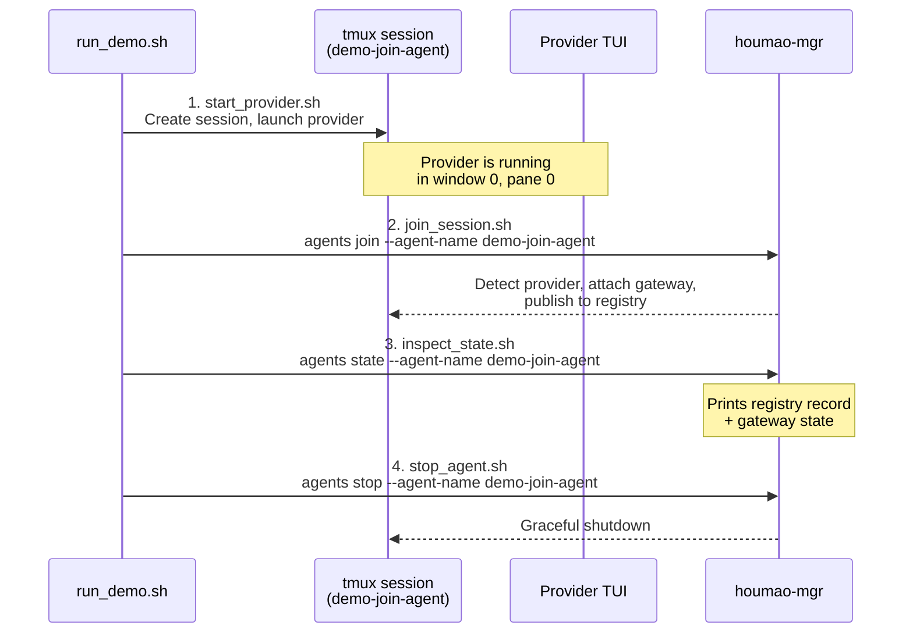

# agents-join-demo-pack

Demonstrates the `houmao-mgr agents join` workflow: adopt an already-running CLI agent (Claude Code, Codex, or Gemini CLI) into Houmao's management surface without a brain build or agent-definition directory.

## Prerequisites

| Requirement | Check |
|---|---|
| `tmux` installed | `tmux -V` |
| `houmao-mgr` on `PATH` | `pixi run houmao-mgr --help` |
| At least one supported provider CLI | `claude --version`, `codex --version`, or `gemini --version` |

## What the Demo Does



## Usage

```bash
# Run the full demo with the default provider (claude)
scripts/demo/agents-join-demo-pack/run_demo.sh

# Use a specific provider
scripts/demo/agents-join-demo-pack/run_demo.sh --provider codex
scripts/demo/agents-join-demo-pack/run_demo.sh --provider gemini
```

Supported `--provider` values: `claude` (default), `codex`, `gemini`.

## Step Scripts

Each step can be run independently for debugging:

| Script | Purpose |
|---|---|
| `start_provider.sh <provider>` | Create tmux session `demo-join-agent` and launch the provider TUI |
| `join_session.sh` | Run `agents join` to adopt the running session |
| `inspect_state.sh` | Query agent state (registry + gateway) |
| `stop_agent.sh` | Gracefully stop the joined agent |

## Demo Root

Runtime artifacts are placed under `tmp/demo/agents-join-demo-pack/`. The tmux session is named `demo-join-agent`.

## Cleanup

If the demo fails partway through, clean up manually:

```bash
tmux kill-session -t demo-join-agent 2>/dev/null || true
```
