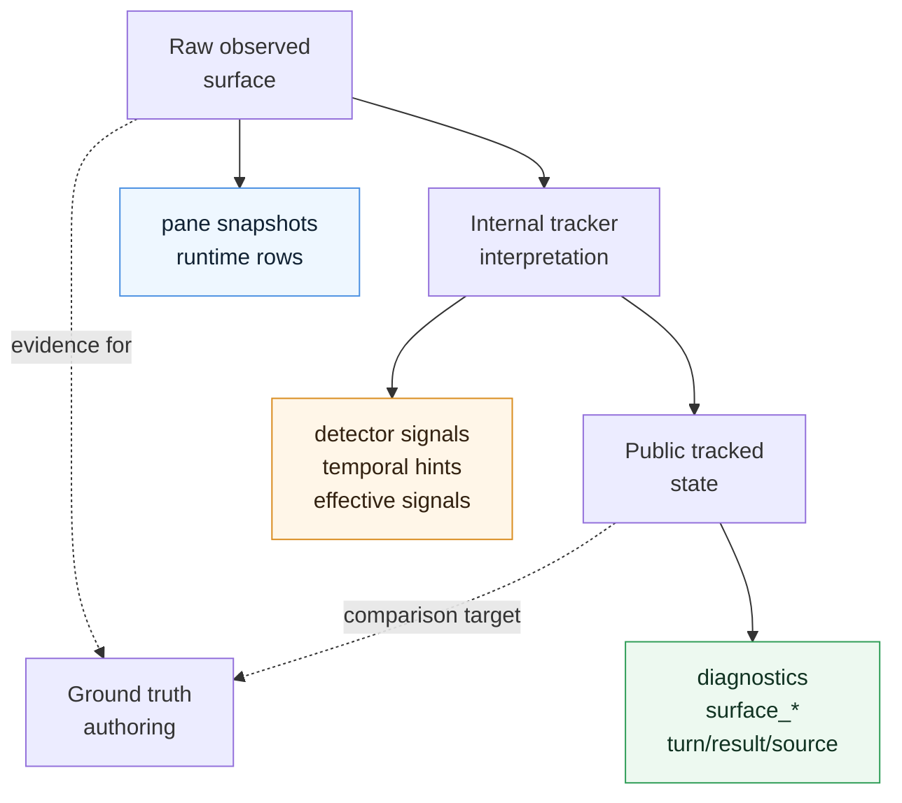
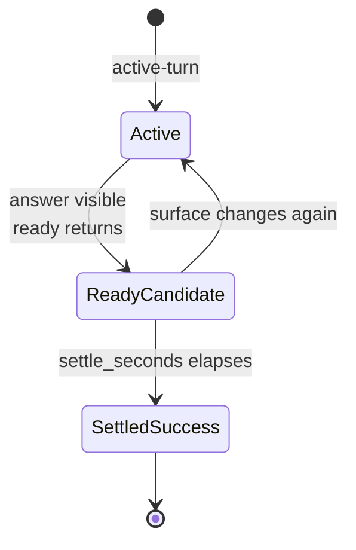
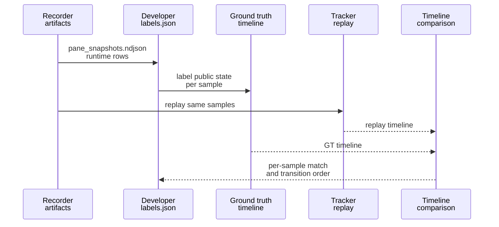
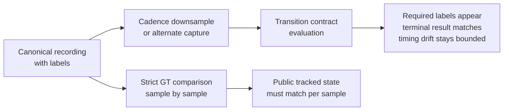

# Ground Truth vs Tracker Output Contract

This note explains what the demo pack means by "ground truth", what the standalone tracker is judged against, and why the comparison is defined that way.

The intended audience is developers working on tracked-TUI semantics, not only operators running the demo scripts.

## Short Version

The recorded-validation harness compares human-authored ground truth against the tracker’s public tracked state, not against raw pane text and not against internal detector or reducer intermediates.

Ground truth is therefore a statement about:

- what the tracker should publicly report at each recorded sample
- after all tracker-owned temporal semantics have been applied
- on the official public fields only

This is the contract the dashboard, reports, and higher-level tooling consume. That is why this is the right validation target for fixture-based regression tests.

## The Three Semantic Layers

There are three distinct layers in the system:

### 1. Raw observed surface

This is the terminal evidence recorded from tmux:

- `recording/pane_snapshots.ndjson`
- `runtime_observations.ndjson`

This layer answers:

- What text was visible in the pane?
- Was tmux up?
- Was the pane dead?
- Was the supported process alive?

This layer is the evidence source, but it is not yet the tracked-TUI contract.

### 2. Internal tracker interpretation

Inside the tracker, raw observations are interpreted into detector-owned and reducer-owned intermediates:

- single-snapshot detector signals
- recent-window temporal hints
- merged effective signals
- timer-armed candidate states such as success-candidate

These are internal semantics. They are useful for implementation and debugging, but they are not the stable public contract of the demo validation harness.

They may change when detector internals, temporal heuristics, or reducer structure are refactored, even when the user-visible tracked state remains correct.

### 3. Public tracked state

This is the state the standalone tracker publicly exposes and the demo pack persists in replay timelines.

The comparison contract is limited to these fields:

- `diagnostics_availability`
- `surface_accepting_input`
- `surface_editing_input`
- `surface_ready_posture`
- `turn_phase`
- `last_turn_result`
- `last_turn_source`

Ground truth is defined over this public state only.

## What Ground Truth Means

`labels.json` is not intended to describe "what the human sees at a glance" in a loose sense.

It is intended to describe:

- the correct public tracked state
- at each sample
- for the current tracker contract

That means a label is already expected to include tracker-owned temporal semantics where those semantics are part of the public state definition.

Example:

- The pane may visibly contain a final assistant answer at time `t0`.
- The tracker may still define the public state as `ready + last_turn_result=none` at `t0`.
- Only after the configured settle delay elapses does the public state become `ready + last_turn_result=success`.

In that case, the correct ground truth is not "success as soon as the answer is visible". The correct ground truth is:

- candidate-ready span before settle
- settled-success span after settle

This is why many fixtures need separate ranges such as:

- `active-turn`
- `success-candidate`
- `settled-success`

## Why Compare Against Public Tracked State

This design is intentional.

### Reason 1: It matches the product contract

The public tracked state is what dashboards, reports, and downstream tooling actually consume.

If the user-facing state is correct, the product behavior is correct, even if the detector reached that answer through different internal evidence than before.

### Reason 2: It avoids over-coupling tests to implementation details

Comparing directly against detector signals or effective signals would make fixtures brittle.

A harmless internal refactor could change:

- which hint produced the outcome
- whether a recent-frame heuristic fired
- whether a raw surface was treated as ambiguous before later resolution

while leaving the public tracked state unchanged.

Those changes should not invalidate a fixture corpus whose purpose is to validate the tracked-TUI contract.

### Reason 3: It makes delayed transitions testable

Some public states are intentionally not immediate. They depend on tracker-owned temporal semantics.

If ground truth were defined directly against raw visual completion, the harness would systematically disagree with the public contract on these delayed transitions.

Comparing against public tracked state lets the fixture author encode:

- "what is visible now"
- versus
- "what the tracker is allowed to report now"

Those are not always the same thing.

## Sample Alignment Model

Recorded validation is sample-aligned.

The harness expands ground truth into one full per-sample timeline and replays the same recording into the tracker to produce one replay timeline over the same sample ids.

The primary comparison is therefore:

- public state at sample `s000001`
- public state at sample `s000002`
- and so on

The harness also checks ordered transition sequence as a secondary sanity check, but the main contract is still per-sample public-state equality.

This matters because the question is not merely "did these two runs eventually reach similar transitions?" The question is:

"Given the recorded evidence available by this sample, what should the tracker publicly report at this point in time?"

For repeated intentional-interruption fixtures, this sample-aligned model is what makes the important reset semantics testable. The labels should distinguish each interrupted cycle separately so the comparison can tell whether:

- the first interrupted-ready posture was observed,
- `last_turn_result` reset to `none` when the second turn became active,
- the second interrupted-ready posture was observed, and
- the final intentional close changed diagnostics posture without inventing success or known failure.

## When Strict GT Comparison Is The Right Tool

Use strict GT comparison when:

- there is one canonical recording,
- labels were authored for that exact sample stream, and
- the question is whether replayed public tracked state matches the authored public-state contract sample by sample.

This is the right mode for:

- publishing canonical fixtures,
- regression-testing public tracked-state semantics, and
- debugging whether a replay diverged from human-authored public-state labels.

## When A Cadence Sweep Needs A Different Contract

Capture-frequency sweeps are a different question.

They ask:

- if the same underlying interaction is observed more sparsely,
- does the tracker still expose the required transition family and terminal outcome?

They do not ask:

- whether every sample in a slower or differently quantized stream should match the canonical per-sample GT timeline.

That is why the demo pack now separates two validation modes:

- strict GT comparison for the canonical capture profile
- transition-contract evaluation for cadence sweeps

The sweep contract is intentionally coarser:

- required state labels such as `active` or `ready_success`
- optional ordered required sequences such as `active -> ready_interrupted -> active -> ready_interrupted -> tui_down`
- required or forbidden terminal results
- bounded first-occurrence drift relative to the baseline variant

This is conceptually correct because changing capture cadence changes the evidence quantization. A slower stream may still be semantically good enough even when exact sample alignment to the canonical GT is no longer meaningful.

In the checked-in shared-TUI demo config, that robustness claim is intentionally bounded: the demo only claims robust tracked-state behavior at `2 Hz` or faster, meaning `sample_interval_seconds <= 0.5`. Slower cadences may still be useful for exploratory probing, but they are outside the default robustness promise the demo now makes.

## How To Handle Settle-Time And Stability Semantics

The safe rule is:

- only label a delayed or stable-only state if that delayed or stable-only meaning is part of the tracker’s public state contract

Today, success settlement is the clearest example of an explicit public delayed transition.

For such states:

- label the pre-settle span as the non-terminal public state
- label the post-settle span as the terminal public state

For states that are only "stable after x seconds" in an informal sense, but are not formalized as a public timed transition, do not invent a GT state that the tracker does not actually expose.

Instead:

- label the public pre-stable state the tracker currently owns
- or change the tracker contract so the stable state becomes an explicit public state first

This keeps the validation semantically honest.

## What The Comparison Does Not Prove

A passing GT comparison does not prove that every detector intermediate is perfect.

It proves that:

- given this recording
- under this tracker contract
- the public tracked state matched the authored expectation

That is a deliberate scope boundary.

If developers need to validate lower-level semantics, that should be a separate testing surface, for example:

- detector-signal fixtures
- temporal-hint fixtures
- trace-level debugging assertions

Those are useful, but they are not the same thing as public tracked-state validation.

## Developer Checklist For Label Authoring

When writing or reviewing `labels.json`, ask:

1. Am I labeling public tracked state, not raw visual intuition?
2. Does this label account for explicit tracker delay semantics such as settle windows?
3. If I am claiming a delayed or stable-only state, is that state actually part of the public contract?
4. Would a harmless internal detector refactor break this label even if the user-facing state stayed correct?

If the answer to the last question is yes, the label is probably targeting the wrong semantic layer.

## Conceptual Correctness Claim

The current approach is conceptually correct if the goal of the demo pack is:

- to validate the standalone tracker as a user-facing state machine
- from replayable terminal evidence
- without binding fixture meaning to internal detector implementation details

The approach would be conceptually wrong only if the intended test target were something else, such as:

- raw pane interpretation quality independent of public state
- exact detector-signal evolution
- exact temporal-hint derivation

That is not the contract of this demo pack.
