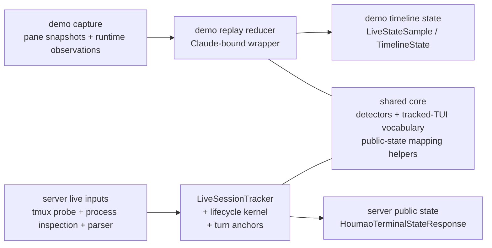

# Demo State Model And Relationship To Houmao Server

This note explains the simplified state model used by the Claude Code state-tracking demo under `scripts/explore/claude-code-state-tracking/` and how it relates to the production TUI tracker in `houmao-server`.

The short version:

- the demo was built first as an external validation harness for visible turn-state behavior
- the server-side TUI tracker was developed using that demo as a reference for the simplified public turn model
- the two now share part of their vocabulary and some helper logic, but they are still different systems with different responsibilities

## Lineage

The demo exists to answer one narrow question: given real tmux-backed Claude behavior, what simplified public turn state should a human or tool see over time?

That is why the demo is intentionally independent from `houmao-server`. It records pane snapshots and runtime liveness, derives content-first groundtruth, and replays the same observation stream through a reducer. The server-side tracker was then developed with that demo as a reference, so that the production tracker would converge on the same visible semantics instead of inventing a separate lifecycle vocabulary.

Today the relationship is:



The important nuance is that the server did not just copy the demo wholesale. It adopted the demo's simplified public semantics as a reference target, then added the extra authority, diagnostics, and lifecycle structure needed for a live production service.

## The Demo State Model

The demo publishes a narrow tracked timeline. The central sample shape is `LiveStateSample`, which is a live or timer-driven projection of the shared tracked-TUI vocabulary.

Its core fields are:

- `diagnostics_availability`
- `surface_accepting_input`
- `surface_editing_input`
- `surface_ready_posture`
- `turn_phase`
- `last_turn_result`
- `last_turn_source`
- detector metadata such as `detector_name`, `detector_version`, `active_reasons`, and `notes`

That shape is intentionally close to `TrackedTimelineState` and is designed for:

- replay comparison
- interactive watch dashboards
- transition logs
- validating detector and reducer changes against groundtruth

The demo does not try to be a complete service contract. It is a focused visibility model for "what turn state did we observe?" rather than a general-purpose runtime state API.

## Similarities

The demo model and the server model are similar in the places that matter most for visible turn semantics.

| Area | Shared behavior |
|------|-----------------|
| Public vocabulary | Both use the same simplified tracked-TUI concepts: diagnostics availability, surface tri-state observables, `turn_phase`, `last_turn_result`, and `last_turn_source`. |
| Detector-driven semantics | Both depend on detector output to decide whether the TUI looks ready, active, interrupted, failed, or ambiguously interactive. |
| Simplified turn posture | Both intentionally collapse richer internal activity into the same small public turn set: `ready`, `active`, `unknown`. |
| Last-turn provenance | Both preserve whether a recorded terminal outcome came from explicit input or from guarded surface inference. |
| Sticky last-turn behavior | Both keep `last_turn` sticky until a later terminal outcome supersedes it, instead of clearing it merely because a later active turn begins. |
| Success settling | Both require a stable success-like surface before publishing `last_turn_result=success`; they do not treat every ready-looking frame as a completed answer. |
| Validation role | The demo is used to validate whether the production server semantics are drifting from replay-grade expectations. |

In practical terms, if the demo says a live Claude sequence should look like:

```text
unknown -> ready -> active -> ready / success
```

then the server-side tracker is expected to publish a compatible visible progression for the same observed behavior, even if the server internally uses more machinery to get there.

## Differences

The differences are about authority, richness, and operational purpose.

| Aspect | Demo | Server |
|-------|------|--------|
| Primary role | Validation harness and replay oracle | Production source of truth for live tracked terminal state |
| Independence | Explicitly runs outside `houmao-server` | Owns the live tracking contract exposed by `houmao-server` |
| Input source | Recorded pane snapshots plus runtime observations | Live tmux probe, process inspection, parser output, and accepted input events |
| Tool scope | Currently Claude-focused in this demo path | General server-owned tracker for supported TUIs |
| Output richness | Narrow timeline rows and transition events | Full API payload with identity, diagnostics, parsed surface, stability, and recent transitions |
| Authority model | Lightweight armed-turn source plus settle timer | Explicit server-owned turn anchors, anchor loss/expiry, lifecycle authority, and lifecycle timing |
| Parser usage | May carry only minimal parsed surface context into reduction | Owns the full parsed surface and low-level observation stack |
| Stability model | Tracks emitted samples and transition events for analysis | Publishes bounded `recent_transitions` and generic visible-state `stability` as part of the API |
| Consumer expectation | Humans and maintainers inspecting replay and live-watch artifacts | Clients, dashboards, and other runtime consumers polling the server API |

## The Biggest Conceptual Difference: Authority

This is the most important difference.

The demo reducer answers:

```text
"Given these observations, what simplified public state would we replay?"
```

The server tracker answers:

```text
"As the live owner of this tracked terminal, what state am I willing to publish right now?"
```

That difference forces the server to carry authority that the demo does not need to expose:

- whether a server-owned turn anchor is active, absent, or lost
- whether completion monitoring is currently authoritative
- how long the current readiness/completion state has been unstable or unknown
- whether a previously published success should be briefly retractable before the anchor expires

The demo has a reduced analogue of this idea. It can arm explicit-input provenance and a pending success timer, but it does not expose the richer authority surface that the server maintains internally.

## The Biggest Structural Difference: Payload Shape

The demo sample is approximately:

```text
diagnostics availability
+ surface observables
+ turn phase
+ last turn result/source
+ detector metadata
```

The server response is approximately:

```text
tracked session identity
+ low-level diagnostics
+ optional probe snapshot
+ optional parsed surface
+ public surface observables
+ public turn phase
+ public last turn
+ stability
+ recent transitions
+ internal lifecycle metadata kept alongside the public response
```

That is why the demo is a good reference for semantics, but not a drop-in substitute for the server API.

## Rough Field Mapping

The closest field-level correspondence looks like this:

| Demo field | Closest server field |
|-----------|----------------------|
| `diagnostics_availability` | `diagnostics.availability` |
| `surface_accepting_input` | `surface.accepting_input` |
| `surface_editing_input` | `surface.editing_input` |
| `surface_ready_posture` | `surface.ready_posture` |
| `turn_phase` | `turn.phase` |
| `last_turn_result` | `last_turn.result` |
| `last_turn_source` | `last_turn.source` |
| `active_reasons`, `notes` | detector/debug evidence, not a stable top-level API field |

Important server-only concepts with no real demo equivalent:

- `tracked_session`
- `probe_snapshot`
- `parsed_surface`
- `stability`
- `recent_transitions`
- `operator_state`
- `lifecycle_timing`
- `lifecycle_authority`

## What "Server Developed Using The Demo As A Reference" Means

It does not mean the server is a thin wrapper over the demo.

It means the demo established the expected simplified external semantics first:

1. what counts as `ready`, `active`, or `unknown`
2. when a terminal result is sticky
3. when success is mature enough to publish
4. which visible surfaces should block a false success
5. which changes are detector bugs versus real state-model bugs

The server-side tracker was then shaped against those expectations so that production behavior would match the externally validated turn model instead of drifting into a different internal vocabulary.

Over time, some of that shared logic was extracted into common modules such as:

- `src/houmao/shared_tui_tracking/models.py`
- `src/houmao/shared_tui_tracking/public_state.py`
- `src/houmao/shared_tui_tracking/reducer.py`

So the current relationship is not just "demo inspired server". It is now:

- historical reference
- ongoing validation oracle
- partial shared-core consumer

all at once.

## How To Use This Distinction

Use the demo when you want to answer:

- "What visible state progression do real Claude surfaces suggest?"
- "Did a detector change regress the simplified turn model?"
- "Does replay still match content-first groundtruth?"

Use the server model when you want to answer:

- "What state should the live service publish right now?"
- "What is the authoritative runtime view for this tracked terminal?"
- "What diagnostics, stability, and recent transitions should clients see?"

If the two disagree on visible turn semantics, treat that as a real design signal. In this repository, the demo is not a disposable toy. It is one of the reference mechanisms used to keep the server-side TUI tracker honest.
