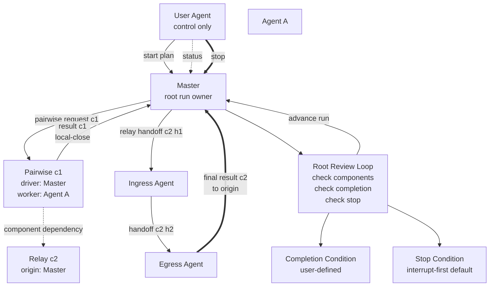

# Render The Final Generic Loop Graph

Use this page when the authored plan needs the final Mermaid graph that shows typed loop components, result-return paths, where the loop supervision lives, and where stop and completion are checked.

The final plan must include one Mermaid fenced code block. Do not use ASCII art as the primary graph representation.

## What The Graph Must Show

At minimum, the top-level graph must show:

- the user agent outside the execution loop
- the designated master or root run owner
- every typed loop component
- pairwise immediate-control edges and their local-close result return to the immediate driver
- relay lane handoff edges and their final-result return from egress to relay origin
- component dependencies or ordering constraints
- where the supervision loop lives
- where the completion condition is evaluated
- where the stop condition is evaluated

## Graph Semantics

- Draw the user agent as control-only unless the plan explicitly makes a managed user-controlled agent an execution participant.
- Label each component with `component_id` and `component_type`.
- Draw pairwise component execution as driver-to-worker request and worker-to-driver result.
- Draw relay component execution as ordered forward handoffs plus final egress-to-origin result.
- Draw component dependencies with dashed or labeled dependency edges rather than as implicit worker cycles.
- Draw the supervision loop as a review cycle owned by the root owner, not as a worker-to-worker cycle.
- Keep labels short and wrap with ` ` when needed.
- Split a very large topology into one top-level component diagram plus supporting component detail diagrams instead of making one unreadable diagram.

## Example

## Guardrails

- Do not imply that the user agent is an execution participant by drawing receipt or result ownership on the user agent.
- Do not draw the loop as an arbitrary cyclic worker graph when the real loop is typed component execution plus root-owner supervision.
- Do not omit component type, stop condition, completion condition, or result-return paths from the final plan graph.
