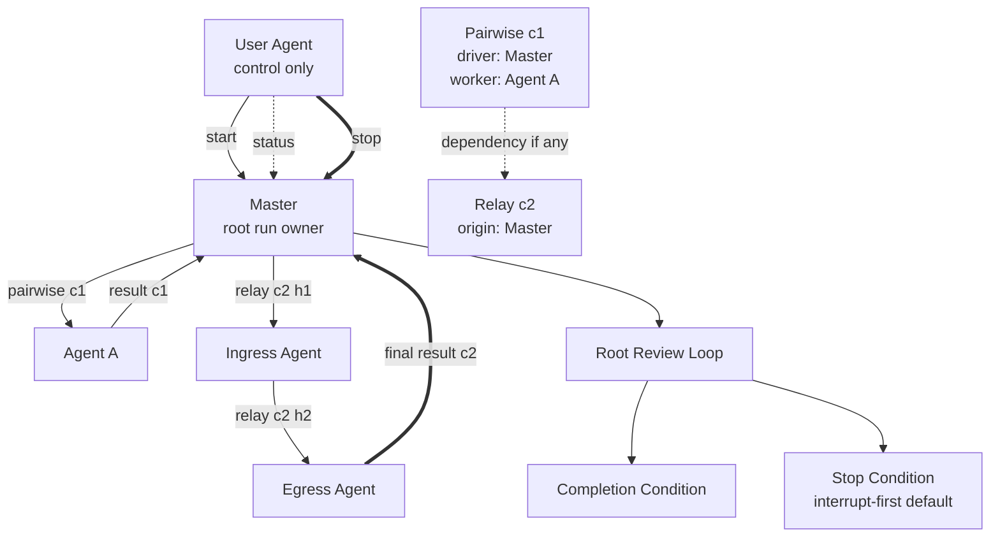

# Single-File Generic Loop Graph Plan Template

````md
---
plan_id: <plan-id>
run_id: <run-id or placeholder>
root_owner: <designated-master-or-root-owner>
participants:
  - <root-owner>
  - <agent-a>
  - <agent-b>
default_stop_mode: interrupt-first
---

# Objective
<what the run is trying to accomplish>

# Completion Condition
<what the root owner must be able to evaluate as complete>

# Master / Root Owner
<which agent owns the run and synthesizes completion>

# Participants
- `<agent>`: <role in one or more components>

# Loop Components
- `component_id`: <component-id>
  `component_type`: <pairwise | relay>
  `participants`: <agents>
  `root/driver/origin`: <agent>
  `downstream target or lane order`: <agent or ordered list>
  `elemental protocol`: <pairwise edge-loop | relay-loop>
  `result routing`: <worker -> driver | egress -> origin>

# Component Dependencies
<explicit dependencies, ordering, or concurrency rules>

# Graph Policy
<normalized delegation, forwarding, and dependency rules>

# Result Routing Contract
<component-level and run-level result return rules>

# Reporting Contract
<status, completion, and stop-summary expectations>

# Scripts
- `path`: <script path>
  `purpose`: <what it does>
  `allowed callers`: <which agents may call it>
  `inputs`: <inputs>
  `outputs`: <outputs>
  `side effects`: <side effects>
  `failure behavior`: <what failure means>

# Mermaid Generic Loop Graph

````

Use this form when one file is enough. If the plan starts accumulating large support notes, many components, or multiple scripts, switch to the bundle form.
