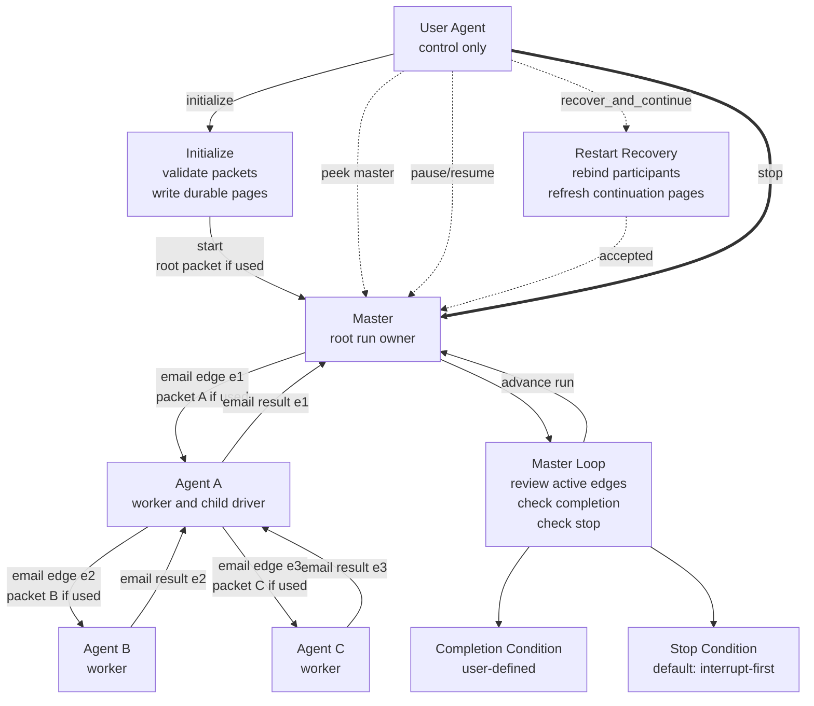

# Render The Final Loop Graph

Use this page when the authored plan needs the final Mermaid graph that shows who controls whom, where the loop lives, and where stop and completion are checked.

The final plan must include one Mermaid fenced code block. Do not use ASCII art as the primary graph representation.

## What The Graph Must Show

At minimum, the top-level graph must show:

- the user agent outside the execution loop
- the designated master as the root run owner
- the pairwise immediate-control edges between drivers and workers
- where the supervision loop lives
- where the completion condition is evaluated
- where the stop condition is evaluated

## Graph Semantics

- Draw execution edges between the immediate driver and immediate worker.
- Draw the supervision loop as a review cycle owned by the master, not as a worker-to-worker cycle.
- If a worker becomes a child driver, draw that child control edge beneath the worker and show the child result returning to the immediate parent.
- When labeling operator controls, prefer the canonical names `initialize`, `start`, `peek master`, `pause`, `resume`, `recover_and_continue`, and `stop`.
- Label the default `initialize` path as routing-packet validation plus durable page writes. Label standalone preparation mail only when the authored plan explicitly selects `operator_preparation_wave`.
- Keep labels short and wrap with ` ` when needed.
- Split a very large topology into one top-level diagram plus supporting subtree diagrams instead of making one unreadable diagram.

## Example

## Guardrails

- Do not imply that the user agent is an execution participant by drawing receipt or result ownership on the user agent.
- Do not draw the loop as an arbitrary cyclic worker graph when the real loop is the master's supervision cycle.
- Do not omit the stop condition or completion condition from the final plan graph.
