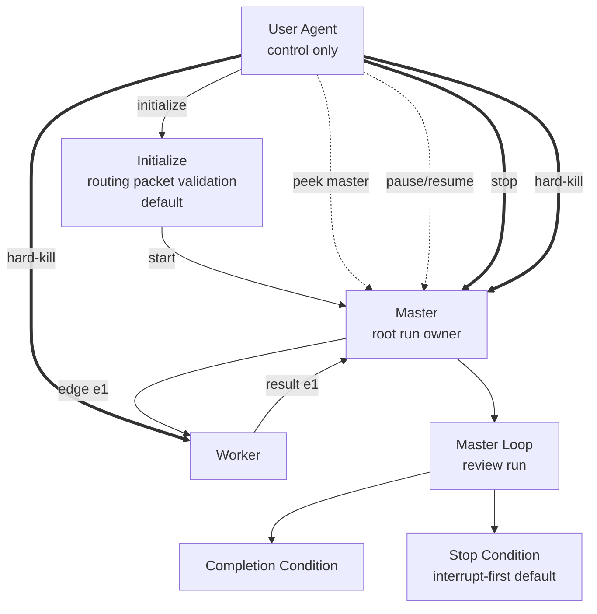

# Single-File Pairwise Loop Plan Template

````md
---
plan_id: <plan-id>
run_id: <run-id or placeholder>
master: <designated-master>
participants:
  - <master>
  - <worker-a>
  - <worker-b>
delegation_policy: <delegate_none | delegate_to_named | delegate_freely_within_named_set | delegate_any>
prestart_strategy: <precomputed_routing_packets | operator_preparation_wave>
plan_revision: <revision or digest>
default_stop_mode: interrupt-first
---

# Objective
<what the run is trying to accomplish>

# Completion Condition
<what the master must be able to evaluate as complete>

# Participants
- `<agent>`: <role in the topology>

# Topology
- descendants: <which participants have downstream descendants and which are leaves>
- graph artifact: <none | NetworkX node-link graph path>
- packet JSON artifact: <none | packet JSON path for validate-packets>

# Delegation Policy
<normalized delegation rules>

# Prestart Procedure
- notifier preflight: <how notifier is verified or enabled>
- selected strategy: `precomputed_routing_packets` by default
- graph-tool preflight: <analyze, optional slice, and packet-expectations results when a graph artifact exists>
- routing packet validation: <validate-packets result when graph and packet JSON artifacts exist, or manual visible-coverage check when they do not>
- root routing packet: <packet id or section reference included in the start charter>
- child packet forwarding: append exact prepared child packet text to the ordinary pairwise edge request; do not edit, merge, or summarize unless this plan explicitly permits it
- mismatch handling: stop downstream dispatch and report to the immediate driver, or to the operator when the driver is the master
- explicit operator preparation wave: <not used | targets, acknowledgement posture, and operator reply policy when selected>
- master trigger: <how the start charter stays separate from initialize>

# Routing Packets
## `<root-packet-id>`
- intended recipient: <master>
- immediate driver: <operator control plane>
- plan revision: <revision or digest>
- local role/objective: <what the master owns>
- allowed delegation: <none | named set | free within named set | any>
- result return: <completion summary to operator, not a pairwise child result>
- obligations: <mailbox, reminder, receipt, result, or timeout-watch obligations>
- forbidden actions: <what this participant must not do>
- child dispatch table:
  - `<child-agent>`: append packet `<edge-packet-id>` verbatim
- child packets: <inline packet text or exact section reference>

## `<edge-packet-id>`
- intended recipient: <child-agent>
- immediate driver: <parent-agent>
- plan revision: <revision or digest>
- local role/objective: <what this child owns>
- allowed delegation: <none | named set | free within named set | any>
- result return: <send final result back to immediate driver>
- obligations: <mailbox, reminder, receipt, result, or timeout-watch obligations>
- forbidden actions: <what this participant must not do>
- child dispatch table: <none | child packet ids>

# Operator Preparation Wave
<Only include when selected. Record preparation targets, mail posture `fire_and_proceed | require_ack`, operator reply policy, and leaf-target overrides.>

# Lifecycle Vocabulary
- operator actions: `plan`, `initialize`, `start`, `peek`, `ping`, `pause`, `resume`, `stop`, `hard-kill`
- observed states: `authoring`, `initializing`, `awaiting_ack`, `ready`, `running`, `paused`, `stopping`, `stopped`, `dead`

# Reporting Contract
<peek, completion, stop-summary, and hard-kill-summary expectations using canonical observed states>

# Timeout-Watch Policy
- enabled for: <participants or edges, if any>
- overdue threshold: <duration or none>
- follow-up rule: mailbox first, then `houmao-agent-inspect` during a later reminder-driven round
- reminder posture: one supervisor reminder per watcher by default

# Scripts
- `path`: <script path>
  `purpose`: <what it does>
  `allowed callers`: <which agents may call it>
  `inputs`: <inputs>
  `outputs`: <outputs>
  `side effects`: <side effects>
  `failure behavior`: <what failure means>

# Mermaid Control Graph

````

Use this form when one file is enough. If the plan starts accumulating large support notes or multiple scripts, switch to the bundle form.
