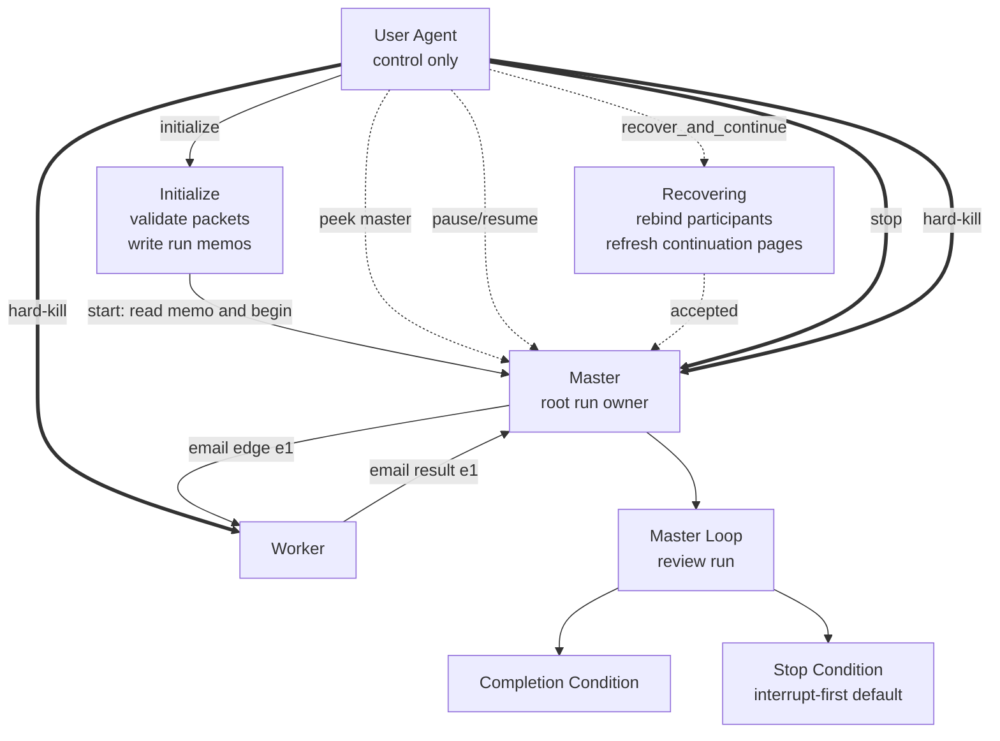

# Single-File Pairwise Loop Plan Template

Write this template as `<plan-output-dir>/plan.md`.

## Expected Output Directory

```text
<plan-output-dir>/
  plan.md
```

````md
---
plan_id: <plan-id>
run_id: <run-id or placeholder>
master: <designated-master>
participants:
  - <master>
  - <worker-a>
  - <worker-b>
workspace_contract_mode: <standard | custom>
delegation_policy: <delegate_none | delegate_to_named | delegate_freely_within_named_set | delegate_any>
prestart_strategy: <precomputed_routing_packets | operator_preparation_wave>
mail_notifier_interval_seconds: <5 unless user specified otherwise for operator_preparation_wave>
acknowledgement_posture: <fire_and_proceed | require_ack>
plan_revision: <revision or digest>
default_stop_mode: interrupt-first
---

# Objective
<what the run is trying to accomplish>

# Completion Condition
<what the master must be able to evaluate as complete>

# Participants
- `<agent>`: <role in the topology>

# Workspace Contract
- mode: `<standard | custom>`
- standard posture: `<in-repo | out-of-repo | n/a>`
- task root or launch cwd: `<task-scoped workspace root, out-of-repo cwd, or explicit custom cwd>`
- source write paths: `<declared writable source paths>`
- shared writable paths: `<declared shared writable paths or none>`
- bookkeeping paths: `<declared bookkeeping paths>`
- read-only paths: `<declared read-only paths>`
- ad hoc worktrees: `<allowed | forbidden | plan-specific rule>`
- runtime-owned recovery files: remain outside this workspace contract

# Topology
- descendants: <which participants have downstream descendants and which are leaves>
- graph artifact: <none | NetworkX node-link graph path>
- packet JSON artifact: <none | packet JSON path for validate-packets>

# Delegation Policy
<normalized delegation rules>

# Prestart Procedure
- selected strategy: `precomputed_routing_packets` by default
- launch profiles: <none | participant -> launch-profile mapping that initialize may use after mailbox-association precheck>
- initialize memo slot: <for example slot `initialize` keyed by exact run_id sentinels>
- durable continuation page namespace: <for example loop-runs/pairwise-v3/<run_id>/recover-and-continue.md>
- runtime-owned recovery record path: <for example <runtime-root>/loop-runs/pairwise-v2/<run_id>/record.json>
- runtime-owned recovery history path: <for example <runtime-root>/loop-runs/pairwise-v2/<run_id>/events.jsonl>
- email/mailbox verification: refuse to proceed when the master or any required participant lacks email/mailbox support
- start delivery: send the kickoff through mail by default; use direct prompt only when the user explicitly asks for it
- memo sentinel convention: <exact begin/end sentinels keyed by run_id and slot>
- initialize memo material: write master and participant run-owned memo blocks before `ready`
- operator preparation wave: <not selected | targeted preparation mail to delegating/non-leaf participants | explicit target set>
- notifier preflight: enable gateway mail-notifier for targeted preparation-wave participants before preparation mail, interval `5s` unless user specified otherwise
- acknowledgement posture: `fire_and_proceed` by default
- graph-tool preflight: <analyze, optional slice, and packet-expectations results when a graph artifact exists>
- routing packet validation: <validate-packets result when graph and packet JSON artifacts exist, or manual visible-coverage check when they do not>
- root routing packet: <packet id or section reference included in the designated master's initialize memo>
- child packet forwarding: append exact prepared child packet text to the pairwise edge request email; do not edit, merge, or summarize unless this plan explicitly permits it
- mismatch handling: stop downstream dispatch and report to the immediate driver, or to the operator when the driver is the master
- in-loop job communication: advise all agents to use email/mailbox for pairwise edge requests, receipts, and results by default
- master trigger: <how the compact start trigger tells the master to read its memo and start>

# Routing Packets
## `<root-packet-id>`
- intended recipient: <master>
- immediate driver: <operator control plane>
- plan revision: <revision or digest>
- local role/objective: <what the master owns>
- allowed delegation: <none | named set | free within named set | any>
- result return: <completion summary to operator, not a pairwise child result>
- obligations: <mailbox, reminder, receipt, result, or timeout-watch obligations>
- forbidden actions: <what this participant must not do>
- child dispatch table:
  - `<child-agent>`: append packet `<edge-packet-id>` verbatim
- child packets: <inline packet text or exact section reference>

## `<edge-packet-id>`
- intended recipient: <child-agent>
- immediate driver: <parent-agent>
- plan revision: <revision or digest>
- local role/objective: <what this child owns>
- allowed delegation: <none | named set | free within named set | any>
- result return: <send final result back to immediate driver>
- obligations: <mailbox, reminder, receipt, result, or timeout-watch obligations>
- forbidden actions: <what this participant must not do>
- child dispatch table: <none | child packet ids>

# Run Memo Material
Record the initialize memo slot expectations, continuation page namespace, runtime-owned recovery record path family, memo sentinel convention, and run-owned memo-block posture. Record standalone preparation mail only when `operator_preparation_wave` is selected explicitly.

# Lifecycle Vocabulary
- operator actions: `plan`, `initialize`, `start`, `peek`, `ping`, `pause`, `resume`, `recover_and_continue`, `stop`, `hard-kill`
- observed states: `authoring`, `initializing`, `awaiting_ack`, `ready`, `running`, `paused`, `recovering`, `recovered_ready`, `stopping`, `stopped`, `dead`

# Reporting Contract
<peek, recovery-summary, completion, stop-summary, and hard-kill-summary expectations using canonical observed states; peek remains unintrusive and read-only>

# Timeout-Watch Policy
- enabled for: <participants or edges, if any>
- overdue threshold: <duration or none>
- follow-up rule: mailbox first, then `houmao-agent-inspect` during a later reminder-driven round
- reminder posture: one supervisor reminder per watcher by default

# Scripts
- `path`: <script path>
  `purpose`: <what it does>
  `allowed callers`: <which agents may call it>
  `inputs`: <inputs>
  `outputs`: <outputs>
  `side effects`: <side effects>
  `failure behavior`: <what failure means>

# Mermaid Control Graph

````

Use this form when one file is enough. If the plan starts accumulating large support notes, multiple scripts, or reusable reporting or bookkeeping templates, switch to the bundle form. The generated single-file output directory should contain only `plan.md`.
