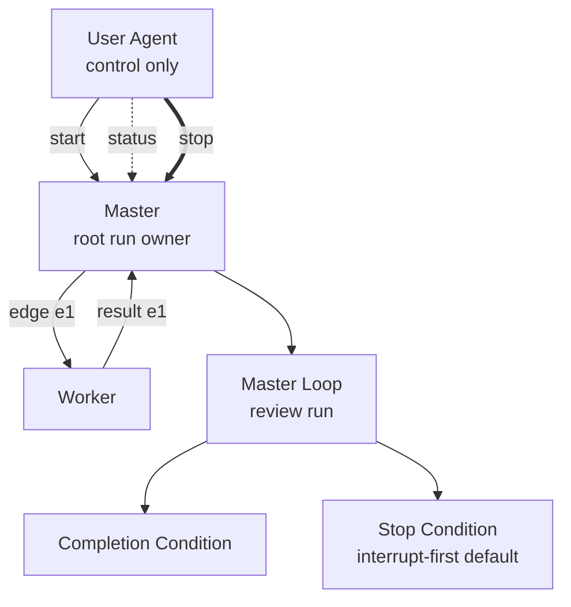

# Single-File Pairwise Loop Plan Template

````md
---
plan_id: <plan-id>
run_id: <run-id or placeholder>
master: <designated-master>
participants:
  - <master>
  - <worker-a>
  - <worker-b>
delegation_policy: <delegate_none | delegate_to_named | delegate_freely_within_named_set | delegate_any>
default_stop_mode: interrupt-first
mail_notifier_interval_seconds: <5 unless user specified otherwise>
graph_artifact: <none | NetworkX node-link graph path>
---

# Objective
<what the run is trying to accomplish>

# Completion Condition
<what the master must be able to evaluate as complete>

# Participants
- `<agent>`: <role in the topology>

# Delegation Policy
<normalized delegation rules>

# Reporting Contract
<status, completion, and stop-summary expectations>

# Graph-Tool Preflight
- `analyze`: <none | summary or reference to `houmao-mgr internals graph high analyze` output>
- `slice`: <none | summary or reference to descendant slice checks used during authoring>
- `render-mermaid scaffold`: <none | summary or reference when `graph high render-mermaid` was used>

# Scripts
- `path`: <script path>
  `purpose`: <what it does>
  `allowed callers`: <which agents may call it>
  `inputs`: <inputs>
  `outputs`: <outputs>
  `side effects`: <side effects>
  `failure behavior`: <what failure means>

# Mermaid Control Graph

````

Use this form when one file is enough. If the plan starts accumulating large support notes or multiple scripts, switch to the bundle form.
