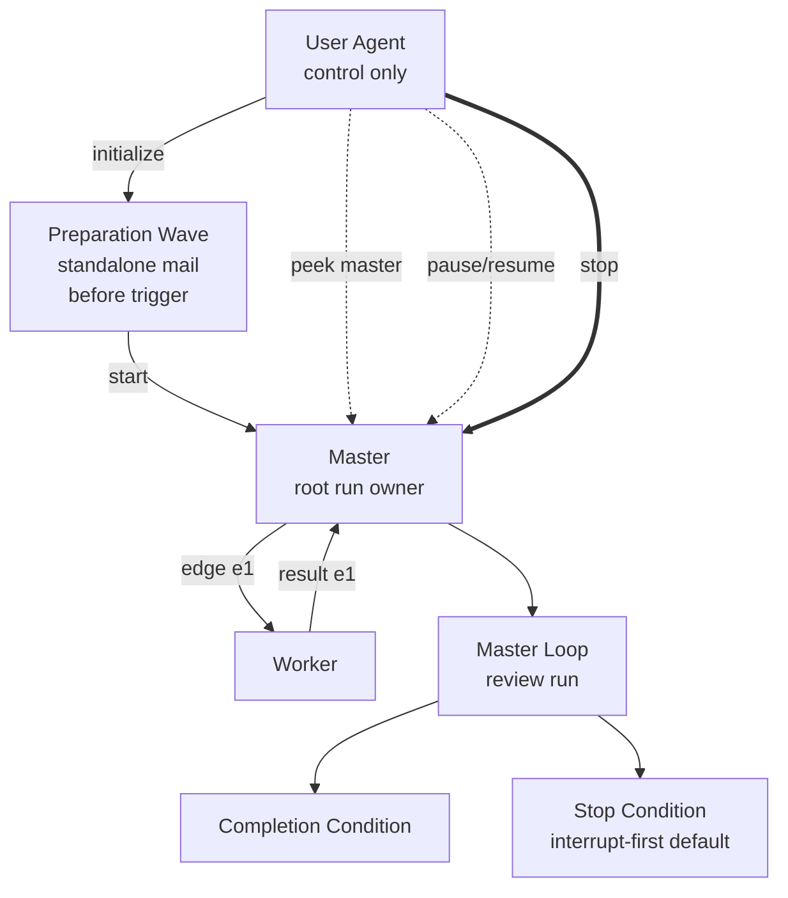

# Single-File Pairwise Loop Plan Template

````md
---
plan_id: <plan-id>
run_id: <run-id or placeholder>
master: <designated-master>
participants:
  - <master>
  - <worker-a>
  - <worker-b>
delegation_policy: <delegate_none | delegate_to_named | delegate_freely_within_named_set | delegate_any>
prestart_mode: <fire_and_proceed | require_ack>
default_stop_mode: interrupt-first
---

# Objective
<what the run is trying to accomplish>

# Completion Condition
<what the master must be able to evaluate as complete>

# Participants
- `<agent>`: <role in the topology>

# Delegation Policy
<normalized delegation rules>

# Prestart Procedure
- notifier preflight: <how notifier is verified or enabled>
- participant preparation wave: <how standalone prep mail is sent>
- acknowledgement posture: <fire_and_proceed | require_ack>
- operator reply policy: <none | operator_mailbox>
- master trigger: <how the start charter stays separate from preparation mail>

# Participant Preparation
## `<agent>`
- role: <what this participant owns>
- resources: <mailbox, scripts, artifacts, or tools this participant may use>
- allowed delegation: <none | named set | free within named set | any>
- delegation patterns: <work-type specific expectations when needed>
- obligations: <mailbox, reminder, receipt, or result obligations>
- forbidden actions: <what this participant must not do>

# Lifecycle Vocabulary
- operator actions: `plan`, `initialize`, `start`, `peek`, `ping`, `pause`, `resume`, `stop`
- observed states: `authoring`, `initializing`, `awaiting_ack`, `ready`, `running`, `paused`, `stopping`, `stopped`, `dead`

# Reporting Contract
<peek, completion, and stop-summary expectations using canonical observed states>

# Timeout-Watch Policy
- enabled for: <participants or edges, if any>
- overdue threshold: <duration or none>
- follow-up rule: mailbox first, then `houmao-agent-inspect` during a later reminder-driven round
- reminder posture: one supervisor reminder per watcher by default

# Scripts
- `path`: <script path>
  `purpose`: <what it does>
  `allowed callers`: <which agents may call it>
  `inputs`: <inputs>
  `outputs`: <outputs>
  `side effects`: <side effects>
  `failure behavior`: <what failure means>

# Mermaid Control Graph

````

Use this form when one file is enough. If the plan starts accumulating large support notes or multiple scripts, switch to the bundle form.
