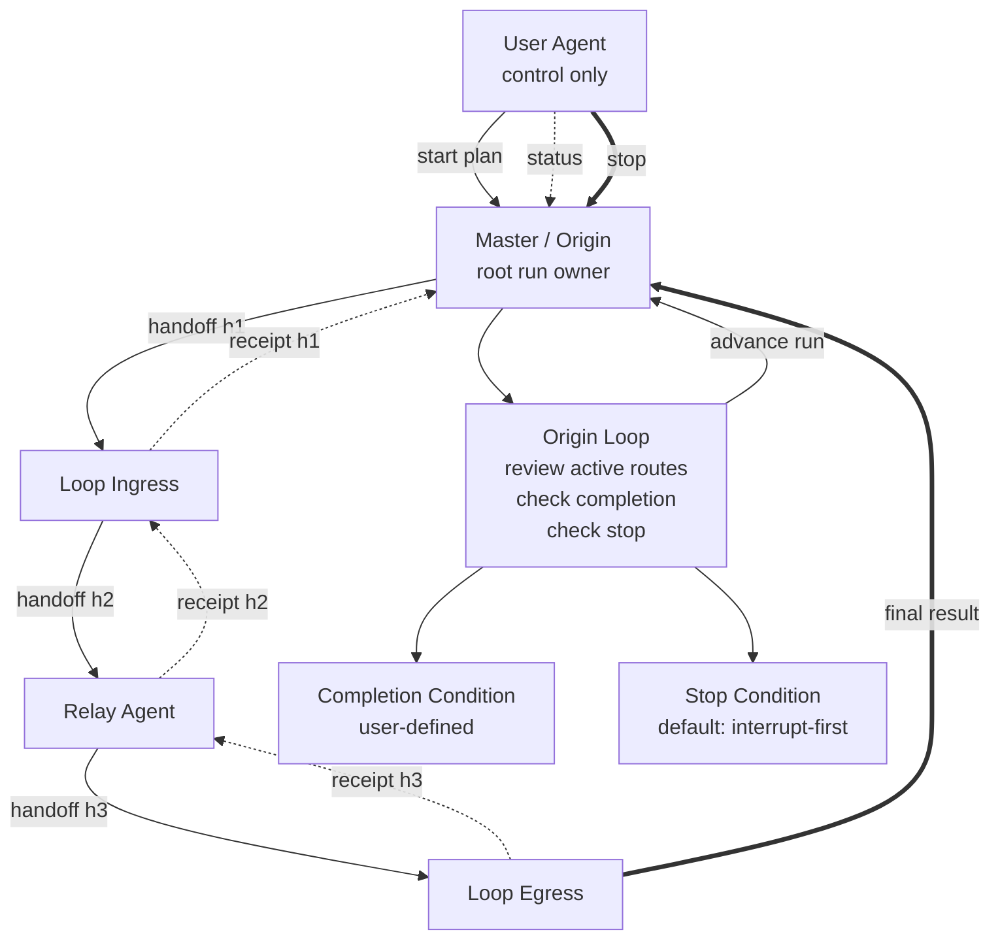

# Render The Final Relay Graph

Use this page when the authored plan needs the final Mermaid graph that shows who may hand off to whom, where the loop lives, and where stop and completion are checked.

The final plan must include one Mermaid fenced code block. Do not use ASCII art as the primary graph representation.

## What The Graph Must Show

At minimum, the top-level graph must show:

- the user agent outside the execution loop
- the designated master as the loop origin and root run owner
- the relay handoff edges between upstream and downstream agents
- where immediate receipts flow back to the previous sender
- where the final result returns from the loop egress to the origin
- where the supervision loop lives
- where the completion condition is evaluated
- where the stop condition is evaluated

## Graph Semantics

- Draw execution edges as forward relay handoffs.
- Draw per-hop receipts as immediate upstream acknowledgements rather than as final completion.
- Draw the final-result return from the loop egress back to the origin.
- Draw the supervision loop as a review cycle owned by the origin, not as a worker-to-worker cycle.
- Keep labels short and wrap with ` ` when needed.
- Split a very large topology into one top-level diagram plus supporting subtree diagrams instead of making one unreadable diagram.

## Example

## Guardrails

- Do not imply that the user agent is an execution participant by drawing receipt or result ownership on the user agent.
- Do not draw the loop as an arbitrary cyclic worker graph when the real loop is the origin's supervision cycle.
- Do not omit the stop condition, completion condition, or final-result return path from the final plan graph.
