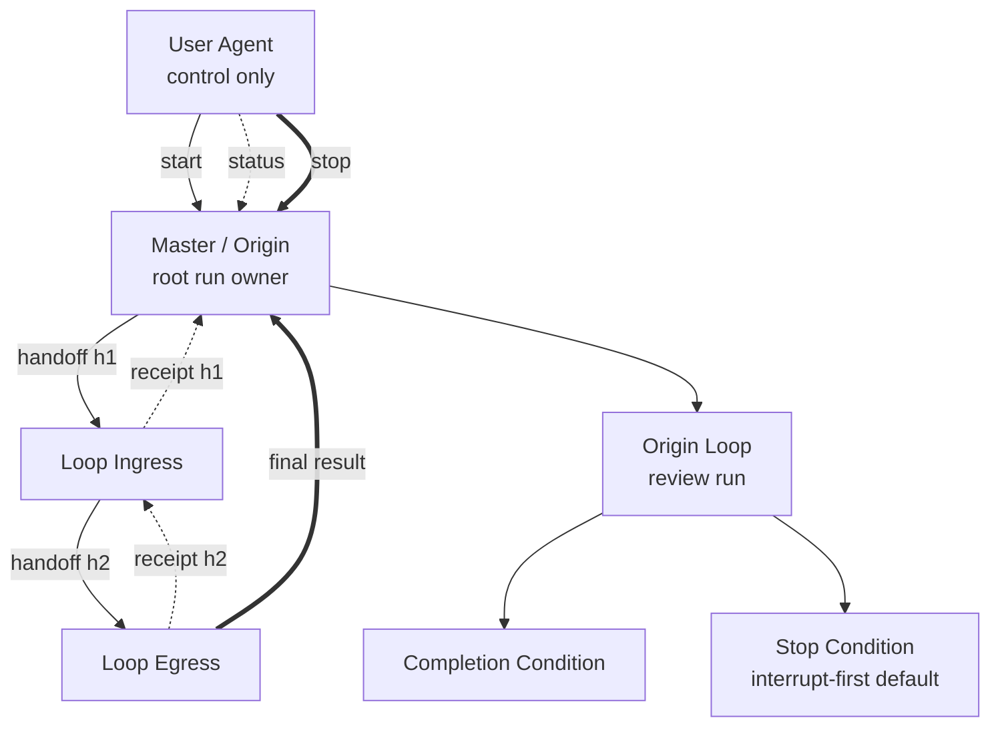

# Single-File Relay Loop Plan Template

````md
---
plan_id: <plan-id>
run_id: <run-id or placeholder>
master: <designated-master>
participants:
  - <master>
  - <ingress>
  - <relay-a>
  - <egress>
route_policy: <fixed_route_only | forward_to_named | forward_freely_within_named_set | forward_any>
default_stop_mode: interrupt-first
---

# Objective
<what the run is trying to accomplish>

# Completion Condition
<what the master must be able to evaluate as complete>

# Master / Loop Origin
<which agent owns the run and receives the final result>

# Participants
- `<agent>`: <role in the topology>

# Route Policy
<normalized forwarding rules>

# Result Return Contract
<who sends immediate receipts and which egress returns the final result to the origin>

# Relay Lanes
- `<lane>`: <origin -> ingress -> relay -> egress path>

# Reporting Contract
<status, completion, and stop-summary expectations>

# Scripts
- `path`: <script path>
  `purpose`: <what it does>
  `allowed callers`: <which agents may call it>
  `inputs`: <inputs>
  `outputs`: <outputs>
  `side effects`: <side effects>
  `failure behavior`: <what failure means>

# Mermaid Relay Graph

````

Use this form when one file is enough. If the plan starts accumulating large support notes, multiple relay lanes, or multiple scripts, switch to the bundle form.
