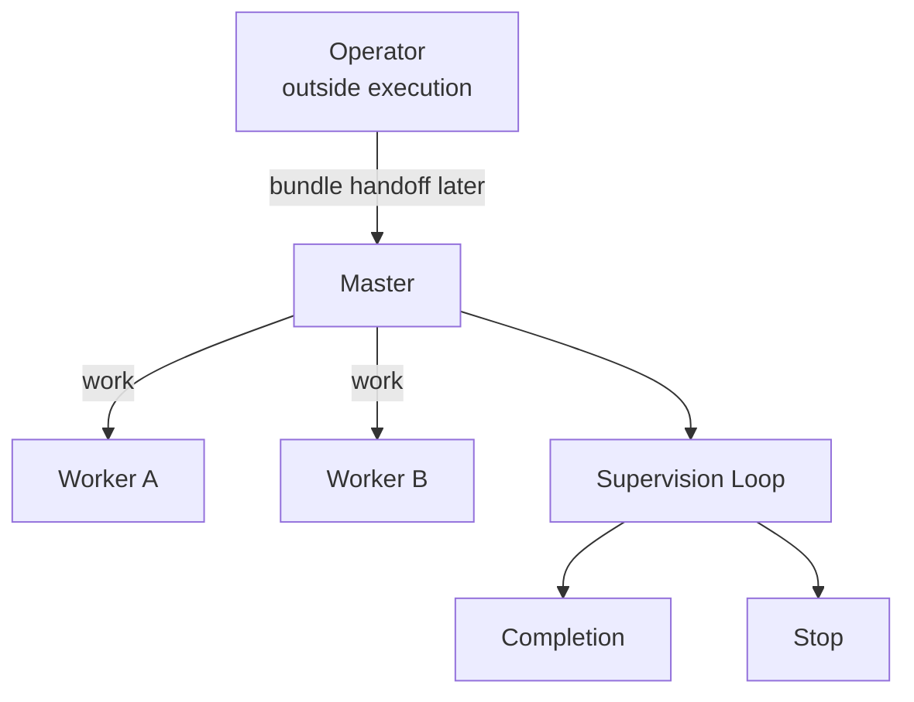

# Render The Loop Graph

Use this page when `plan.md` needs the final Mermaid graph for the loop bundle.

The final bundle must include one Mermaid fenced code block in `plan.md`. Do not use ASCII art as the primary graph representation.

## What The Graph Must Show

At minimum, the top-level graph must show:

- the operator outside the execution loop
- the designated master
- the high-level execution topology for the chosen loop kind
- where the supervision loop lives
- where the completion condition is evaluated
- where the stop condition is evaluated

## Graph Semantics

- Keep the operator outside the execution loop.
- Draw the master as the root operational owner for the run.
- Show the execution topology at a readable level instead of drawing every low-level mailbox detail.
- Show the supervision loop as a review cycle, not as arbitrary cyclic worker control.
- Put the top-level graph in `plan.md` even if supporting diagrams appear elsewhere later.

## Example

## Guardrails

- Do not omit the operator, completion, or stop checkpoints from the top-level graph.
- Do not place the only Mermaid graph in a support file while leaving `plan.md` without one.
- Do not draw the topology as an arbitrary agent-to-agent cycle when the real loop is the supervision cycle.
