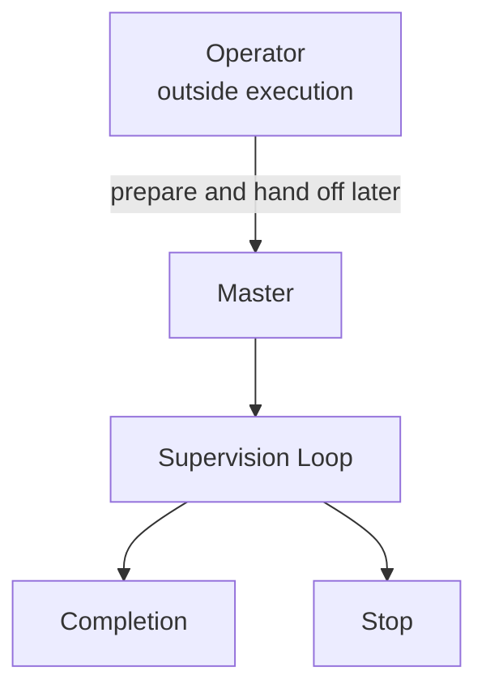

# `plan.md` Template

~~~~md
# Objective
<what the loop is trying to accomplish>

# Loop Kind
<pairwise | relay>

# Master
<designated master>

# Participants
See `participants.md`.

# Execution
See `execution.md`.

# Distribution
See `distribution.md`.

# Completion
<short completion summary>

# Stop
<short stop summary>

# Mermaid Graph

~~~~
